# Diagrama de Casos de Uso — NORA

> Documento de referência para a disciplina **Agile Methodology with Squad Framework**
> Sprint 1+2 · FIAP Challenge 2026 × TOTVS · Engenharia de Software 2º Ano

---

## Atores

| Ator | Tipo | Descrição |
|---|---|---|
| **Visitante** | Primário | Usuário não autenticado que acessa o site/app |
| **Usuário Core** | Primário | Profissional individual, plano B2C (Free ou Pro) |
| **Usuário Enterprise** | Primário | Funcionário de empresa com acesso escopo-restrito |
| **Admin Enterprise** | Primário | Root user da empresa; acesso irrestrito ao tenant |
| **Serviço Externo** | Sistema | Integrações via MCP (Claude, calendário, tasks) |
| **Provider de Identidade** | Sistema | Provedor externo de autenticação corporativa (SSO pós-MVP) |

> Observação: a NORA AI aparece no diagrama como **módulo interno**, não como ator externo UML.

---

## Diagrama

```mermaid
graph TD
  %% ─── Estilo dos Atores ───
  V(["👤 Visitante"])
  UC(["👤 Usuário Core"])
  UE(["👤 Usuário Enterprise"])
  AE(["👤 Admin Enterprise"])
  SE(["🔌 Serviço Externo"])
  IDP(["🔐 Provider de Identidade"])

  %% ─── Casos de Uso: Acesso ───
  subgraph ACESSO["Módulo: Acesso & Identidade"]
    CU01(["UC01 · Criar conta"])
    CU02(["UC02 · Fazer login"])
    CU03(["UC03 · Recuperar senha"])
    CU04(["UC04 · Login SSO corporativo (pós-MVP)"])
  end

  %% ─── Casos de Uso: Core ───
  subgraph CORE["Módulo: NORA Core"]
    CU05(["UC05 · Upload de transcrição / gravação"])
    CU06(["UC06 · Captura ao vivo via Desktop App"])
    CU07(["UC07 · Visualizar resumo da reunião"])
    CU08(["UC08 · Visualizar tarefas extraídas"])
    CU09(["UC09 · Editar e marcar tarefas"])
    CU10(["UC10 · Exportar relatório da reunião"])
    CU11(["UC11 · Gerenciar integrações MCP"])
  end

  %% ─── Casos de Uso: Enterprise (Usuário) ───
  subgraph ENT_USER["Módulo: Enterprise — Usuário"]
    CU12(["UC12 · Visualizar transcrições do escopo"])
    CU13(["UC13 · Buscar reuniões por contexto"])
    CU14(["UC14 · Ver insights do departamento"])
    CU15(["UC15 · Exportar relatório do escopo"])
  end

  %% ─── Casos de Uso: Enterprise (Admin) ───
  subgraph ENT_ADMIN["Módulo: Enterprise — Administração (Root do tenant)"]
    CU16(["UC16 · Configurar contexto da empresa"])
    CU17(["UC17 · Convidar e gerenciar usuários"])
    CU18(["UC18 · Criar grupos IAM"])
    CU18A(["UC18A · Criar e versionar políticas IAM (JSON)"])
    CU18B(["UC18B · Anexar políticas a grupos/usuários"])
    CU18C(["UC18C · Adicionar/remover usuários em grupos"])
    CU19(["UC19 · Ver todas as transcrições (bypass Root)"])
    CU20(["UC20 · Configurar tenant"])
    CU21(["UC21 · Exportar relatório global"])
    CU21A(["UC21A · Auditar mudanças de IAM"])
  end

  %% ─── Casos de Uso: IA ───
  subgraph NORA_AI["Módulo: Processamento NORA AI"]
    CU22(["UC22 · Transcrever áudio para texto"])
    CU23(["UC23 · Gerar resumo com NLP"])
    CU24(["UC24 · Extrair tarefas e decisões"])
    CU25(["UC25 · Indexar conteúdo com embeddings"])
    CU26(["UC26 · Injetar contexto do produto/empresa"])
    CU27(["UC27 · Enviar notificações"])
    CU28(["UC28 · Avaliar produtividade vs. objetivo declarado (opt-in)"])
    CU29(["UC29 · Avaliar Customer Confidence (Enterprise)"])
    CU30(["UC30 · Atualizar Account Health Score (Enterprise)"])
  end

  %% ─── Relações: Visitante ───
  V --> CU01
  V --> CU02
  V --> CU03

  %% ─── Relações: Usuário Core ───
  UC --> CU02
  UC --> CU05
  UC --> CU06
  UC --> CU07
  UC --> CU08
  UC --> CU09
  UC --> CU10
  UC --> CU11

  %% ─── Relações: Usuário Enterprise ───
  UE --> CU02
  UE --> CU04
  UE --> CU12
  UE --> CU13
  UE --> CU14
  UE --> CU15

  %% ─── Relações: Admin Enterprise ───
  AE --> CU02
  AE --> CU04
  AE --> CU16
  AE --> CU17
  AE --> CU18
  AE --> CU18A
  AE --> CU18B
  AE --> CU18C
  AE --> CU19
  AE --> CU20
  AE --> CU21
  AE --> CU21A
  AE --> CU12
  AE --> CU14

  %% ─── Relações: Processamento interno da NORA AI ───
  CU05 --> CU23
  CU05 -. se áudio .-> CU22
  CU06 --> CU22
  CU22 --> CU23
  CU23 --> CU24
  CU23 --> CU25
  CU23 -. Enterprise .-> CU26
  CU23 -. se goal declarado .-> CU28
  CU23 -. Enterprise + lead .-> CU29
  CU29 --> CU30
  CU23 --> CU27

  %% ─── Relações: Serviço Externo ───
  CU11 --> SE
  CU27 --> SE
  CU04 --> IDP
```

---

## Descrição Narrativa dos Casos de Uso

### UC01 — Criar conta
**Ator principal:** Visitante
**Pré-condição:** Usuário acessa o site pela primeira vez
**Fluxo principal:**
1. Visitante clica em "Criar conta"
2. Preenche nome, e-mail e senha
3. NORA valida e-mail (verificação por link)
4. Conta Core (Free) é criada
**Pós-condição:** Usuário autenticado com acesso ao painel Core

---

### UC02 — Fazer login
**Ator principal:** Usuário Core
**Pré-condição:** Conta criada previamente
**Fluxo principal:**
1. Usuário acessa a tela de login
2. Informa e-mail e senha
3. NORA valida credenciais e retorna token JWT
4. Usuário é redirecionado ao dashboard

---

### UC04 — Login SSO corporativo
**Ator principal:** Usuário Enterprise / Admin Enterprise
**Pré-condição:** Tenant configurado com domínio corporativo
**Observação:** SSO é uma evolução Enterprise pós-MVP. No MVP, usuários Enterprise entram por convite e login e-mail/senha corporativo.
**Fluxo principal:**
1. Usuário acessa portal Enterprise pelo domínio da empresa
2. É redirecionado para provider SSO (Google Workspace / Azure AD)
3. Autenticação ocorre no provider externo
4. NORA recebe callback e monta sessão com roles do tenant
**Extensão:** Caso SSO não esteja configurado, fallback para login por e-mail corporativo

---

### UC05 — Upload de transcrição / gravação
**Ator principal:** Usuário Core
**Pré-condição:** Usuário autenticado
**Fluxo principal:**
1. Usuário acessa "Nova reunião"
2. Faz upload de arquivo textual `.txt`, `.vtt` ou `.srt` no MVP
3. NORA processa via pipeline NLP (UC23 → UC24 → UC25)
4. Resultado disponível no painel em até 30 segundos
**Extensão:** Upload de `.mp3/.mp4` entra pós-MVP e inclui transcrição automática (UC22)

---

### UC06 — Captura ao vivo via Desktop App
**Ator principal:** Usuário Core
**Pré-condição:** Desktop App instalado e autorizado a capturar áudio do sistema
**Fluxo principal:**
1. Usuário inicia reunião no Meet/Teams/Zoom
2. Ativa captura na NORA Desktop App
3. Áudio é transcrito em tempo real (streaming STT)
4. Contexto e notas parciais aparecem no painel lateral
5. Ao encerrar, NORA gera o relatório completo

---

### UC16 — Configurar contexto da empresa
**Ator principal:** Admin Enterprise
**Pré-condição:** Tenant ativo
**Fluxo principal:**
1. Admin acessa "Configurações > Contexto do produto"
2. Descreve a empresa, produtos, glossário interno e stakeholders-chave
3. NORA usa esse contexto como instrução base ao processar reuniões do tenant (UC26)
4. Contexto é versionado (histórico de alterações)

---

### UC17 — Convidar e gerenciar usuários
**Ator principal:** Root do tenant (Admin Enterprise)
**Pré-condição:** Tenant ativo
**Fluxo principal:**
1. Root acessa "Configurações > IAM > Usuários"
2. Convida usuário por e-mail corporativo
3. (Opcional) adiciona o usuário a um ou mais grupos já existentes (ver UC18C)
4. Usuário recebe convite, define senha e acessa apenas o que suas políticas IAM permitem

---

### UC18 — Criar grupos IAM
**Ator principal:** Root do tenant
**Pré-condição:** Tenant ativo
**Fluxo principal:**
1. Root acessa "Configurações > IAM > Grupos"
2. Cria um novo grupo (ex.: "Vendas-SP", "Auditores")
3. Grupo fica disponível para anexação de políticas (UC18B) e adição de membros (UC18C)

---

### UC18A — Criar e versionar políticas IAM (JSON)
**Ator principal:** Root do tenant
**Pré-condição:** Tenant ativo
**Fluxo principal:**
1. Root acessa "Configurações > IAM > Políticas"
2. Cria política enviando documento JSON com `version` e `statements[]` (cada um com `effect`, `action[]`, `resource[]` e `condition` opcional)
3. Sistema valida contra schema oficial e cria versão 1
4. Cada alteração cria uma nova versão (histórico imutável)
**Extensão:** Root pode partir de **templates** opcionais ("ReadOnlyAccess", "MeetingAnalystAccess") como ponto de partida.

---

### UC18B — Anexar políticas a grupos/usuários
**Ator principal:** Root do tenant
**Fluxo principal:**
1. Root seleciona uma política
2. Anexa a um ou mais grupos (recomendado) ou a um usuário específico
3. Sistema atualiza permissões imediatamente; próximas requisições já refletem o novo estado

---

### UC18C — Adicionar/remover usuários em grupos
**Ator principal:** Root do tenant
**Fluxo principal:**
1. Root abre o grupo desejado
2. Adiciona ou remove usuários membros
3. Permissões resultantes são reavaliadas na próxima requisição de cada usuário afetado

---

### UC28 — Avaliar produtividade vs. objetivo declarado (opt-in)
**Ator principal:** Usuário Core / Usuário Enterprise
**Pré-condição:** Recurso de produtividade ativado pelo usuário ao subir a reunião
**Fluxo principal:**
1. No upload, o usuário declara o `purpose` da reunião e a lista de `expectedOutcomes` que precisavam ser tratados
2. (Opcional) o usuário cola/edita um `projectStateSnapshot` descrevendo o que já está feito
3. A NORA processa a reunião normalmente (UC23) e, ao final, avalia cobertura outcome-a-outcome (`ADDRESSED` / `PARTIAL` / `MISSED`)
4. Calcula um Productivity Score (0–100), banda (`LOW` / `MEDIUM` / `HIGH`) e justificativa
5. Resultado fica visível no detalhe da reunião
**Extensão (pós-MVP):** Em vez do `projectStateSnapshot` manual, a NORA puxa o estado do projeto via MCP de Jira / Linear / Azure DevOps / GitHub Projects.

---

### UC29 — Avaliar Customer Confidence (Enterprise)
**Ator principal:** Usuário Enterprise (AE)
**Pré-condição:** Reunião está vinculada a uma `customer_account`; tenant é Enterprise
**Fluxo principal:**
1. Após o resumo (UC23), o worker analisa sinais de compra e objeções na transcrição
2. Calcula um Customer Confidence Score (0–100) e banda (`LOW` / `MEDIUM` / `HIGH`)
3. Compara com a última avaliação da mesma conta para gerar `trend` (`IMPROVING` / `STABLE` / `DECLINING`)
4. Persiste sinais e objeções com a citação textual
**Resultado:** indicador disponível no detalhe da reunião e no painel da conta.

---

### UC30 — Atualizar Account Health Score (Enterprise)
**Ator principal:** Sistema (disparado por UC29)
**Pré-condição:** Existe um novo Customer Confidence persistido
**Fluxo principal:**
1. Sistema combina o Customer Confidence recente, riscos e oportunidades acumulados, recência de interação e tendência
2. Calcula novo Account Health Score (0–100) com banda (`AT_RISK` / `WATCH` / `HEALTHY` / `STRONG`)
3. Persiste snapshot com referência à análise que disparou
4. Se houve mudança de banda para pior, dispara alerta para os usuários autorizados (US51)
**Resultado:** série temporal da saúde da conta atualizada.

---

## Relacionamentos de Inclusão e Extensão

| Caso de Uso | Relação | Dependência |
|---|---|---|
| UC05 (texto) | `<<include>>` | UC23 (Gerar resumo) |
| UC05 (áudio), UC06 | `<<include>>` | UC22 (Transcrever áudio) |
| UC22 | `<<include>>` | UC23 (Gerar resumo) |
| UC23 | `<<include>>` | UC24 (Extrair tarefas) |
| UC23 | `<<include>>` | UC25 (Indexar embeddings) |
| UC23 | `<<extend>>` | UC26 (Injetar contexto — somente Enterprise) |
| UC07, UC12 | `<<extend>>` | UC15/UC10 (Exportar — opcional) |
| UC04 | `<<extend>>` | UC02 (fallback para login padrão) |
