# Use Case Diagram — NORA

> Reference document for the **Agile Methodology with Squad Framework** course
> Sprint 1+2 · FIAP Challenge 2026 × TOTVS · Software Engineering, 2nd Year

## Actors

| Actor | Type | Description |
|---|---|---|
| **Visitor** | Primary | Unauthenticated user who accesses the site/app |
| **Core User** | Primary | Individual professional, B2C plan (Free or Pro) |
| **Enterprise User** | Primary | Company employee with scope-restricted access |
| **Enterprise Admin** | Primary | Company root user; unrestricted access to the tenant |
| **External Service** | System | Integrations via MCP (Claude, calendar, tasks) |
| **Identity Provider** | System | External corporate authentication provider (SSO post-MVP) |

> Note: NORA AI appears in the diagram as an **internal module**, not as an external UML actor.

## Diagram

```mermaid
graph TD
  %% ─── Estilo dos Atores ───
  V(["Visitante"])
  UC(["Usuário Core"])
  UE(["Usuário Enterprise"])
  AE(["Admin Enterprise"])
  SE(["Serviço Externo"])
  IDP(["Provider de Identidade"])

  %% ─── Casos de Uso: Acesso ───
  subgraph ACESSO["Módulo: Acesso & Identidade"]
    CU01(["UC01 · Criar conta"])
    CU02(["UC02 · Fazer login"])
    CU03(["UC03 · Recuperar senha"])
    CU04(["UC04 · Login SSO corporativo (pós-MVP)"])
  end

  %% ─── Casos de Uso: Core ───
  subgraph CORE["Módulo: NORA Core"]
    CU05(["UC05 · Upload de transcrição / gravação"])
    CU06(["UC06 · Captura ao vivo via Desktop App"])
    CU07(["UC07 · Visualizar resumo da reunião"])
    CU08(["UC08 · Visualizar tarefas extraídas"])
    CU09(["UC09 · Editar e marcar tarefas"])
    CU10(["UC10 · Exportar relatório da reunião"])
    CU11(["UC11 · Gerenciar integrações MCP"])
  end

  %% ─── Casos de Uso: Enterprise (Usuário) ───
  subgraph ENT_USER["Módulo: Enterprise — Usuário"]
    CU12(["UC12 · Visualizar transcrições do escopo"])
    CU13(["UC13 · Buscar reuniões por contexto"])
    CU14(["UC14 · Ver insights do departamento"])
    CU15(["UC15 · Exportar relatório do escopo"])
  end

  %% ─── Casos de Uso: Enterprise (Admin) ───
  subgraph ENT_ADMIN["Módulo: Enterprise — Administração (Root do tenant)"]
    CU16(["UC16 · Configurar contexto da empresa"])
    CU17(["UC17 · Convidar e gerenciar usuários"])
    CU18(["UC18 · Criar grupos IAM"])
    CU18A(["UC18A · Criar e versionar políticas IAM (JSON)"])
    CU18B(["UC18B · Anexar políticas a grupos/usuários"])
    CU18C(["UC18C · Adicionar/remover usuários em grupos"])
    CU19(["UC19 · Ver todas as transcrições (bypass Root)"])
    CU20(["UC20 · Configurar tenant"])
    CU21(["UC21 · Exportar relatório global"])
    CU21A(["UC21A · Auditar mudanças de IAM"])
  end

  %% ─── Casos de Uso: IA ───
  subgraph NORA_AI["Módulo: Processamento NORA AI"]
    CU22(["UC22 · Transcrever áudio para texto"])
    CU23(["UC23 · Gerar resumo com NLP"])
    CU24(["UC24 · Extrair tarefas e decisões"])
    CU25(["UC25 · Indexar conteúdo com embeddings"])
    CU26(["UC26 · Injetar contexto do produto/empresa"])
    CU27(["UC27 · Enviar notificações"])
    CU28(["UC28 · Avaliar produtividade vs. objetivo declarado (opt-in)"])
    CU29(["UC29 · Avaliar Customer Confidence (Enterprise)"])
    CU30(["UC30 · Atualizar Account Health Score (Enterprise)"])
  end

  %% ─── Relações: Visitante ───
  V --> CU01
  V --> CU02
  V --> CU03

  %% ─── Relações: Usuário Core ───
  UC --> CU02
  UC --> CU05
  UC --> CU06
  UC --> CU07
  UC --> CU08
  UC --> CU09
  UC --> CU10
  UC --> CU11

  %% ─── Relações: Usuário Enterprise ───
  UE --> CU02
  UE --> CU04
  UE --> CU12
  UE --> CU13
  UE --> CU14
  UE --> CU15

  %% ─── Relações: Admin Enterprise ───
  AE --> CU02
  AE --> CU04
  AE --> CU16
  AE --> CU17
  AE --> CU18
  AE --> CU18A
  AE --> CU18B
  AE --> CU18C
  AE --> CU19
  AE --> CU20
  AE --> CU21
  AE --> CU21A
  AE --> CU12
  AE --> CU14

  %% ─── Relações: Processamento interno da NORA AI ───
  CU05 --> CU23
  CU05 -. se áudio .-> CU22
  CU06 --> CU22
  CU22 --> CU23
  CU23 --> CU24
  CU23 --> CU25
  CU23 -. Enterprise .-> CU26
  CU23 -. se goal declarado .-> CU28
  CU23 -. Enterprise + lead .-> CU29
  CU29 --> CU30
  CU23 --> CU27

  %% ─── Relações: Serviço Externo ───
  CU11 --> SE
  CU27 --> SE
  CU04 --> IDP
```

## Narrative Description of the Use Cases

### UC01 — Create account
**Primary actor:** Visitor
**Pre-condition:** The user accesses the site for the first time
**Main flow:**
1. The visitor clicks "Criar conta"
2. Fills in name, e-mail and password
3. NORA validates the e-mail (verification by link)
4. A Core (Free) account is created
**Post-condition:** The user is authenticated with access to the Core panel

### UC02 — Log in
**Primary actor:** Core User
**Pre-condition:** An account was previously created
**Main flow:**
1. The user goes to the login screen
2. Enters e-mail and password
3. NORA validates the credentials and returns a JWT token
4. The user is redirected to the dashboard

### UC04 — Corporate SSO login
**Primary actor:** Enterprise User / Enterprise Admin
**Pre-condition:** Tenant configured with a corporate domain
**Note:** SSO is a post-MVP Enterprise evolution. In the MVP, Enterprise users come in by invitation and corporate e-mail/password login.
**Main flow:**
1. The user accesses the Enterprise portal through the company domain
2. Is redirected to the SSO provider (Google Workspace / Azure AD)
3. Authentication happens at the external provider
4. NORA receives the callback and builds the session with the tenant roles
**Extension:** If SSO is not configured, fall back to login by corporate e-mail

### UC05 — Upload of transcript / recording
**Primary actor:** Core User
**Pre-condition:** Authenticated user
**Main flow:**
1. The user goes to "Nova reunião"
2. Uploads a text file `.txt`, `.vtt` or `.srt` in the MVP
3. NORA processes it through the NLP pipeline (UC23 → UC24 → UC25)
4. The result is available on the panel within 30 seconds
**Extension:** `.mp3/.mp4` upload comes post-MVP and includes automatic transcription (UC22)

### UC06 — Live capture via Desktop App
**Primary actor:** Core User
**Pre-condition:** Desktop App installed and authorized to capture system audio
**Main flow:**
1. The user starts a meeting on Meet/Teams/Zoom
2. Activates capture in the NORA Desktop App
3. Audio is transcribed in real time (streaming STT)
4. Context and partial notes appear in the side panel
5. When it ends, NORA generates the full report

### UC16 — Configure company context
**Primary actor:** Enterprise Admin
**Pre-condition:** Active tenant
**Main flow:**
1. The admin goes to "Configurações > Contexto do produto"
2. Describes the company, products, internal glossary and key stakeholders
3. NORA uses this context as the base instruction when processing the tenant's meetings (UC26)
4. The context is versioned (change history)

### UC17 — Invite and manage users
**Primary actor:** Tenant root (Enterprise Admin)
**Pre-condition:** Active tenant
**Main flow:**
1. The root goes to "Configurações > IAM > Usuários"
2. Invites a user by corporate e-mail
3. (Optional) adds the user to one or more existing groups (see UC18C)
4. The user receives the invitation, sets a password and accesses only what their IAM policies allow

### UC18 — Create IAM groups
**Primary actor:** Tenant root
**Pre-condition:** Active tenant
**Main flow:**
1. The root goes to "Configurações > IAM > Grupos"
2. Creates a new group (e.g. "Vendas-SP", "Auditores")
3. The group becomes available for policy attachment (UC18B) and member addition (UC18C)

### UC18A — Create and version IAM policies (JSON)
**Primary actor:** Tenant root
**Pre-condition:** Active tenant
**Main flow:**
1. The root goes to "Configurações > IAM > Políticas"
2. Creates a policy by submitting a document with `version` and `statements[]` (each with `effect`, `action[]`, `resource[]` and an optional `condition`), written either in the **form** or in the **JSON editor** — both produce the same document and the same `POST /iam/policies` (US42)
3. The system validates it against the official schema and creates version 1
4. Each change creates a new version (immutable history)
**Extension:** The root may start from a built-in **template** — `read-only-access`, `meeting-analyst`, `iam-administrator`, `department-scoped-meeting-reader` — loaded from `GET /iam/policy-templates` into the editor (US41). The template is only a starting document: nothing is created until step 2, by the same handler.

### UC18B — Attach policies to groups/users
**Primary actor:** Tenant root
**Main flow:**
1. The root selects a policy
2. Attaches it to one or more groups (recommended) or to a specific user
3. The system updates permissions immediately; the next requests already reflect the new state

### UC18C — Add/remove users in groups
**Primary actor:** Tenant root
**Main flow:**
1. The root opens the desired group
2. Adds or removes member users
3. The resulting permissions are re-evaluated on the next request of each affected user

### UC28 — Evaluate productivity vs. declared goal (opt-in)
**Primary actor:** Core User / Enterprise User
**Pre-condition:** The productivity feature was enabled by the user when uploading the meeting
**Main flow:**
1. At upload, the user declares the meeting's `purpose` and the list of `expectedOutcomes` that needed to be addressed
2. (Optional) the user pastes/edits a `projectStateSnapshot` describing what is already done
3. NORA processes the meeting normally (UC23) and, at the end, evaluates coverage outcome by outcome (`ADDRESSED` / `PARTIAL` / `MISSED`)
4. Computes a Productivity Score (0–100), a band (`LOW` / `MEDIUM` / `HIGH`) and a justification
5. The result is visible in the meeting detail
**Extension (post-MVP):** Instead of the manual `projectStateSnapshot`, NORA pulls the project state via MCP from Jira / Linear / Azure DevOps / GitHub Projects.

### UC29 — Evaluate Customer Confidence (Enterprise)
**Primary actor:** Enterprise User (AE)
**Pre-condition:** The meeting is linked to a `customer_account`; the tenant is Enterprise
**Main flow:**
1. After the summary (UC23), the worker analyzes buying signals and objections in the transcript
2. Computes a Customer Confidence Score (0–100) and a band (`LOW` / `MEDIUM` / `HIGH`)
3. Compares it with the last evaluation of the same account to generate a `trend` (`IMPROVING` / `STABLE` / `DECLINING`)
4. Persists signals and objections with the verbatim quote
**Result:** the indicator is available in the meeting detail and in the account panel.

### UC30 — Update Account Health Score (Enterprise)
**Primary actor:** System (triggered by UC29)
**Pre-condition:** A new Customer Confidence has been persisted
**Main flow:**
1. The system combines the recent Customer Confidence, accumulated risks and opportunities, interaction recency and trend
2. Computes a new Account Health Score (0–100) with a band (`AT_RISK` / `WATCH` / `HEALTHY` / `STRONG`)
3. Persists a snapshot with a reference to the analysis that triggered it
4. If the band changed for the worse, it triggers an alert to the authorized users (US51)
**Result:** the account health time series is updated.

## Include and Extend Relationships

| Use Case | Relationship | Dependency |
|---|---|---|
| UC05 (text) | `<<include>>` | UC23 (Generate summary) |
| UC05 (audio), UC06 | `<<include>>` | UC22 (Transcribe audio) |
| UC22 | `<<include>>` | UC23 (Generate summary) |
| UC23 | `<<include>>` | UC24 (Extract tasks) |
| UC23 | `<<include>>` | UC25 (Index embeddings) |
| UC23 | `<<extend>>` | UC26 (Inject context — Enterprise only) |
| UC07, UC12 | `<<extend>>` | UC15/UC10 (Export — optional) |
| UC04 | `<<extend>>` | UC02 (fallback to standard login) |
