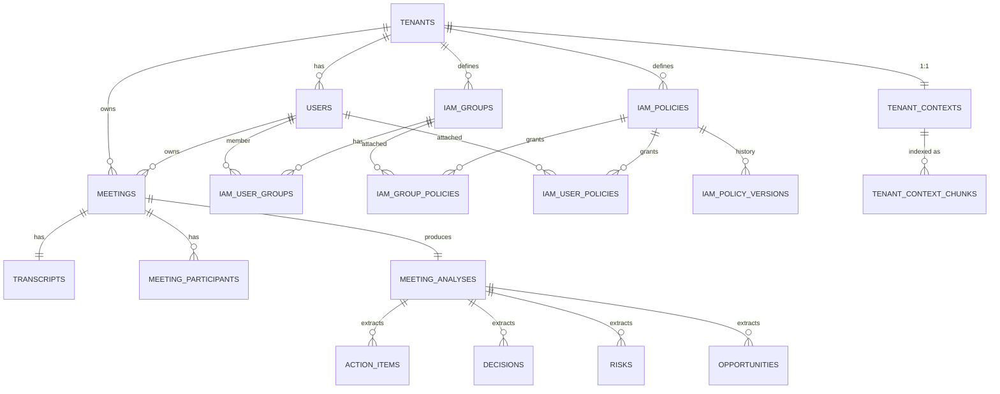

# Modelo de Dados — NORA (MVP)

> Postgres 16. Multi-tenant via coluna `tenant_id` em todas as tabelas tenant-bound.
> RLS (Row-Level Security) será habilitado em produção; no MVP, a regra é forçada por filtro de aplicação coberto por testes de isolamento.

---

## 1. Visão Geral (ER)



---

## 2. Tabelas

### 2.1 `tenants`

| Coluna | Tipo | Notas |
|---|---|---|
| id | uuid PK | |
| name | text NOT NULL | |
| slug | text UNIQUE NOT NULL | usado em URLs |
| status | text NOT NULL | `ACTIVE`, `SUSPENDED` |
| plan | text NOT NULL | `FREE`, `PRO`, `ENTERPRISE` |
| created_at | timestamptz NOT NULL | |
| updated_at | timestamptz NOT NULL | |

### 2.2 `users`

| Coluna | Tipo | Notas |
|---|---|---|
| id | uuid PK | |
| tenant_id | uuid NOT NULL FK→tenants(id) | |
| email | citext NOT NULL | UNIQUE por (tenant_id, email) |
| password_hash | text NOT NULL | bcrypt/argon2 |
| display_name | text NOT NULL | |
| is_root | boolean NOT NULL DEFAULT false | exatamente um por tenant; criado no provisionamento; bypass total no IAM |
| status | text NOT NULL | `ACTIVE`, `INVITED`, `DISABLED` |
| created_at | timestamptz NOT NULL | |
| updated_at | timestamptz NOT NULL | |

Índices: `(tenant_id, email)` UNIQUE; partial unique `(tenant_id) WHERE is_root = true` para garantir um único Root por tenant.

### 2.3 `iam_groups`

Grupos são coleções nomeadas de usuários. Criados livremente pelo Root ou por usuários com permissão `iam:group:create`. Não existem grupos default impostos pela plataforma.

| Coluna | Tipo | Notas |
|---|---|---|
| id | uuid PK | |
| tenant_id | uuid NOT NULL FK→tenants(id) | |
| name | text NOT NULL | UNIQUE por (tenant_id, name) |
| description | text | |
| created_at | timestamptz NOT NULL | |
| created_by | uuid FK→users(id) | |
| updated_at | timestamptz NOT NULL | |

### 2.4 `iam_user_groups`

| Coluna | Tipo |
|---|---|
| user_id | uuid FK→users(id) ON DELETE CASCADE |
| group_id | uuid FK→iam_groups(id) ON DELETE CASCADE |
| tenant_id | uuid NOT NULL |
| attached_at | timestamptz NOT NULL |
| attached_by | uuid FK→users(id) |
| PK | (user_id, group_id) |

### 2.5 `iam_policies`

Documento JSON estilo AWS IAM: lista de statements com `effect` (Allow/Deny), `action[]`, `resource[]` e `condition` opcional.

| Coluna | Tipo | Notas |
|---|---|---|
| id | uuid PK | |
| tenant_id | uuid NOT NULL FK→tenants(id) | |
| name | text NOT NULL | UNIQUE por (tenant_id, name) |
| description | text | |
| document | jsonb NOT NULL | versão atual; ver schema em `docs/api/llm-schemas/...` (a definir) |
| current_version | integer NOT NULL DEFAULT 1 | |
| is_template | boolean NOT NULL DEFAULT false | `true` para presets opcionais ("ReadOnlyAccess" etc.) que aceleram setup |
| created_at | timestamptz NOT NULL | |
| created_by | uuid FK→users(id) | |
| updated_at | timestamptz NOT NULL | |

Formato esperado de `document`:

```json
{
  "version": "2026-05-07",
  "statements": [
    {
      "effect": "Allow",
      "action": ["meeting:read", "analysis:read"],
      "resource": ["nora:tenant/{tenantId}:meeting/*"],
      "condition": {
        "stringEquals": { "nora:Department": "sales" }
      }
    }
  ]
}
```

### 2.6 `iam_policy_versions`

Histórico imutável para auditoria e rollback.

| Coluna | Tipo |
|---|---|
| id | uuid PK |
| policy_id | uuid FK→iam_policies(id) ON DELETE CASCADE |
| tenant_id | uuid NOT NULL |
| version | integer NOT NULL |
| document | jsonb NOT NULL |
| created_at | timestamptz NOT NULL |
| created_by | uuid FK→users(id) |

Índice: UNIQUE `(policy_id, version)`.

### 2.7 `iam_group_policies`

| Coluna | Tipo |
|---|---|
| group_id | uuid FK→iam_groups(id) ON DELETE CASCADE |
| policy_id | uuid FK→iam_policies(id) ON DELETE CASCADE |
| tenant_id | uuid NOT NULL |
| attached_at | timestamptz NOT NULL |
| PK | (group_id, policy_id) |

### 2.8 `iam_user_policies`

Políticas anexadas diretamente a um usuário (uso menos frequente; preferir grupos).

| Coluna | Tipo |
|---|---|
| user_id | uuid FK→users(id) ON DELETE CASCADE |
| policy_id | uuid FK→iam_policies(id) ON DELETE CASCADE |
| tenant_id | uuid NOT NULL |
| attached_at | timestamptz NOT NULL |
| PK | (user_id, policy_id) |

### 2.9 `meetings`

| Coluna | Tipo | Notas |
|---|---|---|
| id | uuid PK | |
| tenant_id | uuid NOT NULL | |
| owner_id | uuid NOT NULL FK→users(id) | |
| title | text NOT NULL | |
| started_at | timestamptz NOT NULL | |
| ended_at | timestamptz | |
| duration_seconds | integer | |
| language | text NOT NULL DEFAULT 'pt-BR' | |
| processing_status | text NOT NULL | `PENDING`, `PROCESSING`, `COMPLETED`, `FAILED` |
| processing_error | text | |
| tags | text[] | |
| created_at | timestamptz NOT NULL | |
| updated_at | timestamptz NOT NULL | |

Índices: `(tenant_id, started_at DESC)`, `(tenant_id, owner_id, started_at DESC)`, `(tenant_id, processing_status)`.

### 2.10 `meeting_participants`

| Coluna | Tipo |
|---|---|
| id | uuid PK |
| tenant_id | uuid NOT NULL |
| meeting_id | uuid NOT NULL FK→meetings(id) ON DELETE CASCADE |
| display_name | text NOT NULL |
| email | text |
| is_internal | boolean NOT NULL DEFAULT false |

### 2.11 `transcripts`

| Coluna | Tipo | Notas |
|---|---|---|
| id | uuid PK | |
| tenant_id | uuid NOT NULL | |
| meeting_id | uuid UNIQUE NOT NULL FK→meetings(id) | |
| format | text NOT NULL | `TXT`, `VTT`, `SRT` |
| storage_uri | text NOT NULL | caminho local no MVP, blob URL depois |
| sha256 | text NOT NULL | dedup futura |
| char_count | integer NOT NULL | |
| word_count | integer NOT NULL | |
| created_at | timestamptz NOT NULL | |

### 2.12 `meeting_analyses`

| Coluna | Tipo | Notas |
|---|---|---|
| id | uuid PK | |
| tenant_id | uuid NOT NULL | |
| meeting_id | uuid UNIQUE NOT NULL FK→meetings(id) | |
| summary | text NOT NULL | |
| sentiment_overall | text | |
| topics | text[] | |
| model_version | text NOT NULL | |
| prompt_version | text NOT NULL | |
| tokens_input | integer | |
| tokens_output | integer | |
| processing_millis | integer | |
| pii_redactions_applied | integer | |
| generated_at | timestamptz NOT NULL | |

### 2.13 `decisions`

| Coluna | Tipo |
|---|---|
| id | uuid PK |
| tenant_id | uuid NOT NULL |
| analysis_id | uuid NOT NULL FK→meeting_analyses(id) ON DELETE CASCADE |
| text | text NOT NULL |
| confidence | numeric(3,2) |
| ordinal | integer NOT NULL |

### 2.14 `action_items`

| Coluna | Tipo | Notas |
|---|---|---|
| id | uuid PK | |
| tenant_id | uuid NOT NULL | |
| analysis_id | uuid NOT NULL FK→meeting_analyses(id) ON DELETE CASCADE | |
| title | text NOT NULL | |
| assignee | text | nome cru extraído da fala |
| assignee_user_id | uuid | resolução opcional para `users` |
| due_date | date | |
| priority | text NOT NULL | `LOW`, `MEDIUM`, `HIGH` |
| status | text NOT NULL DEFAULT 'OPEN' | `OPEN`, `IN_PROGRESS`, `DONE`, `CANCELLED` |
| source_quote | text NOT NULL | |
| created_at | timestamptz NOT NULL | |
| updated_at | timestamptz NOT NULL | |

Índices: `(tenant_id, status, due_date)`, `(tenant_id, assignee_user_id)`.

### 2.15 `risks`

| Coluna | Tipo |
|---|---|
| id | uuid PK |
| tenant_id | uuid NOT NULL |
| analysis_id | uuid NOT NULL FK→meeting_analyses(id) ON DELETE CASCADE |
| text | text NOT NULL |
| severity | text NOT NULL |
| category | text NOT NULL |
| source_quote | text NOT NULL |

### 2.16 `opportunities`

| Coluna | Tipo |
|---|---|
| id | uuid PK |
| tenant_id | uuid NOT NULL |
| analysis_id | uuid NOT NULL FK→meeting_analyses(id) ON DELETE CASCADE |
| text | text NOT NULL |
| estimated_value | text NOT NULL |
| category | text NOT NULL |
| source_quote | text NOT NULL |

### 2.17 `tenant_contexts`

| Coluna | Tipo | Notas |
|---|---|---|
| tenant_id | uuid PK FK→tenants(id) | |
| version | integer NOT NULL | incrementa a cada `PUT` |
| company_name | text NOT NULL | |
| industry | text | |
| value_proposition | text NOT NULL | |
| products | jsonb NOT NULL DEFAULT '[]' | |
| competitors | text[] NOT NULL DEFAULT '{}' | |
| ideal_customer_profile | text | |
| commercial_playbook | text[] NOT NULL DEFAULT '{}' | |
| glossary | jsonb NOT NULL DEFAULT '[]' | |
| updated_at | timestamptz NOT NULL | |
| updated_by | uuid FK→users(id) | |

### 2.18 `tenant_context_chunks`

| Coluna | Tipo | Notas |
|---|---|---|
| id | uuid PK | |
| tenant_id | uuid NOT NULL | |
| chunk_type | text NOT NULL | `COMPANY_OVERVIEW`, `PRODUCT`, `PLAYBOOK`, `GLOSSARY`, `COMPETITOR`, `ICP` |
| title | text | |
| content | text NOT NULL | |
| version | integer NOT NULL | |
| updated_at | timestamptz NOT NULL | |

> O índice vetorial vive no Azure AI Search; esta tabela é a fonte da verdade para reconstrução.

### 2.19 `audit_events`

| Coluna | Tipo | Notas |
|---|---|---|
| id | uuid PK | |
| tenant_id | uuid | NULL para eventos de plataforma |
| actor_user_id | uuid | |
| action | text NOT NULL | `LOGIN`, `MEETING_UPLOAD`, `CONTEXT_UPDATE`, `ROLE_CHANGE`, etc. |
| resource_type | text | |
| resource_id | uuid | |
| metadata | jsonb | |
| occurred_at | timestamptz NOT NULL | |

---

## 3. Regras de Integridade

- Toda tabela tenant-bound tem FK composta lógica via `tenant_id`. As queries da aplicação **sempre** filtram por `tenant_id` antes de `id`.
- `meeting_analyses` é 1:1 com `meeting`. Reprocessar substitui (ou versiona em iteração futura).
- Deletar uma `meeting` cascateia transcript, participants, analysis e filhos.
- Deletar um `tenant` é proibido em produção; usar `status = SUSPENDED`.

---

## 4. Próximas Migrations Sugeridas (Flyway)

```
V001__create_tenants.sql
V002__create_users.sql
V003__create_iam_groups_policies.sql
V004__create_meetings_and_transcripts.sql
V005__create_meeting_analyses_and_children.sql
V006__create_tenant_contexts.sql
V007__create_audit_events.sql
V008__indexes_and_partial_constraints.sql
V009__enable_rls.sql  -- pós-MVP
```

---

## 5. Considerações Acadêmicas (Oracle)

A entrega de Database Design da FIAP exige modelo Oracle. Recomenda-se **espelhar** este modelo em Oracle (`NUMBER`/`VARCHAR2`/`TIMESTAMP WITH TIME ZONE`) e versionar em `docs/data-model-oracle.md` para a disciplina, mantendo Postgres como banco de produção.
