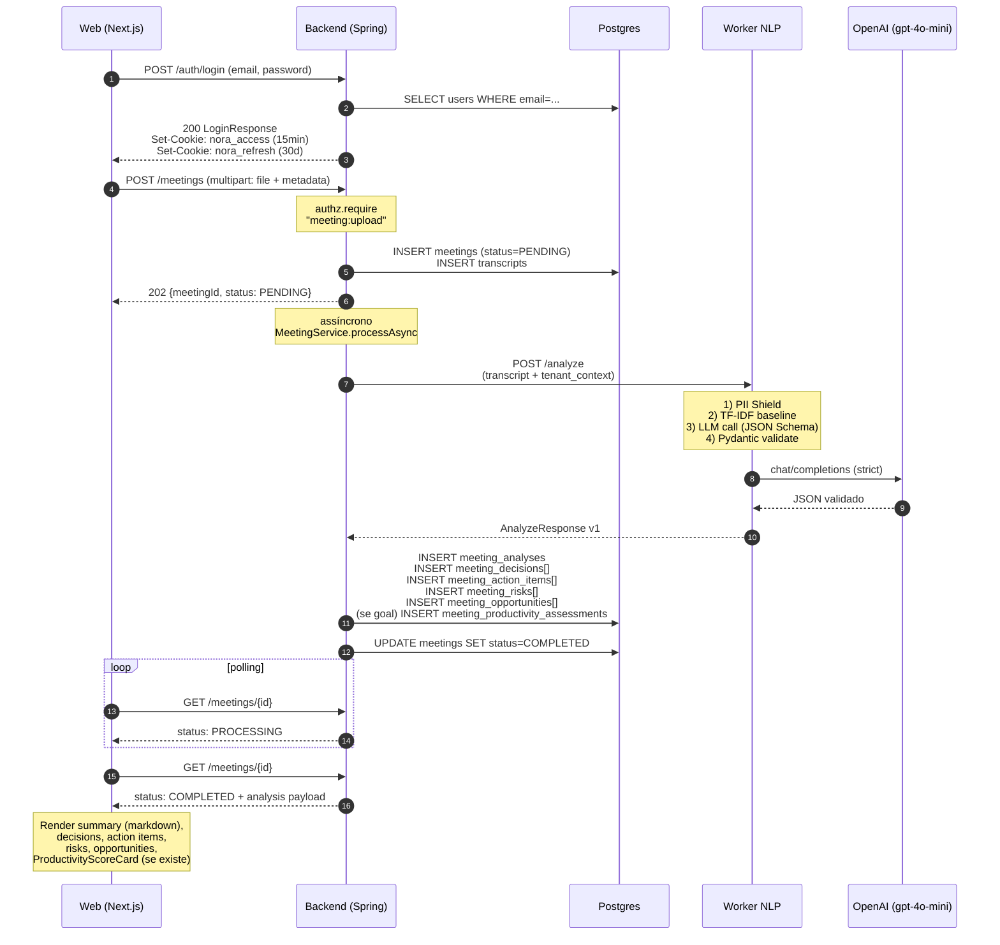

# Architecture — NORA

> End-to-end technical view of NORA: stack, layers, flows and the rationale behind the decisions.
> Every statement here is anchored in code (`path:line`), a Flyway migration or an ADR.
> When something is planned but not implemented, it is explicitly marked as such.

---

## §1. Stack overview

| Component | Version | Purpose | ADR / Source |
|---|---|---|---|
| **Backend** Java | 21 | Spring Boot 3.3.5 + DDD + JPA | `services/api/pom.xml:11,21` |
| Spring Boot | 3.3.5 | Backend framework | `services/api/pom.xml:11` |
| Flyway | inherited from Spring Boot | Versioned Postgres migrations | `services/api/pom.xml:60-66` |
| Postgres | 16 | Transactional, multi-tenant database | ADR 0002 |
| JJWT | 0.12.6 | JWT issuance and parsing | `services/api/pom.xml:80-95` |
| springdoc-openapi | 2.6.0 | Automatic OpenAPI spec generation | `services/api/pom.xml:73-76` |
| Bucket4j | 8.10.1 | Rate limiting (Speech Token Broker) | `services/api/pom.xml:112-116` |
| Testcontainers | 1.21.0 | Real Postgres integration in tests | `services/api/pom.xml:27,131` |
| WireMock | 3.9.1 | NLP worker stub in integration tests | `services/api/pom.xml:141-146` |
| **NLP Worker** Python | ≥3.12 | FastAPI + Pydantic + OpenAI | `services/nlp-worker/pyproject.toml:5` |
| FastAPI | ≥0.115 | Worker HTTP API | `services/nlp-worker/pyproject.toml:15` |
| Pydantic | ≥2.9 | Input/output schema validation | `services/nlp-worker/pyproject.toml:17` |
| OpenAI SDK | ≥1.50 | LLM client (provider agnostic) | `services/nlp-worker/pyproject.toml:20`, ADR 0004 |
| nlp-baseline | 0.1.0 (local path) | Reusable PT-BR TF-IDF package | `packages/nlp-baseline/`, ADR 0010 |
| scikit-learn | ≥1.4 | TF-IDF baseline | `packages/nlp-baseline/pyproject.toml:11` |
| **Web** Next.js | 14.2.15 | App Router + RSC | `apps/web/package.json:18` |
| React | 18.3.1 | UI | `apps/web/package.json:19-20` |
| TypeScript | ^5.6.3 | Strict typing on the frontend | `apps/web/package.json:39` |
| Tailwind CSS | ^3.4.13 | Styling. **No shadcn, no MUI** | `apps/web/package.json:38` |
| Monaco Editor (React) | ^4.7.0 | JSON editor for IAM policies | `apps/web/package.json:15` |
| react-markdown | ^10.1.0 | Rendering of the analysis `summary` | `apps/web/package.json:21-22` |
| **Desktop** Tauri | 2 | Native wrapper + audio capture | `apps/desktop/src-tauri/Cargo.toml:15`, ADR 0008 |
| Rust | edition 2021 | System-wide audio capture (WASAPI/CoreAudio) | `apps/desktop/src-tauri/Cargo.toml:6` |
| **Infra** Azure | — | Container Apps + Postgres Flexible + KV + Storage | `infra/bicep/main.bicep` |
| Bicep | — | Declarative IaC | `infra/bicep/*.bicep` |
| GitHub Actions | — | CI/CD (ci.yml + build-images.yml + deploy-infra.yml) | `.github/workflows/*.yml` |

Notes:

- The monorepo lives in `apps/`, `services/`, `packages/` and `infra/` (ADR 0001). The MCPs (calendar/tasks/crm) remain a deferred roadmap concept; there is no `mcp/` folder in the repository.
- Web runs on **raw Tailwind**: the editorial palette and tokens live in `apps/web/src/app/globals.css` and `apps/web/tailwind.config.ts`. There is no dependency on `@shadcn/ui`, MUI, Chakra or similar.
- The worker has three operating modes: `USE_LLM_STUB=true` (CI / dev without LLM), `LLM_BASE_URL=https://api.openai.com/v1` (MVP default, OpenAI directly) and Azure OpenAI (Enterprise).

---

## §2. Backend DDD layers

The backend follows 4 strict layers, organized under `services/api/src/main/java/br/com/nora/api/`:

```
domain/         <- regras puras, zero dependência de framework
application/    <- casos de uso, services, portas (interfaces)
infrastructure/ <- adapters: JPA, JJWT, HTTP clients, Azure SDK
api/            <- controllers REST, DTOs, exception handlers
```

### Inviolable rules

1. **`domain/` knows nothing about Spring, JPA, HTTP or any external SDK.** Only POJOs/records and business logic.
2. **`application/` orchestrates use cases** and depends only on ports (interfaces) declared in `application/ports/`.
3. **`infrastructure/` implements the ports** with JPA, JJWT, HTTP clients, Azure SDK, etc.
4. **`api/` contains only controllers, DTOs and mappers.** No business rules in a controller.

### Canonical examples

| Class | Layer | Why |
|---|---|---|
| `IamPolicy` (`domain/iam/IamPolicy.java`) | domain | Immutable record; pure validation logic |
| `PolicyEvaluator` (`domain/iam/PolicyEvaluator.java:35`) | domain | IAM algorithm (Deny-first, wildcards) with no external dependency |
| `AuthorizationService` (`application/iam/AuthorizationService.java:17`) | application | Orchestrates `UserRepository` + `IamRepository` (ports) |
| `MeetingService` (`application/meeting/MeetingService.java`) | application | Upload, listing, reprocessing via repos |
| `JjwtJwtIssuer` (`infrastructure/security/JjwtJwtIssuer.java`) | infrastructure | Implements `JwtIssuer` (port) with the JJWT library |
| `AzureSpeechTokenBroker` (`infrastructure/speech/AzureSpeechTokenBroker.java`) | infrastructure | HTTP adapter for Azure `/issueToken` |
| `MeetingsController` (`api/controllers/MeetingsController.java:64`) | api | Thin controller that delegates to `MeetingService` |

### Why DDD in strict layers

- **Pure testability in the domain:** `PolicyEvaluator` has 95.8% coverage (audit §12) because it does not require a Spring container.
- **Infrastructure substitutability:** swapping JJWT for another JWT provider is just implementing `JwtIssuer`. Same for LLM (ADR 0004) and Speech.
- **Predictable onboarding:** a new dev always finds the business rule in `application/` or `domain/`, never in `infrastructure/` or `api/`.

---

## §3. Multi-tenancy

Root decision: **ADR 0002 — application-level filter in the MVP, RLS in production.**

### `tenant_id` is a first-class piece of data

Every tenant-bound table carries `tenant_id UUID NOT NULL` (the schema goes up to `V021`; see `docs/engineering/data-model.md` as the canonical source). Verified in the migrations:

- `tenants` (V001) — source
- `users.tenant_id` (V002:10)
- `meetings.tenant_id` (V004:7)
- `transcripts.tenant_id` (V004:55)
- `meeting_analyses.tenant_id` (V005:30)
- `iam_*.tenant_id` (V006: 7 tables)
- `tenant_contexts.tenant_id UNIQUE` (V005:15)
- `iam_user_invitations.tenant_id` (V010:5)
- `refresh_tokens.tenant_id` (V011:6)
- `meeting_goals.tenant_id` (V012:6) and the remaining Productivity tables (V012)

### Where `tenant_id` is injected

The JWT issued by `JjwtJwtIssuer` carries `tenantId` in the claim. On every authenticated request:

1. `JwtAuthenticationFilter` validates the token and populates `CurrentUser` with `AuthenticatedPrincipal(userId, tenantId, ...)`.
2. Each controller obtains the principal via `CurrentUser.require()` (example: `MeetingsController.java:101`).
3. Every call to `MeetingService`, `AnalysisService`, `IamService` etc. receives `tenantId` explicitly; there is never a global lookup by `id`.
4. `AuthorizationService.isAllowed(userId, tenantId, action, resource)` (`application/iam/AuthorizationService.java:27`) injects the `tenantId` into `PolicyEvaluator`.

In SQL this becomes `WHERE tenant_id = :tenantId AND id = :id` — never just `WHERE id = :id`. Attempts to access outside the scope return 403 (or 404, depending on enumeration risk; see `GlobalExceptionHandler`).

### RLS — implemented in the schema (V016 + V019/V020)

ADR 0002 promised Row-Level Security in production. **Delivered in the schema in `V016__row_level_security.sql`** (it is no longer "pending debt"): `tenant_isolation` policies + `ENABLE ROW LEVEL SECURITY` on 10 tenant-owned tables (plus the 3 from V017: `customer_accounts`, `meeting_account_links`, `customer_confidence_assessments` → 13 in total), with the predicate `tenant_id = nora.current_tenant_id()` (which reads the session GUC `nora.current_tenant_id`). `V019`/`V020` complete the RLS coverage and make the scope auth-aware. `infrastructure/security/TenantRlsAspect` performs the `SET LOCAL` per `@Transactional`.

**Enforcement is opt-in:** the Postgres owner/admin bypasses RLS by default (dev/Testcontainers stay inert — tests untouched). In prod, enable it via the dedicated `nora_app` role (`NOBYPASSRLS`) + the flag `nora.security.rls.enforce=true`. It is defense in depth: even if a query forgets the `WHERE tenant_id`, RLS blocks it. What remains is the operational cutover/enforcement in production (runbook in ADR 0026/0028), not the schema. See `data-model.md §4`.

---

## §4. AWS-style IAM (ADR 0007)

A model identical to AWS IAM, chosen because it gives the Enterprise tenant the freedom to model their own org chart without waiting for the NORA roadmap.

### Topology

```
Tenant
├── Root user           — owner do tenant; bypass total em AuthorizationService
├── Users               — convidados via /iam/invitations (US06)
├── Groups              — coleções nomeadas; criadas livremente
├── Policies            — documentos JSON: Effect / Action / Resource [/ Condition]
├── Users ⇄ Groups       (N:N, `iam_user_groups`)
├── Groups ⇄ Policies    (N:N, `iam_group_policies`)
└── Users ⇄ Policies     (N:N, anexação direta opcional, `iam_user_policies`)
```

Root uniqueness guarantee: partial index `UNIQUE (tenant_id) WHERE is_root = TRUE` (V006:26-27).

### Evaluation algorithm (`PolicyEvaluator.java:35`)

1. **Root bypass** (`AuthorizationService.java:41`): if `users.isRoot(userId, tenantId)`, it returns `ALLOW` immediately.
2. **Collect applicable statements** (from the user itself + from all the groups it belongs to).
3. **Deny-first** (`PolicyEvaluator.java:91-93`): any `Deny` matching Action+Resource+Condition wins.
4. **At least one `Allow` matching** Action+Resource+Condition → returns `ALLOW`.
5. **Default deny** (line 96): if no `Allow` matched, returns `false`.

### Wildcards

- `*` matches zero-or-more characters
- `?` matches exactly one character

Applicable in `action` and `resource`. Example: `meeting:*` matches `meeting:read`, `meeting:upload`, `meeting:reprocess`, etc. Implementation: `PolicyEvaluator.matches` (lines 148-166), which converts the pattern into a regex using `Pattern.quote` for the remaining characters.

### Conditions — fail-closed

`PolicyEvaluator` (`matchesCondition`): **unsupported** operators make the statement **not match** (`return false`). This is fail-closed combined with Default Deny — a policy with an operator that is not implemented yet (e.g.: `StringNotEquals`) **denies access**, it does not escalate privilege. A missing attribute in the context is also fail-closed.

Supported operators: `StringEquals`, `StringIn`, `StringLike`, `DateGreaterThan`, `DateLessThan` (`SUPPORTED_CONDITION_OPERATORS` in `PolicyEvaluator.java`). They cover ~90% of real policies. `StringIn` matches against a list; `StringLike` uses the `*`/`?` wildcards; the date operators parse ISO-8601 (offset or plain date `yyyy-MM-dd`).

### Pre-check for list endpoints (`PolicyEvaluator.hasAnyAllow`, lines 53-71)

For `GET /meetings`, making one `isAllowed` call per item would be expensive. `requireAnyAllow` in `AuthorizationService:70` does a pre-check: is there at least one `Allow` for `meeting:read` ignoring conditions? If yes, it proceeds to fine-grained per-item filtering. If not, immediate 403.

### Deny-by-default for authorization (#51)

Authentication was already deny-by-default (`anyRequest().authenticated()` in `SecurityConfig`); authorization was not. An authenticated principal reached any handler that did not happen to check by hand, so a new controller method shipped ungated and nothing noticed.

`RequiresPermissionInterceptor` now **refuses** any handler of `br.com.nora.api.*` that declares neither `@RequiresPermission` nor `@AuthorizationNotRequired(reason = "…")`. The refusal is logged at ERROR naming the handler and answers `IAM_AUTHORIZATION_NOT_DECLARED` (403), distinct from the ordinary `IAM_FORBIDDEN`, so it reads as a coding mistake rather than a user problem. Framework handlers dispatched through the same `DispatcherServlet` (actuator, springdoc, the error controller) are outside that package and stay gated by `SecurityConfig` alone; the two control-plane controllers run on their own `SecurityFilterChain` behind a shared-token filter and carry a class-level opt-out.

`@AuthorizationNotRequired` demands a written reason — a blank one is treated as undeclared and denied. Three categories are legitimate: **public** endpoints listed in `PUBLIC_ENDPOINTS` (they carry their own credential or rate limit), **principal-scoped** endpoints that only ever touch the caller's own row (`/auth/me`, password change, logout-all, `/users/me`, `/chat/sessions/**`), and endpoints that **authorize in the method body** because the decision needs the resource's attributes, which the interceptor cannot see (it runs before the resource is loaded). That last boundary is load-bearing: a condition over an attribute missing from the context makes the statement not match, which is fail-closed for an Allow but silently drops a Deny — so those endpoints must not be "simplified" into the annotation.

List endpoints are not an opt-out: they combine `@RequiresPermission(anyAllow = true)` as the pre-gate with a per-item `AuthorizationService#filterAllowed` in the body. The strict path would build the literal ARN `…:task/*` and match the `*` as plain text on the resource side, so a Deny written against one specific id would never fire.

### Current action catalog

Exhaustive map extracted from the controllers (Grep in `services/api/src/main/java/br/com/nora/api/api/controllers/`):

| Resource | Actions |
|---|---|
| **meeting** | `meeting:upload`, `meeting:read`, `meeting:update`, `meeting:reprocess`, `meeting:analyze:live` |
| **iam (groups/policies/audit)** | `iam:group:read`, `iam:group:create`, `iam:group:delete`, `iam:group:add-member`, `iam:group:remove-member`, `iam:policy:read`, `iam:policy:create`, `iam:policy:update`, `iam:policy:delete`, `iam:attachment:create`, `iam:attachment:delete`, `iam:audit:read` |
| **iam (invitations)** | `iam:user:invite`, `iam:invite:read`, `iam:invite:revoke` |
| **tenant** | `tenant:read`, `tenant:name:write`, `tenant:domain:read`, `tenant:domain:write`, `tenant:context:read`, `tenant:context:write` |
| **task** | `task:read`, `task:write` |
| **workflow** (#51) | `workflow:read`, `workflow:write`, `workflow:test` |
| **integration** (#51) | `integration:read`, `integration:write` |
| **speech** (#51) | `speech:token:issue` |

`workflow:test` is deliberately separate from read and write: it executes the wired actions for real (e-mail, Slack, issue creation) against the tenant's integrations.

Canonical resource: `nora:tenant/{tenantId}:{recurso}/{instanceId|*}`. Examples:

- `nora:tenant/abc-123:meeting/xyz-987`
- `nora:tenant/abc-123:meeting/*` (list/upload)
- `nora:tenant/abc-123:iam/*` (all IAM operations)
- `nora:tenant/abc-123:workflow/{id|*}`
- `nora:tenant/abc-123:integration/*` (connections are keyed by provider name, not UUID)

**Onboarding impact:** there is no seeded default policy in NORA — the only principal with implicit access is the tenant **Root** (`users.is_root`, bypass in `AuthorizationService`), and every other member gets access strictly from policies attached to them. Root therefore keeps full access to Flows and Integrations after #51. A non-Root member whose policy does not cover the new action names (a `*` or `workflow:*` grant does) needs an explicit grant from the tenant admin — that is the point of the change: those endpoints previously had no authorization at all.

### Versioning and auditing

- `iam_policy_versions` (V006:89-99): immutable history of each edit (`PRIMARY KEY (policy_id, version)`)
- `iam_audit_events` (V006:138-150): every IAM operation records actor, action, target and JSONB payload

---

## §5. LLM pipeline

Meeting analysis flow — triggered when an upload arrives or via `POST /meetings/{id}/reprocess`.

```
┌──────────────┐    1. /analyze      ┌──────────────────┐
│   Backend    │ ──────────────────▶ │   Worker NLP     │
│  (Spring)    │ ◀────────────────── │   (FastAPI)      │
│              │    JSON validado    │                  │
└──────────────┘                     │  ┌────────────┐  │
                                     │  │ PII Shield │  │  1) regex BR
                                     │  └─────┬──────┘  │
                                     │        ▼         │
                                     │  ┌────────────┐  │
                                     │  │ nlp-baseline│ │  2) TF-IDF PT-BR
                                     │  │   TF-IDF   │  │
                                     │  └─────┬──────┘  │
                                     │        ▼         │
                                     │  ┌────────────┐  │
                                     │  │  LLM call  │  │  3) gpt-4o-mini
                                     │  │  (OpenAI)  │  │     + JSON Schema strict
                                     │  └─────┬──────┘  │
                                     │        ▼         │
                                     │  ┌────────────┐  │
                                     │  │  Pydantic  │  │  4) MeetingAnalysisV1
                                     │  │  validate  │  │
                                     │  └────────────┘  │
                                     └──────────────────┘
```

### Detailed steps

1. **PII Shield** (`services/nlp-worker/src/nora_nlp/services/pii_shield.py`): redacts email, phone, CPF, CNPJ, credit card and BR proper names before any external call. See §6.
2. **TF-IDF baseline** (`packages/nlp-baseline/src/nlp_baseline/`, ADR 0010): extracts the top-N terms from the text for academic interpretability and prompt enrichment.
3. **LLM call** (`services/nlp-worker/src/nora_nlp/services/llm_analyzer.py:117`): `analyze()` loads the versioned prompt from `prompts/{version}.md`, assembles system+user prompts, and calls the agnostic LLM client (`clients/llm.py`) with `response_format=json_schema` (strict mode — ADR 0003).
4. **Pydantic validation** (`models.py`, `MeetingAnalysisV1`): every field of the response goes through strict validation — score 0-100, enum bands, sizes, etc. A schema failure is a controlled error, not an exposed stack trace.

### Provider agnostic (ADR 0004)

Variables: `LLM_BASE_URL`, `LLM_API_KEY`, `LLM_MODEL`. MVP default: `https://api.openai.com/v1` + `gpt-4o-mini`. Enterprise/Azure OpenAI: point `LLM_BASE_URL` at the Azure endpoint and use the corresponding key from Key Vault. CI uses `USE_LLM_STUB=true` (zero cost, deterministic stub in `services/stub_analyzer.py`).

### Strict JSON Schema mandatory (ADR 0003)

The canonical schema lives in `docs/api/llm-schemas/meeting-analysis-v1.schema.json` and is mirrored in `models.py` (Pydantic) + transmitted to the LLM via `response_format`. A failure in strict mode falls back to `json_object` (line 7 of `llm_analyzer.py`). Free-form output never crosses a service boundary.

---

## §6. PII Shield (ADR 0012)

A deterministic pipeline that runs before any call to the LLM. Implementation in `services/nlp-worker/src/nora_nlp/services/pii_shield.py`.

### Covered types

| Type | Detection | Coverage |
|---|---|---|
| **EMAIL** | Regex `[a-zA-Z0-9._%+-]+@[a-zA-Z0-9.-]+\.[a-zA-Z]{2,}` | universal |
| **PHONE** | BR regex with area code (DDD) + optional +55 | BR |
| **CPF** | Formatted regex `\d{3}\.\d{3}\.\d{3}-\d{2}` | BR |
| **CNPJ** | Formatted regex `\d{2}\.\d{3}\.\d{3}/\d{4}-\d{2}` | BR |
| **CREDIT_CARD** | Regex 4×4 digits | universal |
| **PERSON_NAME** | 3 heuristics: formal prefixes (Sr./Dr./Profa.) + Title Case sequence + hardcoded list of ~270 BR names + negative list of ~80 terms (TOTVS, NORA, SAP, etc.) | BR (~80% coverage) |

**ADDRESS** is out of scope in the MVP (ADR 0012; known debt — audit §6).

### Redaction pipeline

Each match becomes a placeholder `[[TIPO_N]]` where N is the incremental index. Example:

```
Antes:   "O Lucas me mandou um e-mail (lucas@acme.com) com o CPF 123.456.789-00"
Depois:  "O [[PERSON_NAME_1]] me mandou um e-mail ([[EMAIL_1]]) com o CPF [[CPF_1]]"
```

The mapping `placeholder → hash(SHA-256, first 16 chars)` is kept in `PiiRedactionV1` for auditing without retaining the original value. The total number of redactions is recorded in `meeting_analyses.pii_redactions_applied` (V005:39).

### Why regex + a hardcoded list instead of NER

ADR 0012: the solution covers the MVP target market (Brazil/TOTVS) **well**, avoids the complexity of multi-language NER models and adds zero extra dependencies. Upgrade triggers are documented (first non-BR tenant; >5% non-pt-BR transcripts; a concrete bug report).

---

## §7. Speech Token Broker (ADR 0009)

Desktop needs to transcribe in real time with Azure Speech without exposing the subscription key. Solution: a **broker in the backend** that issues ephemeral tokens.

### Flow

```
Desktop (Tauri)         Backend NORA              Azure Speech
     |                       |                         |
     |-- POST /speech/token ▶|                         |
     |   Authorization:JWT   |-- POST /issueToken ▶   |
     |                       |   (AZURE_SPEECH_KEY     |
     |                       |    do Key Vault)        |
     |                       |◀-- token (~9-10 min)    |
     |◀--{token, region}-----|                         |
     |                       |                         |
     |--- SpeechConfig.from_authorization_token(...) ─▶|
     |                       |                         |
     |--- Audio Stream WebSocket ─────────────────────▶|
     |◀── partial / final transcription ──────────────│
```

### Implementation

- **Endpoint**: `SpeechController.issueToken` (`services/api/src/main/java/br/com/nora/api/api/controllers/SpeechController.java:24-32`), `POST /speech/token` authenticated by JWT.
- **Azure adapter**: `AzureSpeechTokenBroker` in `infrastructure/speech/` calls the Azure `/issueToken` endpoint using `AZURE_SPEECH_KEY` resolved via a Key Vault reference (`infra/bicep/`).
- **Rate limit**: Bucket4j 6 tokens/minute/user (audit §3, ADR 0009).
- **TTL**: ~9-10 min (controlled by Azure itself). Desktop renews every ~8 min in long sessions.

The subscription key **never** leaves the backend. If a Desktop is compromised, the blast radius is the ephemeral token (10 min).

---

## §8. Productivity Score (ADR 0005)

An **opt-in** feature enabled per meeting when the user declares a `MeetingGoal` before/after the upload.

### Modeling

- `meeting_goals` (V012:14-23): 1:1 with `meetings`. Fields: `purpose` (free text), `project_state_snapshot` (optional).
- `meeting_goal_expected_outcomes` (V012:28-37): ordered list of expected outcomes (N:1 with `meeting_goals`).
- `meeting_productivity_assessments` (V012:42-58): 1:1 with `meetings`. Result generated by the worker: `score` (0-100), `band` (`LOW`/`MEDIUM`/`HIGH`), `off_topic_ratio`, `decision_density`, `rationale`.
- `meeting_outcome_coverage` (V012:63-78): coverage per outcome (`ADDRESSED`/`PARTIAL`/`MISSED` + `evidence`).

### Behavior

- **Without a `MeetingGoal`**, the `productivity` field in the schema is `null` (`meeting-analysis-v1.schema.json`); nothing is persisted.
- **With a `MeetingGoal`**, the worker injects `purpose` + `expected_outcomes` into the prompt, and the LLM emits the `productivity` block validated by Pydantic.
- The UI renders `ProductivityScoreCard` (`apps/web/src/components/productivity-score-card.tsx`) only when the assessment exists.

### Mandatory disclaimer

The UI (and any future export) **must** display: *"Indicador da reunião, não dos participantes."* Reason: the score measures the meeting's adherence to the declared goal, not individual performance — the risk of punitive use is described in ADR 0005.

---

## §9. Customer Confidence (ADR 0006 + ADR 0015) — implemented full-stack (#148)

**Current status: IMPLEMENTED.** It was delivered in PR #148 (2026-05-21) via ADR 0015: LLM schema → worker emits → backend persists in the pipeline → read endpoint → UI. **Aggregated** Account Health (US50-51) remains deferred (ADR 0014).

### What exists today

- **Complete LLM schema** in `docs/api/llm-schemas/meeting-analysis-v1.schema.json:117-167`:
  - `score` (0-100), `band` (`LOW`/`MEDIUM`/`HIGH`)
  - `trend` (`IMPROVING`/`STABLE`/`DECLINING`, vs. the last assessment of the same account)
  - `buyingSignals[]` (with `type` enum: `BUDGET_DISCUSSED`, `TIMELINE_DISCUSSED`, `STAKEHOLDER_INVOLVED`, `NEXT_STEP_REQUESTED`, `REFERENCE_REQUESTED`, `PROPOSAL_REQUESTED`, `OTHER`)
  - `objections[]` (with `type` enum: `PRICE`, `TIMELINE`, `AUTHORITY`, `NEED`, `COMPETITOR_MENTION`, `TRUST`, `FEATURE_GAP`, `OTHER`)
  - `rationale`
- ADR 0006 accepted; the LLM already emits the block when the tenant is Enterprise (and the meeting is external).

### What exists now (post-PR #148, 2026-05-21)

- **Postgres tables (V017)**: `customer_accounts` (dedup by `LOWER(name)`), `meeting_account_links`, `customer_confidence_assessments`, `customer_buying_signals`, `customer_objections` — all tenant-owned with RLS (see `data-model.md §2.29-2.33`). `account_health_snapshots` remains **not migrated** (US50-51 deferred via ADR 0014).
- **The worker emits**: Pydantic `MeetingAnalysisV1.customer_confidence` (`models.py:252`) + stub + prompt + strict JSON Schema; it emits only in conversations with a customer/lead (internal meeting → `null`).
- **Persistence in the pipeline**: `AnalysisService.java:127` → `CustomerConfidenceService.persist` does a get-or-create of the account (case-insensitive dedup), an idempotent meeting↔account link, computes the **trend server-side** (comparing with the account's previous assessment, dead band ±5) and records the assessment + signals + objections. Scoped by tenant.
- **Endpoint**: `GET /meetings/{id}` (`MeetingsController:239` → `findViewByMeetingId`) expands `MeetingDetailResponse` with `customerConfidence` when present.
- **UI**: `CustomerConfidenceCard` rendered in `meetings/[id]/page.tsx:182`.

> **Stale comments (frozen):** the header of `V017__create_customer_confidence.sql` and the Javadoc of `CustomerConfidenceAssessment` were written in Slice 1 of #148 and still say "worker does not emit / no wiring". The one in the `.sql` is **intentionally untouched** (a migration is forward-only/immutable — `standards.md §6`); the reality is the wiring described above.

### Applied decision — ADR 0015 (accepted 2026-05-14, **applied in #148** 2026-05-21)

**ADR 0015 — Customer Confidence: minimum viable persistence** (partially supersedes ADR 0006). Stratfy (PO) block vote: **option (a)** — implement the minimum. Delivered in #148, with two divergences from the original plan:

- The migration was delivered as **V017** (the planned V013 slot was used by soft-delete in #114).
- It came in 1 PR (not in the planned dedicated branch `feat/sub-1.11-...`).

Aggregated Account Health (US50-US51) **remains deferred** via ADR 0014. Alternative (B) — removing Customer Health from the landing page — was rejected: demo credibility > effort saved. Details in `docs/adr/0015-customer-confidence-minimal-persistence.md`.

---

## §10. End-to-end flow "login → upload → analysis → result"



Step by step in words:

1. **Login** (`POST /auth/login`): authenticates the user, issues `nora_access` (JWT 15 min) and `nora_refresh` (UUID 30d, persisted in `refresh_tokens` — V011). Both cookies HttpOnly. See `AuthController.login`.
2. **Upload** (`POST /meetings`, multipart): accepts `.txt`, `.vtt`, `.srt` (`ALLOWED_FORMATS` in `MeetingsController.java:66`). Creates a `PENDING` meeting and triggers asynchronous processing.
3. **Backend → Worker** (`MeetingService.processAsync` → `AnalysisService.requestAnalysis`): assembles the `AnalyzeRequest` with transcript + tenant_context + options.
4. **Worker** (`/analyze`): PII Shield → TF-IDF baseline → strict LLM → Pydantic validate → returns `AnalyzeResponse`.
5. **Persistence**: the backend saves `meeting_analyses` + children (`meeting_decisions`, `meeting_action_items`, `meeting_risks`, `meeting_opportunities`) + optionally `meeting_productivity_assessments` + `meeting_outcome_coverage`. It updates `meetings.processing_status = COMPLETED`.
6. **Frontend polling**: the "Processando" card in `apps/web/src/app/(app)/meetings/[id]/page.tsx` polls every ~2s until `processing_status = COMPLETED`.
7. **Render**: the UI shows the summary (markdown via `react-markdown`), decisions, action items, risks/opportunities and, if present, `ProductivityScoreCard`.

---

## §11. Azure infrastructure

Provisioned via Bicep (`infra/bicep/main.bicep`) and deployed by `deploy-infra.yml` (Service Principal OIDC). Operational details (the eight Azure for Students pitfalls, recreation commands, troubleshooting) **live in `docs/operations/azure-deploy.md`** (to be written by the Tech Lead in parallel).

### Resource Group `rg-nora-dev` — current inventory

| Resource | Name / Endpoint | Type |
|---|---|---|
| Container Apps Env | `nora-cae-dev` | `Microsoft.App/managedEnvironments` |
| Container App | `nora-web-dev` | Public Next.js |
| Container App | `nora-api-dev` | Public Spring API |
| Container App | `nora-worker-dev` | FastAPI internal-only |
| Postgres Flexible | `nora-pg-dev-wgl3a3` | B1ms, central US |
| Key Vault | `nora-kv-dev-wgl3a3` | Standard |
| Storage Account | `norastdevwgl3a3mz` | Standard_LRS |
| Log Analytics | `nora-la-dev` | workspace-based |
| App Insights | `nora-ai-dev` | connected to LA |
| Speech | provisioned in PR #71 | `Microsoft.CognitiveServices` kind=`SpeechServices` |
| User-Assigned MI (×3) | api/worker/web | Federated with Service Principal OIDC |
| AI Search | **not used** (`enableSearch=false`) | semantic search (US15) was delivered via pgvector + an HTTP embedding client, not Azure AI Search (PR #206, `V021`) |

Service Principal: `sp-nora-github-deploy` (audit §7), with 3 federated credentials (main, pull_request, environment:dev). Roles: `Contributor` + `Role Based Access Control Administrator` on `rg-nora-dev`.

---

## §12. Stack rationale — why each choice

### Postgres 16 (vs MongoDB / Cosmos DB)

- Strong ACID is mandatory (multi-tenant + IAM with policy versioning).
- `tenant_id` per row + future RLS is simpler than resharding per collection.
- JSONB covers flexibility where it is needed (`iam_policies.document`, `tenant_contexts.document`, `meetings.attributes`) without switching databases.
- Already mastered by the team; there is no real need for schema-less.

### Spring Boot 3 (vs Quarkus / Micronaut)

- Enterprise maturity and a huge ecosystem (springdoc-openapi, Bucket4j, Testcontainers integration, JJWT).
- Team familiar with Java/Spring; zero learning curve.
- DDD in strict layers works well in the Spring pattern (thin controllers + services + repositories).
- First-class support for OIDC, OAuth2, Bean validation.

### Flyway (vs Liquibase)

- Native SQL, without intermediate XML/YAML. Migrations are reviewable and versionable SQL.
- The `V001__nome.sql` convention is obvious to any dev who opens the repo.
- Spring Boot starts Flyway automatically; zero setup.

### Next.js 14 (vs Nuxt / Remix / SvelteKit)

- Mature App Router; RSC (React Server Components) reduces JS on the client.
- First-class TypeScript.
- Huge React ecosystem (Monaco editor, react-markdown).
- SSR/RSC fits well with the "data-heavy, interaction-light dashboard" model.

### Raw Tailwind (vs shadcn / MUI / Chakra)

- **Total control of the visual identity**: NORA's OKLCH editorial palette, typography (Inter + Instrument Serif + JetBrains Mono) and Enterprise density need to be unique. Off-the-shelf libraries constrain that.
- Smaller bundle: no `@radix-ui`, no external theming engine.
- Tokens declared in `tailwind.config.ts` + CSS vars in `globals.css`. A visual refactor is a surgical diff.
- Cost: every component is handmade. Mitigated by the simple desktop sidecar and a UI focused on few flows.

### Tauri 2 (vs Electron)

- Binary ~10× smaller (no embedded Node runtime).
- System-wide audio capture done in Rust (`system_audio.rs` in `apps/desktop/src-tauri/`) with WASAPI on Windows, CoreAudio/BlackHole on macOS.
- The Python sidecar (ADR 0008) runs the Azure Speech client locally for low latency; NDJSON protocol between Rust and Python.
- Typed IPC between the frontend (web view) and the Rust backend via Tauri commands.

### OpenAI SDK directly (vs LangChain / LlamaIndex)

- Explicit control of the contract (versioned prompt + strict JSON Schema — ADR 0003).
- LangChain would add an abstraction layer that buys nothing for a 1-call pipeline (PII → TF-IDF → LLM → validate).
- ADR 0004 keeps the provider agnostic via env vars; switching to Azure OpenAI or another Chat Completions-compatible endpoint is just changing `LLM_BASE_URL`.

---

## §13. Security hardening delivered (audit follow-ups, post-1.10)

A hardening wave (PRs ~#114–#138, labeled "audit follow-up #N") landed in `main` after Sub-phase 1.10. Documented retroactively in **ADR 0019** (RLS + composite FK), **ADR 0020** (token rotation) and **ADR 0021** (soft-delete):

- **Postgres RLS (V016)** — see §3. Schema-level ready; enforce opt-in (`nora_app` + flag).
- **Soft-delete (V013)** — `deleted_at` + `@SQLRestriction` in `tenants/users/tenant_contexts/meetings`; UNIQUEs became partial. Hard-delete for LGPD/retention is already operational (ADR 0029): `DELETE /privacy/meetings/{id}` (right to be forgotten) + a scheduled `RetentionSweeper`.
- **Refresh-token rotation + reuse-detection (V014)** — `refresh_tokens.family_id`/`replaced_by_id`; every `/auth/refresh` rotates; presenting a revoked token revokes the entire family.
- **Composite isolation FK (V015)** — `meetings.(tenant_id, owner_user_id) → users(tenant_id, id)`: blocks a forged owner from another tenant at the schema level (defense in depth for ADR 0002).
- **JWT RS256 + JWKS** — asymmetric signature; public key exposed at `GET /.well-known/jwks.json` (RSA mode).
- **Expanded auth audit log** — login/refresh/logout events beyond `iam_audit_events` (which was IAM-only).
- **App Insights Java agent** — instrumentation wired in `services/api/Dockerfile`.
- **Upload hardening** — magic-byte/extension/path-traversal checking in `MeetingsController` before persisting the transcript.

## Next architectural refactors

Catalogued technical debt, prioritization and planned successor ADRs live in **`docs/operations/production-readiness-gaps.md`** (written in Sub-phase 1.10; implementation is tackled in Sub-phase 1.12 — Production Hardening, formalized via ADR 0016). Summary of the main ones (state as of 2026-05-21):

- **AUTH_FILTER_HARD_CAP**: **resolved** (Sub-phase 1.11b) — the silent cap of `500` was removed; `MeetingService.listAllForAuthFilter` scans all the tenant's meetings in batches before the in-memory IAM filter. SQL pushdown via `meeting_attributes @>` + GIN (V008) remains a future **performance** optimization (not a fix), for when some tenant reaches that scale.
- **PolicyEvaluator** operators: **resolved** (Sub-phase 1.11c) — `SUPPORTED_CONDITION_OPERATORS` now covers `StringEquals`, `StringIn`, `StringLike`, `DateGreaterThan`, `DateLessThan` (fail-closed kept for unknown operators and missing attributes).
- **Postgres RLS**: **delivered in the schema (V016 + V019/V020)** — only the operational cutover/enforcement in prod is missing (role `nora_app` + flag; runbook in ADR 0026/0028). See §3/§13.
- **`tenant_contexts.version`** (US31): column missing; no version history for the context. Target Sub-phase 1.12.
- **Global `audit_events`** (not just IAM): auth already has its own log (§13); what is missing is consolidating MEETING_UPLOAD, CONTEXT_UPDATE into a single trail. Target Sub-phase 1.12.
- **Customer Confidence**: **implemented full-stack** (PR #148, 2026-05-21) — V017 + worker emit + `AnalysisService` wiring (server-side trend) + `GET /meetings/{id}` + `CustomerConfidenceCard`. Narrative debt resolved. **Aggregated** Account Health (US50-51) remains deferred (ADR 0014). See `docs/adr/0015-customer-confidence-minimal-persistence.md`.
- **Hardening ADRs**: documented retroactively in ADR 0019 (RLS + composite FK), 0020 (refresh-token rotation), 0021 (soft-delete). What remains is evaluating an ADR for JWT RS256/JWKS (candidate).
