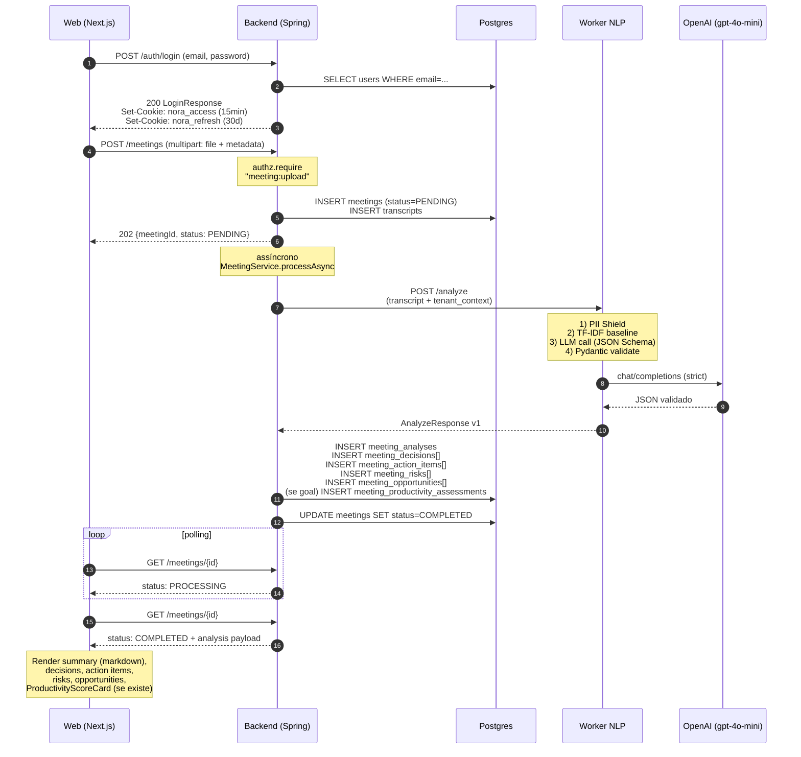

# Arquitetura — NORA

> Visão técnica end-to-end da NORA: stack, camadas, fluxos e racional das decisões.
> Cada afirmação aqui está ancorada em código (`path:linha`), migração Flyway ou ADR.
> Quando algo está planejado mas não implementado, está marcado explicitamente.

---

## §1. Visão geral da stack

| Componente | Versão | Propósito | ADR / Origem |
|---|---|---|---|
| **Backend** Java | 21 | Spring Boot 3.3.5 + DDD + JPA | `services/api/pom.xml:11,21` |
| Spring Boot | 3.3.5 | Framework do backend | `services/api/pom.xml:11` |
| Flyway | herdada do Spring Boot | Migrações versionadas Postgres | `services/api/pom.xml:60-66` |
| Postgres | 16 | Banco transacional, multi-tenant | ADR 0002 |
| JJWT | 0.12.6 | Emissão e parsing de JWT | `services/api/pom.xml:80-95` |
| springdoc-openapi | 2.6.0 | Geração automática de spec OpenAPI | `services/api/pom.xml:73-76` |
| Bucket4j | 8.10.1 | Rate limiting (Speech Token Broker) | `services/api/pom.xml:112-116` |
| Testcontainers | 1.21.0 | Integração Postgres real nos testes | `services/api/pom.xml:27,131` |
| WireMock | 3.9.1 | Stub do worker NLP em integration tests | `services/api/pom.xml:141-146` |
| **Worker NLP** Python | ≥3.12 | FastAPI + Pydantic + OpenAI | `services/nlp-worker/pyproject.toml:5` |
| FastAPI | ≥0.115 | API HTTP do worker | `services/nlp-worker/pyproject.toml:15` |
| Pydantic | ≥2.9 | Validação de schemas de entrada/saída | `services/nlp-worker/pyproject.toml:17` |
| OpenAI SDK | ≥1.50 | Cliente LLM (provider agnóstico) | `services/nlp-worker/pyproject.toml:20`, ADR 0004 |
| nlp-baseline | 0.1.0 (path local) | Package TF-IDF PT-BR reaproveitável | `packages/nlp-baseline/`, ADR 0010 |
| scikit-learn | ≥1.4 | TF-IDF baseline | `packages/nlp-baseline/pyproject.toml:11` |
| **Web** Next.js | 14.2.15 | App Router + RSC | `apps/web/package.json:18` |
| React | 18.3.1 | UI | `apps/web/package.json:19-20` |
| TypeScript | ^5.6.3 | Tipagem estrita no frontend | `apps/web/package.json:39` |
| Tailwind CSS | ^3.4.13 | Estilos. **Sem shadcn, sem MUI** | `apps/web/package.json:38` |
| Monaco Editor (React) | ^4.7.0 | Editor JSON para policies IAM | `apps/web/package.json:15` |
| react-markdown | ^10.1.0 | Render do `summary` da análise | `apps/web/package.json:21-22` |
| **Desktop** Tauri | 2 | Wrapper nativo + captura áudio | `apps/desktop/src-tauri/Cargo.toml:15`, ADR 0008 |
| Rust | edition 2021 | Captura sistêmica de áudio (WASAPI/CoreAudio) | `apps/desktop/src-tauri/Cargo.toml:6` |
| **Infra** Azure | — | Container Apps + Postgres Flexible + KV + Storage | `infra/bicep/main.bicep` |
| Bicep | — | IaC declarativa | `infra/bicep/*.bicep` |
| GitHub Actions | — | CI/CD (ci.yml + build-images.yml + deploy-infra.yml) | `.github/workflows/*.yml` |

Notas:

- O monorepo vive em `apps/`, `services/`, `packages/`, `infra/`, `mcp/` (ADR 0001).
- Web roda em **Tailwind cru**: a paleta editorial e tokens estão em `apps/web/src/app/globals.css` e `apps/web/tailwind.config.ts`. Não há dependência de `@shadcn/ui`, MUI, Chakra ou similar.
- Worker tem três modos de operação: `USE_LLM_STUB=true` (CI / dev sem LLM), `LLM_BASE_URL=https://api.openai.com/v1` (default MVP, OpenAI direto) e Azure OpenAI (Enterprise).

---

## §2. Camadas DDD do backend

O backend segue 4 camadas estritas, organizadas em `services/api/src/main/java/br/com/nora/api/`:

```
domain/         <- regras puras, zero dependência de framework
application/    <- casos de uso, services, portas (interfaces)
infrastructure/ <- adapters: JPA, JJWT, HTTP clients, Azure SDK
api/            <- controllers REST, DTOs, exception handlers
```

### Regras invioláveis

1. **`domain/` não conhece Spring, JPA, HTTP nem nenhum SDK externo.** Apenas POJOs/records e lógica de negócio.
2. **`application/` orquestra casos de uso** e depende apenas de portas (interfaces) declaradas em `application/ports/`.
3. **`infrastructure/` implementa as portas** com JPA, JJWT, clients HTTP, Azure SDK etc.
4. **`api/` contém apenas controllers, DTOs e mappers.** Nenhuma regra de negócio em controller.

### Exemplos canônicos

| Classe | Camada | Por quê |
|---|---|---|
| `IamPolicy` (`domain/iam/IamPolicy.java`) | domain | Record imutável; lógica pura de validação |
| `PolicyEvaluator` (`domain/iam/PolicyEvaluator.java:35`) | domain | Algoritmo IAM (Deny-first, wildcards) sem dependência externa |
| `AuthorizationService` (`application/iam/AuthorizationService.java:17`) | application | Orquestra `UserRepository` + `IamRepository` (portas) |
| `MeetingService` (`application/meeting/MeetingService.java`) | application | Upload, listagem, reprocessamento via repos |
| `JjwtJwtIssuer` (`infrastructure/security/JjwtJwtIssuer.java`) | infrastructure | Implementa `JwtIssuer` (porta) com a lib JJWT |
| `AzureSpeechTokenBroker` (`infrastructure/speech/AzureSpeechTokenBroker.java`) | infrastructure | Adapter HTTP para `/issueToken` Azure |
| `MeetingsController` (`api/controllers/MeetingsController.java:64`) | api | Thin controller que delega a `MeetingService` |

### Por que DDD em camadas estritas

- **Testabilidade pura no domínio:** `PolicyEvaluator` tem 95.8% de cobertura (audit §12) porque não exige container Spring.
- **Substituibilidade da infra:** trocar JJWT por outro provider de JWT é só implementar `JwtIssuer`. Idem para LLM (ADR 0004) e Speech.
- **Onboarding previsível:** dev novo encontra a regra de negócio sempre em `application/` ou `domain/`, nunca em `infrastructure/` ou `api/`.

---

## §3. Multi-tenancy

Decisão raiz: **ADR 0002 — filtro de aplicação no MVP, RLS em produção.**

### `tenant_id` é dado de primeira classe

Toda tabela tenant-bound carrega `tenant_id UUID NOT NULL` (V001–V012). Conferido nas migrations:

- `tenants` (V001) — fonte
- `users.tenant_id` (V002:10)
- `meetings.tenant_id` (V004:7)
- `transcripts.tenant_id` (V004:55)
- `meeting_analyses.tenant_id` (V005:30)
- `iam_*.tenant_id` (V006: 7 tabelas)
- `tenant_contexts.tenant_id UNIQUE` (V005:15)
- `iam_user_invitations.tenant_id` (V010:5)
- `refresh_tokens.tenant_id` (V011:6)
- `meeting_goals.tenant_id` (V012:6) e demais tabelas de Productivity (V012)

### Onde o `tenant_id` é injetado

O JWT emitido em `JjwtJwtIssuer` carrega `tenantId` no claim. Em cada request autenticado:

1. `JwtAuthenticationFilter` valida o token e popula `CurrentUser` com `AuthenticatedPrincipal(userId, tenantId, ...)`.
2. Cada controller obtém o principal via `CurrentUser.require()` (exemplo: `MeetingsController.java:101`).
3. Toda chamada a `MeetingService`, `AnalysisService`, `IamService` etc. recebe `tenantId` explicitamente; nunca há lookup global por `id`.
4. `AuthorizationService.isAllowed(userId, tenantId, action, resource)` (`application/iam/AuthorizationService.java:27`) injeta o `tenantId` no `PolicyEvaluator`.

Em SQL, isso vira `WHERE tenant_id = :tenantId AND id = :id` — nunca apenas `WHERE id = :id`. Tentativas de acesso fora do escopo retornam 403 (ou 404, conforme risco de enumeração; ver `GlobalExceptionHandler`).

### RLS — implementado no schema (V016)

ADR 0002 prometia Row-Level Security em produção. **Entregue no schema em `V016__row_level_security.sql`** (não é mais "débito pendente"): policies `tenant_isolation` + `ENABLE ROW LEVEL SECURITY` em 10 tabelas tenant-owned (mais as 3 de V017: `customer_accounts`, `meeting_account_links`, `customer_confidence_assessments` → 13 no total), predicado `tenant_id = nora.current_tenant_id()` (lê o GUC de sessão `nora.current_tenant_id`). O `infrastructure/security/TenantRlsAspect` faz `SET LOCAL` por `@Transactional`.

**Enforcement é opt-in:** owner/admin Postgres bypassa RLS por default (dev/Testcontainers ficam inertes — testes intocados). Em prod, ativar via role dedicado `nora_app` (`NOBYPASSRLS`) + flag `nora.security.rls.enforce=true`. É defesa em profundidade: mesmo que uma query esqueça o `WHERE tenant_id`, o RLS bloqueia. Ver `data-model.md §4`.

---

## §4. IAM AWS-style (ADR 0007)

Modelo idêntico ao AWS IAM, escolhido por dar liberdade ao tenant Enterprise para modelar seu próprio org chart sem esperar roadmap NORA.

### Topologia

```
Tenant
├── Root user           — owner do tenant; bypass total em AuthorizationService
├── Users               — convidados via /iam/invitations (US06)
├── Groups              — coleções nomeadas; criadas livremente
├── Policies            — documentos JSON: Effect / Action / Resource [/ Condition]
├── Users ⇄ Groups       (N:N, `iam_user_groups`)
├── Groups ⇄ Policies    (N:N, `iam_group_policies`)
└── Users ⇄ Policies     (N:N, anexação direta opcional, `iam_user_policies`)
```

Garantia de unicidade do Root: índice parcial `UNIQUE (tenant_id) WHERE is_root = TRUE` (V006:26-27).

### Algoritmo de avaliação (`PolicyEvaluator.java:35`)

1. **Root bypass** (`AuthorizationService.java:41`): se `users.isRoot(userId, tenantId)`, retorna `ALLOW` imediatamente.
2. **Coletar statements** aplicáveis (do próprio user + de todos os groups em que está).
3. **Deny-first** (`PolicyEvaluator.java:91-93`): qualquer `Deny` que case Action+Resource+Condition vence.
4. **Pelo menos um `Allow` casando** Action+Resource+Condition → retorna `ALLOW`.
5. **Default deny** (linha 96): se nenhum `Allow` casou, retorna `false`.

### Wildcards

- `*` casa zero-ou-mais caracteres
- `?` casa exatamente um caractere

Aplicáveis em `action` e `resource`. Exemplo: `meeting:*` casa `meeting:read`, `meeting:upload`, `meeting:reprocess` etc. Implementação: `PolicyEvaluator.matches` (linhas 148-166), que converte o pattern em regex com `Pattern.quote` nos demais caracteres.

### Conditions — fail-closed

`PolicyEvaluator` (`matchesCondition`): operadores **não suportados** fazem o statement **não casar** (`return false`). Isso é fail-closed combinado com Default Deny — uma policy com operador ainda não implementado (ex.: `StringNotEquals`) **nega acesso**, não escala privilégio. Atributo ausente no contexto também é fail-closed.

Operadores suportados: `StringEquals`, `StringIn`, `StringLike`, `DateGreaterThan`, `DateLessThan` (`SUPPORTED_CONDITION_OPERATORS` em `PolicyEvaluator.java`). Cobrem ~90% das policies reais. `StringIn` casa contra lista; `StringLike` usa wildcards `*`/`?`; os operadores de data parseiam ISO-8601 (offset ou data simples `yyyy-MM-dd`).

### Pré-check de list-endpoints (`PolicyEvaluator.hasAnyAllow`, linhas 53-71)

Para `GET /meetings`, fazer uma chamada `isAllowed` por item seria caro. O `requireAnyAllow` em `AuthorizationService:70` faz pré-check: existe pelo menos um `Allow` para `meeting:read` ignorando conditions? Se sim, segue para filtragem fina por item. Se não, 403 imediato.

### Catálogo de actions atual

Mapa exaustivo extraído dos controllers (Grep em `services/api/src/main/java/br/com/nora/api/api/controllers/`):

| Recurso | Actions |
|---|---|
| **meeting** | `meeting:upload`, `meeting:read`, `meeting:update`, `meeting:reprocess`, `meeting:analyze:live` |
| **iam (groups/policies/audit)** | `iam:group:read`, `iam:group:create`, `iam:group:delete`, `iam:group:add-member`, `iam:group:remove-member`, `iam:policy:read`, `iam:policy:create`, `iam:policy:update`, `iam:policy:delete`, `iam:attachment:create`, `iam:attachment:delete`, `iam:audit:read` |
| **iam (invitations)** | `iam:user:invite`, `iam:invite:read`, `iam:invite:revoke` |
| **tenant** | `tenant:domain:read`, `tenant:domain:write` |
| **task** | `task:read`, `task:write` |

Resource canônico: `nora:tenant/{tenantId}:{recurso}/{instanceId|*}`. Exemplos:

- `nora:tenant/abc-123:meeting/xyz-987`
- `nora:tenant/abc-123:meeting/*` (list/upload)
- `nora:tenant/abc-123:iam/*` (todas operações IAM)

### Versionamento e auditoria

- `iam_policy_versions` (V006:89-99): histórico imutável de cada edição (`PRIMARY KEY (policy_id, version)`)
- `iam_audit_events` (V006:138-150): toda operação IAM grava actor, action, target e payload JSONB

---

## §5. LLM pipeline

Fluxo de análise de reunião — disparado quando um upload chega ou via `POST /meetings/{id}/reprocess`.

```
┌──────────────┐    1. /analyze      ┌──────────────────┐
│   Backend    │ ──────────────────▶ │   Worker NLP     │
│  (Spring)    │ ◀────────────────── │   (FastAPI)      │
│              │    JSON validado    │                  │
└──────────────┘                     │  ┌────────────┐  │
                                     │  │ PII Shield │  │  1) regex BR
                                     │  └─────┬──────┘  │
                                     │        ▼         │
                                     │  ┌────────────┐  │
                                     │  │ nlp-baseline│ │  2) TF-IDF PT-BR
                                     │  │   TF-IDF   │  │
                                     │  └─────┬──────┘  │
                                     │        ▼         │
                                     │  ┌────────────┐  │
                                     │  │  LLM call  │  │  3) gpt-4o-mini
                                     │  │  (OpenAI)  │  │     + JSON Schema strict
                                     │  └─────┬──────┘  │
                                     │        ▼         │
                                     │  ┌────────────┐  │
                                     │  │  Pydantic  │  │  4) MeetingAnalysisV1
                                     │  │  validate  │  │
                                     │  └────────────┘  │
                                     └──────────────────┘
```

### Steps detalhados

1. **PII Shield** (`services/nlp-worker/src/nora_nlp/services/pii_shield.py`): redige email, phone, CPF, CNPJ, cartão e nomes próprios BR antes de qualquer chamada externa. Ver §6.
2. **TF-IDF baseline** (`packages/nlp-baseline/src/nlp_baseline/`, ADR 0010): extrai termos top-N do texto pra interpretabilidade acadêmica e enriquecimento do prompt.
3. **LLM call** (`services/nlp-worker/src/nora_nlp/services/llm_analyzer.py:117`): `analyze()` carrega prompt versionado de `prompts/{version}.md`, monta system+user prompts, chama o cliente LLM agnóstico (`clients/llm.py`) com `response_format=json_schema` (modo strict — ADR 0003).
4. **Validação Pydantic** (`models.py`, `MeetingAnalysisV1`): cada campo da resposta passa por validação estrita — score 0-100, enum bands, tamanhos, etc. Falha de schema é erro controlado, não stack trace exposto.

### Provider agnóstico (ADR 0004)

Variáveis: `LLM_BASE_URL`, `LLM_API_KEY`, `LLM_MODEL`. Default MVP: `https://api.openai.com/v1` + `gpt-4o-mini`. Enterprise/Azure OpenAI: aponta `LLM_BASE_URL` para o endpoint Azure e usa a key correspondente do Key Vault. CI usa `USE_LLM_STUB=true` (zero custo, stub determinístico em `services/stub_analyzer.py`).

### JSON Schema strict obrigatório (ADR 0003)

O schema canônico fica em `docs/api/llm-schemas/meeting-analysis-v1.schema.json` e é espelhado em `models.py` (Pydantic) + transmitido ao LLM via `response_format`. Falha no modo strict cai em fallback `json_object` (linha 7 do `llm_analyzer.py`). Saída livre nunca cruza fronteira de serviço.

---

## §6. PII Shield (ADR 0012)

Pipeline determinístico antes de qualquer chamada ao LLM. Implementação em `services/nlp-worker/src/nora_nlp/services/pii_shield.py`.

### Tipos cobertos

| Tipo | Detecção | Cobertura |
|---|---|---|
| **EMAIL** | Regex `[a-zA-Z0-9._%+-]+@[a-zA-Z0-9.-]+\.[a-zA-Z]{2,}` | universal |
| **PHONE** | Regex BR com DDD + opção +55 | BR |
| **CPF** | Regex `\d{3}\.\d{3}\.\d{3}-\d{2}` formatado | BR |
| **CNPJ** | Regex `\d{2}\.\d{3}\.\d{3}/\d{4}-\d{2}` formatado | BR |
| **CREDIT_CARD** | Regex 4×4 dígitos | universal |
| **PERSON_NAME** | 3 heurísticas: prefixos formais (Sr./Dr./Profa.) + Title Case sequence + lista hardcoded ~270 nomes BR + negative list ~80 termos (TOTVS, NORA, SAP, etc.) | BR (~80% cobertura) |

**ADDRESS** está fora de escopo no MVP (ADR 0012; débito conhecido — audit §6).

### Pipeline de redação

Cada match vira um placeholder `[[TIPO_N]]` onde N é o índice incremental. Exemplo:

```
Antes:   "O Lucas me mandou um e-mail (lucas@acme.com) com o CPF 123.456.789-00"
Depois:  "O [[PERSON_NAME_1]] me mandou um e-mail ([[EMAIL_1]]) com o CPF [[CPF_1]]"
```

Mapeamento `placeholder → hash(SHA-256, primeiros 16 chars)` fica em `PiiRedactionV1` para auditoria sem reter o valor original. O número total de redações é gravado em `meeting_analyses.pii_redactions_applied` (V005:39).

### Por que regex + lista hardcoded em vez de NER

ADR 0012: a solução cobre **bem** o mercado-alvo MVP (Brasil/TOTVS), evita a complexidade de modelos NER multi-idioma e zero dependência extra. Triggers de upgrade documentados (primeiro tenant não-BR; >5% transcrições não-pt-BR; bug report concreto).

---

## §7. Speech Token Broker (ADR 0009)

Desktop precisa transcrever em tempo real com Azure Speech sem expor a subscription key. Solução: **broker no backend** que emite tokens efêmeros.

### Fluxo

```
Desktop (Tauri)         Backend NORA              Azure Speech
     |                       |                         |
     |-- POST /speech/token ▶|                         |
     |   Authorization:JWT   |-- POST /issueToken ▶   |
     |                       |   (AZURE_SPEECH_KEY     |
     |                       |    do Key Vault)        |
     |                       |◀-- token (~9-10 min)    |
     |◀--{token, region}-----|                         |
     |                       |                         |
     |--- SpeechConfig.from_authorization_token(...) ─▶|
     |                       |                         |
     |--- Audio Stream WebSocket ─────────────────────▶|
     |◀── partial / final transcription ──────────────│
```

### Implementação

- **Endpoint**: `SpeechController.issueToken` (`services/api/src/main/java/br/com/nora/api/api/controllers/SpeechController.java:24-32`), `POST /speech/token` autenticado por JWT.
- **Adapter Azure**: `AzureSpeechTokenBroker` em `infrastructure/speech/` chama o endpoint `/issueToken` Azure usando `AZURE_SPEECH_KEY` resolvida via Key Vault reference (`infra/bicep/`).
- **Rate limit**: Bucket4j 6 tokens/minuto/usuário (audit §3, ADR 0009).
- **TTL**: ~9-10 min (controlado pelo próprio Azure). Desktop renova a cada ~8 min em sessões longas.

A subscription key **nunca** sai do backend. Em caso de comprometimento de um Desktop, o blast radius é o token efêmero (10 min).

---

## §8. Productivity Score (ADR 0005)

Feature **opt-in** ativada por reunião quando o usuário declara um `MeetingGoal` antes/depois do upload.

### Modelagem

- `meeting_goals` (V012:14-23): 1:1 com `meetings`. Campos: `purpose` (texto livre), `project_state_snapshot` (opcional).
- `meeting_goal_expected_outcomes` (V012:28-37): lista ordenada de outcomes esperados (N:1 com `meeting_goals`).
- `meeting_productivity_assessments` (V012:42-58): 1:1 com `meetings`. Resultado gerado pelo worker: `score` (0-100), `band` (`LOW`/`MEDIUM`/`HIGH`), `off_topic_ratio`, `decision_density`, `rationale`.
- `meeting_outcome_coverage` (V012:63-78): cobertura por outcome (`ADDRESSED`/`PARTIAL`/`MISSED` + `evidence`).

### Comportamento

- **Sem `MeetingGoal`**, o campo `productivity` no schema é `null` (`meeting-analysis-v1.schema.json`); nada é persistido.
- **Com `MeetingGoal`**, o worker injeta `purpose` + `expected_outcomes` no prompt, e o LLM emite o bloco `productivity` validado por Pydantic.
- A UI renderiza `ProductivityScoreCard` (`apps/web/src/components/productivity-score-card.tsx`) apenas quando o assessment existe.

### Disclaimer obrigatório

A UI (e qualquer export futuro) **deve** exibir: *"Indicador da reunião, não dos participantes."* Razão: o score mede aderência da reunião ao objetivo declarado, não desempenho individual — risco de uso punitivo descritivo no ADR 0005.

---

## §9. Customer Confidence (ADR 0006 + ADR 0015) — implementado full-stack (#148)

**Status atual: IMPLEMENTADO.** Shipou em PR #148 (2026-05-21) via ADR 0015: schema LLM → worker emite → backend persiste no pipeline → endpoint read → UI. Account Health **agregado** (US50-51) segue deferido (ADR 0014).

### O que existe hoje

- **Schema LLM completo** em `docs/api/llm-schemas/meeting-analysis-v1.schema.json:117-167`:
  - `score` (0-100), `band` (`LOW`/`MEDIUM`/`HIGH`)
  - `trend` (`IMPROVING`/`STABLE`/`DECLINING`, vs. última avaliação da mesma conta)
  - `buyingSignals[]` (com `type` enum: `BUDGET_DISCUSSED`, `TIMELINE_DISCUSSED`, `STAKEHOLDER_INVOLVED`, `NEXT_STEP_REQUESTED`, `REFERENCE_REQUESTED`, `PROPOSAL_REQUESTED`, `OTHER`)
  - `objections[]` (com `type` enum: `PRICE`, `TIMELINE`, `AUTHORITY`, `NEED`, `COMPETITOR_MENTION`, `TRUST`, `FEATURE_GAP`, `OTHER`)
  - `rationale`
- ADR 0006 aceito; o LLM já emite o bloco quando o tenant é Enterprise (e a reunião é externa).

### O que existe agora (pós-PR #148, 2026-05-21)

- **Tabelas Postgres (V017)**: `customer_accounts` (dedup por `LOWER(name)`), `meeting_account_links`, `customer_confidence_assessments`, `customer_buying_signals`, `customer_objections` — todas tenant-owned com RLS (ver `data-model.md §2.29-2.33`). `account_health_snapshots` segue **não migrada** (US50-51 deferida via ADR 0014).
- **Worker emite**: Pydantic `MeetingAnalysisV1.customer_confidence` (`models.py:252`) + stub + prompt + JSON Schema strict; emite só em conversas com cliente/lead (reunião interna → `null`).
- **Persistência no pipeline**: `AnalysisService.java:127` → `CustomerConfidenceService.persist` faz get-or-create da conta (dedup case-insensitive), link idempotente reunião↔conta, calcula **trend server-side** (compara com a avaliação anterior da conta, banda morta ±5) e grava assessment + signals + objections. Escopado por tenant.
- **Endpoint**: `GET /meetings/{id}` (`MeetingsController:239` → `findViewByMeetingId`) expande `MeetingDetailResponse` com `customerConfidence` quando presente.
- **UI**: `CustomerConfidenceCard` renderizado em `meetings/[id]/page.tsx:182`.

> **Comentários stale (frozen):** o header de `V017__create_customer_confidence.sql` e o Javadoc de `CustomerConfidenceAssessment` foram escritos no Slice 1 do #148 e ainda dizem "worker não emite / sem wiring". O do `.sql` é **intencionalmente intocado** (migration é forward-only/imutável — `standards.md §6`); a realidade é o wiring acima.

### Decisão aplicada — ADR 0015 (aceito 2026-05-14, **aplicado em #148** 2026-05-21)

**ADR 0015 — Customer Confidence: persistência mínima viável** (substitui parcialmente ADR 0006). Voto Stratfy (PO) em bloco: **opção (a)** — implementar mínimo. Entregue em #148, com duas divergências do plano original:

- A migration shipou como **V017** (o slot V013 planejado foi usado por soft-delete em #114).
- Veio em 1 PR (não na branch dedicada `feat/sub-1.11-...` planejada).

Account Health agregado (US50-US51) **continua deferido** via ADR 0014. Alternativa (B) — remover Customer Health da landing — foi rejeitada: credibilidade da demo > esforço economizado. Detalhes em `docs/adr/0015-customer-confidence-minimal-persistence.md`.

---

## §10. Fluxo end-to-end "login → upload → análise → resultado"



Passo a passo verbal:

1. **Login** (`POST /auth/login`): autentica usuário, emite `nora_access` (JWT 15 min) e `nora_refresh` (UUID 30d, persistido em `refresh_tokens` — V011). Ambos cookies HttpOnly. Ver `AuthController.login`.
2. **Upload** (`POST /meetings`, multipart): aceita `.txt`, `.vtt`, `.srt` (`ALLOWED_FORMATS` em `MeetingsController.java:66`). Cria meeting `PENDING` e dispara processamento assíncrono.
3. **Backend → Worker** (`MeetingService.processAsync` → `AnalysisService.requestAnalysis`): monta `AnalyzeRequest` com transcript + tenant_context + opções.
4. **Worker** (`/analyze`): PII Shield → TF-IDF baseline → LLM strict → Pydantic validate → retorna `AnalyzeResponse`.
5. **Persistência**: backend salva `meeting_analyses` + filhos (`meeting_decisions`, `meeting_action_items`, `meeting_risks`, `meeting_opportunities`) + opcionalmente `meeting_productivity_assessments` + `meeting_outcome_coverage`. Atualiza `meetings.processing_status = COMPLETED`.
6. **Polling do frontend**: o card "Processando" em `apps/web/src/app/(app)/meetings/[id]/page.tsx` faz polling a cada ~2s até `processing_status = COMPLETED`.
7. **Render**: UI mostra summary (markdown via `react-markdown`), decisions, action items, risks/opportunities e, se presente, `ProductivityScoreCard`.

---

## §11. Infra Azure

Provisionada via Bicep (`infra/bicep/main.bicep`) e deployada por `deploy-infra.yml` (Service Principal OIDC). Detalhes operacionais (oito pegadinhas Azure for Students, comandos de recriação, troubleshooting) **vivem em `docs/operations/azure-deploy.md`** (a ser escrito pelo Tech Lead em paralelo).

### Resource Group `rg-nora-dev` — inventário atual

| Recurso | Nome / Endpoint | Tipo |
|---|---|---|
| Container Apps Env | `nora-cae-dev` | `Microsoft.App/managedEnvironments` |
| Container App | `nora-web-dev` | Next.js público |
| Container App | `nora-api-dev` | Spring API público |
| Container App | `nora-worker-dev` | FastAPI internal-only |
| Postgres Flexible | `nora-pg-dev-wgl3a3` | B1ms, central US |
| Key Vault | `nora-kv-dev-wgl3a3` | Standard |
| Storage Account | `norastdevwgl3a3mz` | Standard_LRS |
| Log Analytics | `nora-la-dev` | workspace-based |
| App Insights | `nora-ai-dev` | conectado ao LA |
| Speech | provisionado em PR #71 | `Microsoft.CognitiveServices` kind=`SpeechServices` |
| User-Assigned MI (×3) | api/worker/web | Federada com Service Principal OIDC |
| AI Search | **desabilitado** (`enableSearch=false`) | provisionar quando US15 for ligado |

Service Principal: `sp-nora-github-deploy` (audit §7), com 3 federated credentials (main, pull_request, environment:dev). Roles: `Contributor` + `Role Based Access Control Administrator` em `rg-nora-dev`.

---

## §12. Stack rationale — por que cada escolha

### Postgres 16 (vs MongoDB / Cosmos DB)

- ACID forte é mandatório (multi-tenant + IAM com versionamento de policy).
- `tenant_id` por linha + RLS futuro é mais simples que reshard por collection.
- JSONB cobre flexibilidade onde precisa (`iam_policies.document`, `tenant_contexts.document`, `meetings.attributes`) sem trocar de banco.
- Já dominado pelo time; não há necessidade real de schema-less.

### Spring Boot 3 (vs Quarkus / Micronaut)

- Maturidade enterprise e ecossistema enorme (springdoc-openapi, Bucket4j, Testcontainers integration, JJWT).
- Time familiar com Java/Spring; curva de aprendizado zero.
- DDD em camadas estritas funciona bem no padrão Spring (controllers thin + services + repositories).
- Suporte first-class a OIDC, OAuth2, validação Bean.

### Flyway (vs Liquibase)

- SQL nativo, sem XML/YAML intermediário. Migrations são SQL revisável e versionável.
- Convenção `V001__nome.sql` é óbvia para qualquer dev que abrir o repo.
- Spring Boot inicia Flyway automaticamente; zero setup.

### Next.js 14 (vs Nuxt / Remix / SvelteKit)

- App Router maduro; RSC (React Server Components) reduz JS no cliente.
- TypeScript first-class.
- Ecossistema React enorme (Monaco editor, react-markdown).
- SSR/RSC se encaixa bem com o modelo "dashboard pesado em dados, leve em interação".

### Tailwind cru (vs shadcn / MUI / Chakra)

- **Controle total da identidade visual**: a paleta editorial OKLCH, tipografia (Inter + Instrument Serif + JetBrains Mono) e densidade Enterprise da NORA precisam ser únicos. Libs prontas engessam.
- Bundle menor: sem `@radix-ui`, sem theming engine externo.
- Tokens declarados em `tailwind.config.ts` + CSS vars em `globals.css`. Refactor visual é diff cirúrgico.
- Custo: cada componente é feito à mão. Mitigado pelo desktop sidecar simples e UI focada em poucos fluxos.

### Tauri 2 (vs Electron)

- Binário ~10× menor (sem runtime Node embarcado).
- Captura de áudio sistêmica feita em Rust (`system_audio.rs` no `apps/desktop/src-tauri/`) com WASAPI no Windows, CoreAudio/BlackHole no macOS.
- Sidecar Python (ADR 0008) roda o cliente Azure Speech localmente para baixa latência; protocolo NDJSON entre Rust e Python.
- IPC tipado entre frontend (web view) e backend Rust via Tauri commands.

### OpenAI SDK direto (vs LangChain / LlamaIndex)

- Controle explícito do contrato (prompt versionado + JSON Schema strict — ADR 0003).
- LangChain adicionaria camada de abstração que não compra nada para um pipeline de 1 chamada (PII → TF-IDF → LLM → validate).
- ADR 0004 mantém provider agnóstico via env vars; trocar para Azure OpenAI ou outro endpoint compatível Chat Completions é só mudar `LLM_BASE_URL`.

---

## §13. Hardening de segurança entregue (audit follow-ups, pós-1.10)

Uma onda de hardening (PRs ~#114–#138, rotulados "audit follow-up #N") entrou em `main` após a Sub-fase 1.10. Documentada retroativamente em **ADR 0019** (RLS + FK composta), **ADR 0020** (token rotation) e **ADR 0021** (soft-delete):

- **RLS Postgres (V016)** — ver §3. Schema-level pronto; enforce opt-in (`nora_app` + flag).
- **Soft-delete (V013)** — `deleted_at` + `@SQLRestriction` em `tenants/users/tenant_contexts/meetings`; UNIQUEs viraram parciais. Hard-delete fica para LGPD/retenção.
- **Refresh-token rotation + reuse-detection (V014)** — `refresh_tokens.family_id`/`replaced_by_id`; cada `/auth/refresh` rotaciona; apresentar token revogado revoga a family inteira.
- **Composite FK de isolamento (V015)** — `meetings.(tenant_id, owner_user_id) → users(tenant_id, id)`: bloqueia owner forjado de outro tenant no nível do schema (defesa em profundidade do ADR 0002).
- **JWT RS256 + JWKS** — assinatura assimétrica; chave pública exposta em `GET /.well-known/jwks.json` (modo RSA).
- **Audit log de auth expandido** — eventos de login/refresh/logout além do `iam_audit_events` (que era IAM-only).
- **App Insights Java agent** — instrumentação wired no `services/api/Dockerfile`.
- **Upload hardening** — checagem de magic-byte/extensão/path-traversal em `MeetingsController` antes de persistir transcript.

## Próximos refactors arquiteturais

Débitos técnicos catalogados, priorização e ADRs sucessores planejados ficam em **`docs/operations/production-readiness-gaps.md`** (escrito na Sub-fase 1.10; implementação ataca-se na Sub-fase 1.12 — Production Hardening, formalizada via ADR 0016). Resumo dos principais (estado em 2026-05-21):

- **AUTH_FILTER_HARD_CAP**: ✅ **resolvido** (Sub-fase 1.11b) — teto silencioso de `500` removido; `MeetingService.listAllForAuthFilter` varre todas as meetings do tenant em lotes antes do filtro IAM in-memory. Pushdown SQL via `meeting_attributes @>` + GIN (V008) fica como otimização **de performance** futura (não correção), quando algum tenant atingir escala.
- **PolicyEvaluator** operadores: ✅ **resolvido** (Sub-fase 1.11c) — `SUPPORTED_CONDITION_OPERATORS` agora cobre `StringEquals`, `StringIn`, `StringLike`, `DateGreaterThan`, `DateLessThan` (fail-closed mantido para operador desconhecido e atributo ausente).
- **RLS Postgres**: ✅ **entregue no schema (V016)** — falta só ativar enforcement em prod (role `nora_app` + flag). Ver §3/§13.
- **`tenant_contexts.version`** (US31): coluna ausente; sem histórico de versão do contexto. Alvo Sub-fase 1.12.
- **`audit_events` global** (não só IAM): auth já tem log próprio (§13); falta consolidar MEETING_UPLOAD, CONTEXT_UPDATE numa trilha única. Alvo Sub-fase 1.12.
- **Customer Confidence**: ✅ **implementado full-stack** (PR #148, 2026-05-21) — V017 + worker emit + `AnalysisService` wiring (trend server-side) + `GET /meetings/{id}` + `CustomerConfidenceCard`. Dívida narrativa resolvida. Account Health **agregado** (US50-51) segue deferido (ADR 0014). Ver `docs/adr/0015-customer-confidence-minimal-persistence.md`.
- **ADRs do hardening**: documentados retroativamente em ADR 0019 (RLS + FK composta), 0020 (refresh-token rotation), 0021 (soft-delete). Resta avaliar ADR para JWT RS256/JWKS (candidato).
