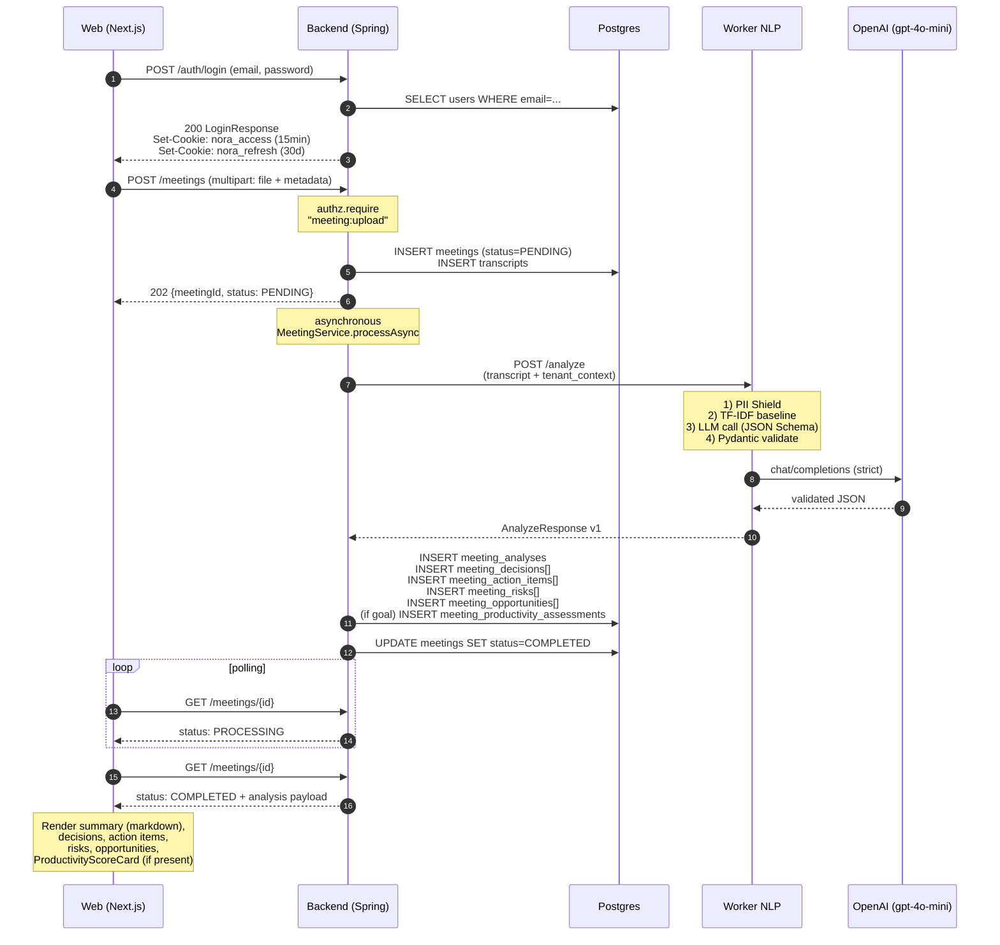

# Architecture — NORA

> End-to-end technical view of NORA: stack, layers, flows and the rationale behind the decisions.
> Every statement here is anchored in code (`path:line`), a Flyway migration or an ADR.
> When something is planned but not implemented, it is explicitly marked as such.

## §1. Stack overview

Each row was read from the file cited beside it, on 2026-08-17, at commit `4017bb4`.

| Component | Version | Purpose | ADR / Source |
|---|---|---|---|
| **Backend** Java | 21 | Spring Boot + DDD + JPA | `services/api/pom.xml:21` |
| Spring Boot | 3.5.16 | Backend framework | `services/api/pom.xml:10` |
| Flyway | inherited from Spring Boot | Versioned Postgres migrations (V001–V027, plus the control plane's own line — §6) | `services/api/pom.xml:59-66` |
| Postgres | 16 | Transactional, multi-tenant database | ADR 0002, `infra/host/docker-compose.yml:152` |
| JJWT | 0.13.0 | JWT issuance and parsing | `services/api/pom.xml:79-95` |
| springdoc-openapi | 2.9.0 | Automatic OpenAPI spec generation | `services/api/pom.xml:72-76` |
| Bucket4j | 8.10.1 | Rate limiting. `AuthRateLimiter` (login/signup/reset) is its only consumer | `services/api/pom.xml:112-116` |
| Testcontainers | 1.21.4 | Real Postgres integration in tests | `services/api/pom.xml:27,142-152` |
| WireMock | 3.13.2 | NLP worker stub in integration tests | `services/api/pom.xml:154-158` |
| **NLP Worker** Python | ≥3.12 | FastAPI + Pydantic + OpenAI | `services/nlp-worker/pyproject.toml:5` |
| FastAPI | ≥0.115 | Worker HTTP API | `services/nlp-worker/pyproject.toml:15` |
| Pydantic | ≥2.9 | Input/output schema validation | `services/nlp-worker/pyproject.toml:17` |
| OpenAI SDK | ≥1.50 | LLM client (provider agnostic) | `services/nlp-worker/pyproject.toml:20`, ADR 0004 |
| nlp-baseline | 0.1.0 (local path) | Reusable PT-BR TF-IDF package | `packages/nlp-baseline/`, ADR 0010 |
| scikit-learn | ≥1.4 | TF-IDF baseline | `packages/nlp-baseline/pyproject.toml:11` |
| **Web** Next.js | 16.3.0 | App Router + RSC. Also the BFF (§8, §14) | `apps/web/package.json:24` |
| React | 18.3.1 | UI | `apps/web/package.json:25-26` |
| TypeScript | ^5.6.3 | Strict typing on the frontend | `apps/web/package.json:45` |
| Tailwind CSS | ^3.4.13 | Styling. **No shadcn, no MUI** | `apps/web/package.json:44` |
| Monaco Editor (React) | ^4.7.0 | JSON editor for IAM policies | `apps/web/package.json:17` |
| React Flow (`@xyflow/react`) | ^12.11.3 | Graph engine of the Flows canvas (§13) | `apps/web/package.json:21`, ADR 0032 |
| react-markdown | ^10.1.0 | Rendering of the analysis `summary` | `apps/web/package.json:27` |
| **Operator console** Next.js | 16.3.0 | `apps/admin`: model catalog + AI cost telemetry (§6) | `apps/admin/package.json:15`, ADR 0023/0024/0025 |
| **Desktop** Tauri | 2 | Native wrapper + audio capture | `apps/desktop/src-tauri/Cargo.toml:71`, ADR 0008 |
| Rust | edition 2021 | System-wide audio capture via WASAPI loopback. Windows-only | `apps/desktop/src-tauri/Cargo.toml:6`, ADR 0038 §2 |
| whisper-rs | =0.16.0 | In-process transcription — **still in the tree, already superseded** (§14) | `apps/desktop/src-tauri/Cargo.toml:68`, ADR 0035 → ADR 0039 |
| **Infra** Self-hosted | — | Single bare-metal Ubuntu host, no hypervisor, Docker Compose | `infra/host/docker-compose.yml`, ADR 0034/0036 |
| GitHub Actions | — | CI/CD (ci.yml + build-images.yml + deploy-host.yml) | `.github/workflows/*.yml` |

Notes:

- The monorepo lives in `apps/`, `services/`, `packages/` and `infra/` (ADR 0001). There is still no `mcp/` folder and no line of MCP code: ADR 0041 decided that NORA will expose an MCP server as an **inbound** adapter inside `services/api` — not a separate process — and that decision has not been built. What did ship is the **outbound** direction, NORA acting on nine external providers through OAuth integrations (§12, ADR 0031). The two are different protocols; conflating them is what made a delivered subsystem look unstarted.
- Web runs on **raw Tailwind**: the editorial palette and tokens live in `apps/web/src/app/globals.css` and `apps/web/tailwind.config.ts`. There is no dependency on `@shadcn/ui`, MUI, Chakra or similar. React Flow (§13) is the single exception ADR 0032 argued for, and it is a graph-interaction engine, not a component library.
- The worker has two operating modes: `USE_LLM_STUB=true` (CI / dev without an LLM) and any endpoint compatible with OpenAI's Chat Completions API via `LLM_BASE_URL`, default `https://api.openai.com/v1` with `gpt-4o-mini` (`services/nlp-worker/src/nora_nlp/settings.py:34-40`, ADR 0004). The third mode this note used to list — Azure OpenAI for Enterprise — went with the subscription (ADR 0034, ADR 0036). The runtime override that replaced static provider choice is the control plane's per-service binding (§6), and the worker does **not** read it.

## §2. Backend DDD layers

The backend follows 4 strict layers, organized under `services/api/src/main/java/br/com/nora/api/`:

```
domain/         <- pure rules, zero framework dependency
application/    <- use cases, services, ports (interfaces)
infrastructure/ <- adapters: JPA, JJWT, HTTP clients (worker, embeddings, OAuth providers)
api/            <- controllers REST, DTOs, exception handlers
```

### Inviolable rules

1. **`domain/` knows nothing about Spring, JPA, HTTP or any external SDK.** Only POJOs/records and business logic.
2. **`application/` orchestrates use cases** and depends only on ports (interfaces) declared in `application/ports/`.
3. **`infrastructure/` implements the ports** with JPA, JJWT, HTTP clients, ciphers, etc.
4. **`api/` contains only controllers, DTOs and mappers.** No business rules in a controller.

### Canonical examples

| Class | Layer | Why |
|---|---|---|
| `IamPolicy` (`domain/iam/IamPolicy.java`) | domain | Immutable record; pure validation logic |
| `PolicyEvaluator` (`domain/iam/PolicyEvaluator.java:35`) | domain | IAM algorithm (Deny-first, wildcards) with no external dependency |
| `AuthorizationService` (`application/iam/AuthorizationService.java:17`) | application | Orchestrates `UserRepository` + `IamRepository` (ports) |
| `MeetingService` (`application/meeting/MeetingService.java`) | application | Upload, listing, reprocessing via repos |
| `JjwtJwtIssuer` (`infrastructure/security/JjwtJwtIssuer.java`) | infrastructure | Implements `JwtIssuer` (port) with the JJWT library |
| `MeetingsController` (`api/controllers/MeetingsController.java:64`) | api | Thin controller that delegates to `MeetingService` |

### Why DDD in strict layers

- **Pure testability in the domain:** `PolicyEvaluator` is at 96.3% instruction / 86.0% branch coverage (measured 2026-08-17 by `scripts/report-coverage.sh` in the `api` job) because it does not require a Spring container.
- **Infrastructure substitutability:** swapping JJWT for another JWT provider is just implementing `JwtIssuer`. Same for the LLM (ADR 0004).
- **Predictable onboarding:** a new dev always finds the business rule in `application/` or `domain/`, never in `infrastructure/` or `api/`.

## §3. Multi-tenancy

Root decision: **ADR 0002 — application-level filter in the MVP, RLS in production.**

### `tenant_id` is a first-class piece of data

Every tenant-bound table carries `tenant_id UUID NOT NULL` (the schema goes up to `V027`; see `docs/engineering/data-model.md` as the canonical source). Verified in the migrations:

- `tenants` (V001) — source
- `users.tenant_id` (V002:10)
- `meetings.tenant_id` (V004:7)
- `transcripts.tenant_id` (V004:55)
- `meeting_analyses.tenant_id` (V005:30)
- `iam_*.tenant_id` (V006: 7 tables)
- `tenant_contexts.tenant_id UNIQUE` (V005:15)
- `iam_user_invitations.tenant_id` (V010:5)
- `refresh_tokens.tenant_id` (V011:6)
- `meeting_goals.tenant_id` (V012:6) and the remaining Productivity tables (V012)

### Where `tenant_id` is injected

The JWT issued by `JjwtJwtIssuer` carries `tenantId` in the claim. On every authenticated request:

1. `JwtAuthenticationFilter` validates the token and populates `CurrentUser` with `AuthenticatedPrincipal(userId, tenantId, ...)`.
2. Each controller obtains the principal via `CurrentUser.require()` (example: `MeetingsController.java:101`).
3. Every call to `MeetingService`, `AnalysisService`, `IamService` etc. receives `tenantId` explicitly; there is never a global lookup by `id`.
4. `AuthorizationService.isAllowed(userId, tenantId, action, resource)` (`application/iam/AuthorizationService.java:27`) injects the `tenantId` into `PolicyEvaluator`.

In SQL this becomes `WHERE tenant_id = :tenantId AND id = :id` — never just `WHERE id = :id`. Attempts to access outside the scope return 403 (or 404, depending on enumeration risk; see `GlobalExceptionHandler`).

### RLS — implemented in the schema (V016 + V019/V020)

ADR 0002 promised Row-Level Security in production. **Delivered in the schema in `V016__row_level_security.sql`** (it is no longer "pending debt"): `tenant_isolation` policies + `ENABLE ROW LEVEL SECURITY` on 10 tenant-owned tables (plus the 3 from V017: `customer_accounts`, `meeting_account_links`, `customer_confidence_assessments` → 13 in total), with the predicate `tenant_id = nora.current_tenant_id()` (which reads the session GUC `nora.current_tenant_id`). `V019`/`V020` complete the RLS coverage and make the scope auth-aware. Since then, **every tenant-owned table ships its policy in the same migration that creates it** — `meeting_embeddings` (V021, §8), `chat_session`/`chat_message` (V022), `workflows`/`workflow_executions` (V023, §11) and `integration_connections` (V024, §12) all carry `ENABLE ROW LEVEL SECURITY` + `tenant_isolation` inline. `infrastructure/security/TenantRlsAspect` performs the `SET LOCAL` per `@Transactional`.

**Enforcement is opt-in in the repository, and on where it is deployed.** By default the Postgres owner/admin bypasses RLS, so dev and Testcontainers stay inert and tests are untouched. Enforcement is the dedicated `nora_app` role (`NOBYPASSRLS`) plus the flag `nora.security.rls.enforce=true`, and it has been **on for the deployed stack since 2026-08-10** — the operator aggregate reads through a separate `nora_telemetry` role (`BYPASSRLS`) and `RlsEnforceTelemetryGuard` refuses to boot on a half-applied cutover (ADR 0028). It is defense in depth: even if a query forgets the `WHERE tenant_id`, RLS blocks it. What is still deferred is flipping the **repository** default, and only that (ADR 0038 §6g), because flipping it makes every local checkout provision three roles before the application will start. Runbook in ADR 0026/0028; see `data-model.md §4`.

## §4. AWS-style IAM (ADR 0007)

A model identical to AWS IAM, chosen because it gives the Enterprise tenant the freedom to model their own org chart without waiting for the NORA roadmap.

### Topology

```
Tenant
├── Root user           — tenant owner; full bypass in AuthorizationService
├── Users               — invited via /iam/invitations (US06)
├── Groups              — named collections; created freely
├── Policies            — JSON documents: Effect / Action / Resource [/ Condition]
├── Users ⇄ Groups       (N:N, `iam_user_groups`)
├── Groups ⇄ Policies    (N:N, `iam_group_policies`)
└── Users ⇄ Policies     (N:N, optional direct attachment, `iam_user_policies`)
```

Root uniqueness guarantee: partial index `UNIQUE (tenant_id) WHERE is_root = TRUE` (V006:26-27).

### Evaluation algorithm (`PolicyEvaluator.java:35`)

1. **Root bypass** (`AuthorizationService.java:41`): if `users.isRoot(userId, tenantId)`, it returns `ALLOW` immediately.
2. **Collect applicable statements** (from the user itself + from all the groups it belongs to).
3. **Deny-first** (`PolicyEvaluator.java:91-93`): any `Deny` matching Action+Resource+Condition wins.
4. **At least one `Allow` matching** Action+Resource+Condition → returns `ALLOW`.
5. **Default deny** (line 96): if no `Allow` matched, returns `false`.

### Wildcards

- `*` matches zero-or-more characters
- `?` matches exactly one character

Applicable in `action` and `resource`. Example: `meeting:*` matches `meeting:read`, `meeting:upload`, `meeting:reprocess`, etc. Implementation: `PolicyEvaluator.matches` (lines 148-166), which converts the pattern into a regex using `Pattern.quote` for the remaining characters.

### Conditions — fail-closed

`PolicyEvaluator` (`matchesCondition`): **unsupported** operators make the statement **not match** (`return false`). This is fail-closed combined with Default Deny — a policy with an operator that is not implemented yet (e.g.: `StringNotEquals`) **denies access**, it does not escalate privilege. A missing attribute in the context is also fail-closed.

Supported operators: `StringEquals`, `StringIn`, `StringLike`, `DateGreaterThan`, `DateLessThan` (`SUPPORTED_CONDITION_OPERATORS` in `PolicyEvaluator.java`). They cover ~90% of real policies. `StringIn` matches against a list; `StringLike` uses the `*`/`?` wildcards; the date operators parse ISO-8601 (offset or plain date `yyyy-MM-dd`).

### Pre-check for list endpoints (`PolicyEvaluator.hasAnyAllow`, lines 53-71)

For `GET /meetings`, making one `isAllowed` call per item would be expensive. `requireAnyAllow` in `AuthorizationService:70` does a pre-check: is there at least one `Allow` for `meeting:read` ignoring conditions? If yes, it proceeds to fine-grained per-item filtering. If not, immediate 403.

### Deny-by-default for authorization (#51)

Authentication was already deny-by-default (`anyRequest().authenticated()` in `SecurityConfig`); authorization was not. An authenticated principal reached any handler that did not happen to check by hand, so a new controller method shipped ungated and nothing noticed.

`RequiresPermissionInterceptor` now **refuses** any handler of `br.com.nora.api.*` that declares neither `@RequiresPermission` nor `@AuthorizationNotRequired(reason = "…")`. The refusal is logged at ERROR naming the handler and answers `IAM_AUTHORIZATION_NOT_DECLARED` (403), distinct from the ordinary `IAM_FORBIDDEN`, so it reads as a coding mistake rather than a user problem. Framework handlers dispatched through the same `DispatcherServlet` (actuator, springdoc, the error controller) are outside that package and stay gated by `SecurityConfig` alone; the two control-plane controllers run on their own `SecurityFilterChain` behind a shared-token filter and carry a class-level opt-out.

`@AuthorizationNotRequired` demands a written reason — a blank one is treated as undeclared and denied. Three categories are legitimate: **public** endpoints listed in `PUBLIC_ENDPOINTS` (they carry their own credential or rate limit), **principal-scoped** endpoints that only ever touch the caller's own row (`/auth/me`, password change, logout-all, `/users/me`, `/chat/sessions/**`), and endpoints that **authorize in the method body** because the decision needs the resource's attributes, which the interceptor cannot see (it runs before the resource is loaded). That last boundary is load-bearing: a condition over an attribute missing from the context makes the statement not match, which is fail-closed for an Allow but silently drops a Deny — so those endpoints must not be "simplified" into the annotation.

List endpoints are not an opt-out: they combine `@RequiresPermission(anyAllow = true)` as the pre-gate with a per-item `AuthorizationService#filterAllowed` in the body. The strict path would build the literal ARN `…:task/*` and match the `*` as plain text on the resource side, so a Deny written against one specific id would never fire.

### Current action catalog

Exhaustive map extracted from the controllers (Grep in `services/api/src/main/java/br/com/nora/api/api/controllers/`):

| Resource | Actions |
|---|---|
| **meeting** | `meeting:upload`, `meeting:read`, `meeting:update`, `meeting:reprocess`, `meeting:analyze:live` |
| **iam (groups/policies/audit)** | `iam:group:read`, `iam:group:create`, `iam:group:delete`, `iam:group:add-member`, `iam:group:remove-member`, `iam:policy:read`, `iam:policy:create`, `iam:policy:update`, `iam:policy:delete`, `iam:attachment:create`, `iam:attachment:delete`, `iam:audit:read` |
| **iam (invitations)** | `iam:user:invite`, `iam:invite:read`, `iam:invite:revoke` |
| **tenant** | `tenant:read`, `tenant:name:write`, `tenant:domain:read`, `tenant:domain:write`, `tenant:context:read`, `tenant:context:write` |
| **task** | `task:read`, `task:write` |
| **workflow** (#51) | `workflow:read`, `workflow:write`, `workflow:test` |
| **integration** (#51) | `integration:read`, `integration:write` |

`workflow:test` is deliberately separate from read and write: it executes the wired actions for real (e-mail, Slack, issue creation) against the tenant's integrations.

Canonical resource: `nora:tenant/{tenantId}:{recurso}/{instanceId|*}`. Examples:

- `nora:tenant/abc-123:meeting/xyz-987`
- `nora:tenant/abc-123:meeting/*` (list/upload)
- `nora:tenant/abc-123:iam/*` (all IAM operations)
- `nora:tenant/abc-123:workflow/{id|*}`
- `nora:tenant/abc-123:integration/*` (connections are keyed by provider name, not UUID)

**Onboarding impact:** there is no seeded default policy in NORA — the only principal with implicit access is the tenant **Root** (`users.is_root`, bypass in `AuthorizationService`), and every other member gets access strictly from policies attached to them. Root therefore keeps full access to Flows and Integrations after #51. A non-Root member whose policy does not cover the new action names (a `*` or `workflow:*` grant does) needs an explicit grant from the tenant admin — that is the point of the change: those endpoints previously had no authorization at all.

### Versioning and auditing

- `iam_policy_versions` (V006:89-99): immutable history of each edit (`PRIMARY KEY (policy_id, version)`)
- `iam_audit_events` (V006:138-150): every IAM operation records actor, action, target and JSONB payload

## §5. LLM pipeline

Meeting analysis flow — triggered when an upload arrives or via `POST /meetings/{id}/reprocess`.

```
┌──────────────┐    1. /analyze      ┌──────────────────┐
│   Backend    │ ──────────────────▶ │   Worker NLP     │
│  (Spring)    │ ◀────────────────── │   (FastAPI)      │
│              │    validated JSON   │                  │
└──────────────┘                     │  ┌────────────┐  │
                                     │  │ PII Shield │  │  1) regex BR
                                     │  └─────┬──────┘  │
                                     │        ▼         │
                                     │  ┌────────────┐  │
                                     │  │ nlp-baseline│ │  2) TF-IDF PT-BR
                                     │  │   TF-IDF   │  │
                                     │  └─────┬──────┘  │
                                     │        ▼         │
                                     │  ┌────────────┐  │
                                     │  │  LLM call  │  │  3) gpt-4o-mini
                                     │  │  (OpenAI)  │  │     + JSON Schema strict
                                     │  └─────┬──────┘  │
                                     │        ▼         │
                                     │  ┌────────────┐  │
                                     │  │  Pydantic  │  │  4) MeetingAnalysisV1
                                     │  │  validate  │  │
                                     │  └────────────┘  │
                                     └──────────────────┘
```

### Detailed steps

1. **PII Shield** (`services/nlp-worker/src/nora_nlp/services/pii_shield.py`): redacts email, phone, CPF, CNPJ, credit card and BR proper names before any external call. See §7.
2. **TF-IDF baseline** (`packages/nlp-baseline/src/nlp_baseline/`, ADR 0010): extracts the top-N terms from the text for academic interpretability and prompt enrichment.
3. **LLM call** (`services/nlp-worker/src/nora_nlp/services/llm_analyzer.py:112`): `analyze()` loads the versioned prompt from `prompts/{version}.md`, assembles system+user prompts, and calls the agnostic LLM client (`clients/llm.py:77`) with `response_format=json_schema` (strict mode — ADR 0003).
4. **Pydantic validation** (`models.py`, `MeetingAnalysisV1`): every field of the response goes through strict validation — score 0-100, enum bands, sizes, etc. A schema failure is a controlled error, not an exposed stack trace.

### Provider agnostic (ADR 0004)

Variables: `LLM_BASE_URL`, `LLM_API_KEY`, `LLM_MODEL` (`services/nlp-worker/src/nora_nlp/settings.py:34-40`). Default: `https://api.openai.com/v1` + `gpt-4o-mini`. Any endpoint that speaks the Chat Completions API works by pointing `LLM_BASE_URL` at it. CI uses `USE_LLM_STUB=true` (zero cost, deterministic stub in `services/stub_analyzer.py`).

For the **analysis** service this env-var binding is still the whole story: ADR 0024 added a runtime catalog that can rebind a service to another model without a redeploy, and the worker does not consume it. §6 says which surface does.

### Strict JSON Schema mandatory (ADR 0003)

The canonical schema lives in `docs/api/llm-schemas/meeting-analysis-v1.schema.json` and is mirrored in `models.py` (Pydantic) + transmitted to the LLM via `response_format`. A failure in strict mode falls back to `json_object` (line 7 of `llm_analyzer.py`). Free-form output never crosses a service boundary.

## §6. Dynamic model catalog and modality router (ADR 0024)

ADR 0004 made the LLM provider agnostic, but the choice was static: one deploy, one model, changed
only by editing an environment variable and restarting. ADR 0024 moved the choice into a database
the operator can edit at runtime, and put a cost number beside it. It **extends** ADR 0004 rather
than replacing it — the env config is still the floor everything falls back to.

### Where it lives: a second database, not a second schema

The catalog is not in the product database. ADR 0022 put it in a **physically separate Postgres**
with its own Flyway line (`services/api/src/main/resources/db/platform/V001__create_platform_schema.sql`),
its own history table and its own datasource
(`infrastructure/platform/PlatformDataSourceConfig.java`, `NamedParameterJdbcTemplate`, not a second
JPA `EntityManagerFactory`). On the self-hosted substrate that separation is the
`postgres-platform` service with its own volume (`infra/host/docker-compose.yml:198`) — weaker
isolation than the two Azure servers it replaced, and the compose file says so in its own comment.

Five tables: `llm_models` (the catalog: provider, baseUrl, model, modality, per-MTok pricing and the
`supportsStrictJsonSchema` flag), `llm_config` (the service→model binding), `usage_events` (the cost
ledger), `feature_flags` and `platform_audit_log`.

**The whole module is gated on `nora.platform.enabled`** (ADR 0022 §4) and defaults to off in local,
test and CI: no connection, no Flyway run. Its Flyway runs inside a `try/catch` in an
`ApplicationRunner`, so a dead control plane degrades the API instead of stopping its boot.

### The two HTTP surfaces

| Surface | Endpoints | Caller |
|---|---|---|
| `PlatformAdminController.java:53` — `/admin/platform` | `GET`/`POST /models`, `DELETE /models/{id}`, `GET /config`, `PUT /config/{service}`, `GET /flags`, `GET /telemetry/cost`, `/telemetry/health`, `/telemetry/business` | The operator console `apps/admin` |
| `PlatformInternalController.java:27` — `/internal/platform` | `GET /llm-config?service=…` (`:38`), `POST /usage` (`:48`, fire-and-forget, always 202) | Runtime consumers |

Each runs on its own `SecurityFilterChain`, ahead of the tenant JWT chain and gated by an
`X-Internal-Token` header (`infrastructure/platform/security/PlatformSecurityConfig.java`: `@Order(1)`
for `/internal/platform/**` with the service token, `@Order(2)` for `/admin/platform/**` with the
admin token). Both controllers carry a class-level `@AuthorizationNotRequired` with a written
reason — there is no IAM principal on the control plane, so §4's interceptor has to be opted out of
deliberately rather than by omission.

### The router, and what actually reads it

`LlmConfigResolver.java:30` knows three services — `chat`, `analysis`, `multimodal` — and resolves
each through a Caffeine cache with `expireAfterWrite(60s)` (`:37-38`), so a switch propagates within
a minute and no request pays a database round trip. Binding validation lives in
`ModelCatalogService`: `analysis` refuses a model with `supportsStrictJsonSchema=false` (that is
ADR 0003's strict pipeline being protected from the operator's own console) and `multimodal`
requires `modality=multimodal`.

The fallback is **soft by design** (`LlmConfigResolver.java:63-80`): platform off, binding absent,
model disabled or query failure all return the service's env default. The resolver never throws.
A control plane that is down must not be able to take chat down with it.

**One honest gap.** Of the three services the router knows, only **`chat`** has a consumer:
`apps/web/src/app/api/chat/route.ts:169` fetches `GET /internal/platform/llm-config?service=chat`
before every conversation. The worker resolves its model from `LLM_*` environment variables and
never calls the endpoint (§5), and `multimodal` has no consumer at all because the modality it
routes for does not exist yet. So an operator who rebinds `analysis` in the console changes a row
that nothing reads. The validation that protects `analysis` is real; the routing behind it is not
wired.

### Cost telemetry, and why it is only an estimate

Usage arrives by two paths into the same `UsageRecorder` port
(`application/platform/UsageRecorder.java`):

- **In-process**, for analysis: `AnalysisService.java:143` calls `emitUsage` (`:207`) with the token
  counts the worker reported. Wrapped in a `try/catch` that logs and continues.
- **Over HTTP**, for the chat BFF: `apps/web/src/app/api/chat/route.ts:230` posts to
  `/internal/platform/usage` fire-and-forget.

Cost is recomputed server-side from the catalog's pricing, so the price of record is the catalog's
and not whatever the caller guessed. Events with `status=stub` do not count. Three things the
console's numbers cannot see, all recorded rather than smoothed over: SDK retries (earlier attempts
never reach `usage`), cache-hit pricing when the hit price is unknown, and — once ADR 0039's
transcription lands — audio minutes NORA never carries (§14). The provider's invoice is
authoritative; this is telemetry, not accounting.

### The console

`apps/admin` is a separate Next.js app (`apps/admin/src/app/models/`, `telemetry/`,
`healthz/route.ts`), reachable only through the Cloudflare Tunnel with Cloudflare Access in front
(ADR 0025) and a second JWT check at the app edge in `apps/admin/src/lib/access.ts`. That second
check is **fail-closed**: without `CF_ACCESS_TEAM_DOMAIN` and `CF_ACCESS_AUD` every page answers 403,
and serving fabricated mock data requires spelling `NORA_ADMIN_USE_MOCKS=true`. ADR 0025 §3
describes the opposite default — degrade to edge-only when the variables are missing — because that
is what was decided then; the inversion landed in PR #471 and the ADR stays as written.

The console and the platform database both sit behind the compose profile `platform`
(`infra/host/docker-compose.yml:529`), so a host that does not want a control plane simply does not
start one.

## §7. PII Shield (ADR 0012)

A deterministic pipeline that runs before any call to the LLM. Implementation in `services/nlp-worker/src/nora_nlp/services/pii_shield.py`.

### Covered types

| Type | Detection | Coverage |
|---|---|---|
| **EMAIL** | Regex `[a-zA-Z0-9._%+-]+@[a-zA-Z0-9.-]+\.[a-zA-Z]{2,}` | universal |
| **PHONE** | BR regex with area code (DDD) + optional +55 | BR |
| **CPF** | Formatted regex `\d{3}\.\d{3}\.\d{3}-\d{2}` | BR |
| **CNPJ** | Formatted regex `\d{2}\.\d{3}\.\d{3}/\d{4}-\d{2}` | BR |
| **CREDIT_CARD** | Regex 4×4 digits | universal |
| **PERSON_NAME** | 3 heuristics: formal prefixes (Sr./Dr./Profa.) + Title Case sequence + hardcoded list of ~270 BR names + negative list of ~80 terms (TOTVS, NORA, SAP, etc.) | BR (~80% coverage) |

| **ADDRESS** | Street-type opener (`Rua`, `Avenida`, `Alameda`, `Rodovia`, `Estrada`, `Praca`, `Largo`, `Travessa`, `Av.`) + capitalised street name + optional number and complement | BR |

**ADDRESS was out of scope in the MVP** (ADR 0012; audit §6) and is covered since ADR 0042. It is
a deterministic recogniser and not NER, so the boundary is worth stating: an address whose name is
lower-cased (`rua sem saida`) or purely numeric (`Rua 25`) is not claimed, and the street-type word
on its own is never enough. It runs in the deterministic stage, **before** the PERSON_NAME
heuristics, because those same street-type words are also on the shield's ordinary-vocabulary list
— where their job is to stop a place name being read as a person — and the two rules only
reconcile through that order.

### Redaction pipeline

Each match becomes a placeholder `[[TYPE_N]]` where N is the incremental index. Example:

```
Before:  "Lucas sent me an email (lucas@acme.com) with the CPF 123.456.789-00"
After:   "[[PERSON_NAME_1]] sent me an email ([[EMAIL_1]]) with the CPF [[CPF_1]]"
```

The mapping `placeholder → hash(SHA-256, first 16 chars)` is kept in `PiiRedactionV1` for auditing without retaining the original value. The total number of redactions is recorded in `meeting_analyses.pii_redactions_applied` (V005:39).

### Why regex + a hardcoded list instead of NER

ADR 0012: the solution covers the MVP target market (Brazil/TOTVS) **well**, avoids the complexity of multi-language NER models and adds zero extra dependencies. Upgrade triggers are documented (first non-BR tenant; >5% non-pt-BR transcripts; a concrete bug report).

## §8. Semantic search and the RAG path (US15, migration V021)

This is what makes the chat answer "what did we decide about the Contoso renewal?" with the meeting
that actually discussed it instead of the twelve most recent ones. It was delivered in PR #206 and
never had a section here.

### Indexing: one vector per meeting, and only of the summary

`meeting_embeddings` (`V021__create_meeting_embeddings.sql`) is keyed by `meeting_id` — one row per
meeting, not per chunk — with `tenant_id`, the `model` that produced the vector, `dim`, and the
vector itself as a **JSON array of floats in a `TEXT` column**. `ON DELETE CASCADE` from `meetings`,
so the erasure path of ADR 0029 takes the vector with the meeting. RLS enforced inline, same pattern
as V019.

Indexing happens at the end of a successful analysis: `AnalysisService.java:154-157` passes
`summarySnippet` to `EmbeddingService.index` (`application/embedding/EmbeddingService.java:35`).
**The meeting title is deliberately not part of the payload** — the summary has been through the PII
Shield because it was generated from the redacted transcript, while the title comes raw from
whoever typed it at upload (ADR 0012). The whole call is best-effort: an embedding failure logs and
returns, and never fails the analysis.

Two consequences worth stating rather than discovering:

- **Nothing backfills.** A meeting analysed before V021, or analysed while no embedding credential
  was configured, has no vector and is invisible to semantic search until it is reprocessed. No
  backfill job exists in the repository.
- **`model` is part of the identity of the vector.** `EmbeddingService.search` filters by
  `client.modelId()` (`provider:model`), so changing provider or model silently empties the index
  until everything is re-indexed. That is why the column exists.

### The client

`infrastructure/embedding/HttpEmbeddingClient.java:36-57` implements the `EmbeddingClient` port with
a plain `java.net.http` call — provider-agnostic in the sense of ADR 0004, defaulting to Gemini
(`text-embedding-004`, 768 dimensions) with OpenAI supported by the same code path. **With no
credential, `isEnabled()` returns false and the whole feature is a no-op**: indexing silently skips
and search returns an empty list, which the caller must be able to survive.

### Search: `GET /meetings/search`

`MeetingsController.java:125`. It embeds the query, ranks the tenant's vectors and returns the
top-k meetings (`k` clamped to 1..10). Two authorization gates, and the shape is not accidental:

1. A **pre-gate** — `@RequiresPermission(action = "meeting:read", anyAllow = true)` — so a caller
   with no `meeting:read` is refused *before* the query is embedded. Without it, an unauthorized
   request still billed a call to the embeddings provider.
2. **Per-item filtering** after the candidates are loaded (`authz.filterAllowed`), with each
   meeting's attributes in hand, because a conditional `Deny` evaluated against a wildcard ARN and
   an empty context never matches (§4). This endpoint feeds the model's context, so a leak here
   would come back out as title plus summary inside an answer.

### Similarity is computed in Java, and `pgvector` is not enabled

`EmbeddingService.cosine` (`:75`) walks the tenant's vectors in memory and sorts. The database image
*is* `pgvector/pgvector:pg16`, and the extension is **not created**: the original reason was Azure's
extension allow-list, and leaving Azure removed the blocker without removing the JSON-in-`TEXT`
design (`infra/host/docker-compose.yml:147-150`). It is adequate for tens or hundreds of meetings
per tenant and it is honestly a linear scan; the upgrade to a real ANN index is a RAG refactor, not
an infrastructure switch.

### How the chat consumes it

`apps/web/src/app/api/chat/route.ts:268` calls `/meetings/search?q=…&k=6` and falls back to the
twelve most recent meetings when the search returns empty or fails — so a workspace with no
embedding credential still gets a chat with context, just not a relevant one. The query is passed
through `redactPii` **before** it leaves the BFF (`:783`), because the search sends it to the
embeddings provider, which is a different external provider from the chat one (ADR 0033).

## §9. Productivity Score (ADR 0005)

An **opt-in** feature enabled per meeting when the user declares a `MeetingGoal` before/after the upload.

### Modeling

- `meeting_goals` (V012:14-23): 1:1 with `meetings`. Fields: `purpose` (free text), `project_state_snapshot` (optional).
- `meeting_goal_expected_outcomes` (V012:28-37): ordered list of expected outcomes (N:1 with `meeting_goals`).
- `meeting_productivity_assessments` (V012:42-58): 1:1 with `meetings`. Result generated by the worker: `score` (0-100), `band` (`LOW`/`MEDIUM`/`HIGH`), `off_topic_ratio`, `decision_density`, `rationale`.
- `meeting_outcome_coverage` (V012:63-78): coverage per outcome (`ADDRESSED`/`PARTIAL`/`MISSED` + `evidence`).

### Behavior

- **Without a `MeetingGoal`**, the `productivity` field in the schema is `null` (`meeting-analysis-v1.schema.json`); nothing is persisted.
- **With a `MeetingGoal`**, the worker injects `purpose` + `expected_outcomes` into the prompt, and the LLM emits the `productivity` block validated by Pydantic.
- The UI renders `ProductivityScoreCard` (`apps/web/src/components/productivity-score-card.tsx`) only when the assessment exists.

### Mandatory disclaimer

The UI (and any future export) **must** display: *"Indicador da reunião, não dos participantes."* Reason: the score measures the meeting's adherence to the declared goal, not individual performance — the risk of punitive use is described in ADR 0005.

## §10. Customer Confidence (ADR 0006 + ADR 0015) — implemented full-stack (#148)

**Current status: IMPLEMENTED.** It was delivered in PR #148 (2026-05-21) via ADR 0015: LLM schema → worker emits → backend persists in the pipeline → read endpoint → UI. **Aggregated** Account Health (US50-51) is **closed scope** — ADR 0014 deferred it; ADR 0038 §4 killed it outright, because it aggregates over accounts and history that do not exist.

### What exists today

- **Complete LLM schema** in `docs/api/llm-schemas/meeting-analysis-v1.schema.json:117-167`:
  - `score` (0-100), `band` (`LOW`/`MEDIUM`/`HIGH`)
  - `trend` (`IMPROVING`/`STABLE`/`DECLINING`, vs. the last assessment of the same account)
  - `buyingSignals[]` (with `type` enum: `BUDGET_DISCUSSED`, `TIMELINE_DISCUSSED`, `STAKEHOLDER_INVOLVED`, `NEXT_STEP_REQUESTED`, `REFERENCE_REQUESTED`, `PROPOSAL_REQUESTED`, `OTHER`)
  - `objections[]` (with `type` enum: `PRICE`, `TIMELINE`, `AUTHORITY`, `NEED`, `COMPETITOR_MENTION`, `TRUST`, `FEATURE_GAP`, `OTHER`)
  - `rationale`
- ADR 0006 accepted; the LLM already emits the block when the tenant is Enterprise (and the meeting is external).

### What exists now (post-PR #148, 2026-05-21)

- **Postgres tables (V017)**: `customer_accounts` (dedup by `LOWER(name)`), `meeting_account_links`, `customer_confidence_assessments`, `customer_buying_signals`, `customer_objections` — all tenant-owned with RLS (see `data-model.md §2.29-2.33`). `account_health_snapshots` was never migrated and never will be (US50-51 closed by ADR 0038 §4).
- **The worker emits**: Pydantic `MeetingAnalysisV1.customer_confidence` (`models.py:252`) + stub + prompt + strict JSON Schema; it emits only in conversations with a customer/lead (internal meeting → `null`).
- **Persistence in the pipeline**: `AnalysisService.java:127` → `CustomerConfidenceService.persist` does a get-or-create of the account (case-insensitive dedup), an idempotent meeting↔account link, computes the **trend server-side** (comparing with the account's previous assessment, dead band ±5) and records the assessment + signals + objections. Scoped by tenant.
- **Endpoint**: `GET /meetings/{id}` (`MeetingsController:239` → `findViewByMeetingId`) expands `MeetingDetailResponse` with `customerConfidence` when present.
- **UI**: `CustomerConfidenceCard` rendered in `meetings/[id]/page.tsx:182`.

> **Stale comments (frozen):** the header of `V017__create_customer_confidence.sql` and the Javadoc of `CustomerConfidenceAssessment` were written in Slice 1 of #148 and still say "worker does not emit / no wiring". The one in the `.sql` is **intentionally untouched** (a migration is forward-only/immutable — `standards.md §6`); the reality is the wiring described above.

### Applied decision — ADR 0015 (accepted 2026-05-14, **applied in #148** 2026-05-21)

**ADR 0015 — Customer Confidence: minimum viable persistence** (partially supersedes ADR 0006). Block vote: **option (a)** — implement the minimum. Delivered in #148, with two divergences from the original plan:

- The migration was delivered as **V017** (the planned V013 slot was used by soft-delete in #114).
- It came in 1 PR (not in the planned dedicated branch `feat/sub-1.11-...`).

Aggregated Account Health (US50-US51) was deferred by ADR 0014 and is now **WONT** by ADR 0038 §4. Alternative (B) — removing Customer Health from the landing page — was rejected at the time: demo credibility > effort saved. Details in `docs/adr/0015-customer-confidence-minimal-persistence.md`.

## §11. NORA Flows — post-commit event bus and workflow engine (ADR 0030)

Before ADR 0030 the backend had no event mechanism at all: everything that had to happen after an
analysis was an inline call inside `AnalysisService.run()`. Flows needed to react to domain facts
without being able to delay or break the analysis that produced them, so the reaction was moved
behind a bus.

### The bus

`application/ports/DomainEventPublisher` is the port; `infrastructure/events/SpringDomainEventPublisher`
is the adapter over Spring's `ApplicationEventPublisher`. Its one interesting line is the
**post-commit rule** (`SpringDomainEventPublisher.java:29-39`): with a transaction active at publish
time the event is held in an `afterCommit` synchronisation, so a rollback discards it; with no
transaction active — which is the analysis pipeline's case, since it commits status in short
transactions — delivery is immediate. **A listener never observes uncommitted state.**

Events are plain records in `domain/event/`, with no Spring in them. Three exist, and
`AnalysisService.publishDomainEvents` (`AnalysisService.java:167`) emits them right after the
`COMPLETED` status commit: one `MeetingAnalysisCompletedEvent`, one `ActionItemCreatedEvent` per
action item, and one `MeetingRiskDetectedEvent` per **HIGH** severity risk only — low and medium
risk as a trigger is noise. Each publish is individually fail-soft.

### The listener

`infrastructure/events/WorkflowEventListener.java:33-49`, `@Async @EventListener`. It re-sets the
tenant in `TenantRlsContext` **from the event** rather than trusting the thread pool's decorator,
clears it in a `finally`, and catches every `RuntimeException` — the last line of defence that keeps
a workflow error from ever travelling back into the analysis pipeline. Same pattern as
`AnalysisService.runAsync` and `RetentionSweeper`.

### The engine

`application/workflow/WorkflowEngine.java` matches the event against the tenant's **ACTIVE**
workflows for that trigger — served by the partial index `idx_workflows_tenant_trigger`
(`V023__create_workflows.sql`) — builds an immutable `WorkflowEventContext` from committed state,
and walks the graph breadth-first from the trigger node (`:198-258`): conditions are evaluated by
`ConditionEvaluator` and stop their branch when they do not pass; actions are resolved by type
through `ActionRegistry` and executed. Every step is appended by `ExecutionLogBuilder` into
`workflow_executions.log_json`, and the execution row is written **before** the walk starts, so a
failure is visible in the history rather than absent from it. A failure in one workflow does not
stop the others fired by the same event.

The `ActionExecutor` contract requires a failure to **propagate an exception**. An action that
swallows its own error and reports success is the one outcome the design refuses.

### The four triggers, and the three that fire

`domain/workflow/TriggerType.java` declares four values. Three carry `hasDispatcher() == true` and
have a handler in the engine; `schedule.cron` does not:

| Trigger | Dispatcher | In the canvas |
|---|---|---|
| `meeting.analysis_completed` | `WorkflowEngine.onMeetingAnalysisCompleted` | Offered (and the one `/flows/new` drops on an empty canvas) |
| `action_item.created` | `WorkflowEngine.onActionItemCreated` | Offered |
| `meeting.risk_detected` | `WorkflowEngine.onMeetingRiskDetected` | Offered |
| `schedule.cron` | **none — nothing in the backend schedules a workflow** | Not offered, and refused on save |

`schedule.cron` stays in the enum because rows already persisted with that value must keep
deserialising; what keeps it out of new definitions is `WorkflowDefinitionParser.java:162`, which
rejects it with "no dispatcher fires it, so the flow would never run" rather than the lie that the
value is unknown. Until PR #468 the canvas offered only the first trigger and the API accepted
`schedule.cron` silently, which produced flows that sat ACTIVE and never ran.

### Storage and API

`V023__create_workflows.sql`: `workflows` (the canvas graph in `definition_json` JSONB, with
`trigger_type` denormalised for the engine's match) and `workflow_executions`
(RUNNING/SUCCESS/FAILED + `log_json`), both tenant-owned with RLS. `WorkflowsController`
(`/workflows`) exposes CRUD plus `POST /{id}/test` (`:128`) and `GET /{id}/executions` (`:135`).
Graph validation on save is `WorkflowDefinitionParser` — exactly one trigger, unique node ids, no
edge to a nonexistent node, known action and condition types — and a violation is a 422
`WORKFLOW_INVALID_DEFINITION` with an actionable message.

**Accepted debt, from the ADR:** there is no outbox. If the process dies between the `COMPLETED`
commit and the listener dispatch, that event is lost with no retry; the manual recovery is
`POST /workflows/{id}/test` or a reprocess.

## §12. OAuth integrations and token storage (ADR 0031)

The Flows actions that matter — send this by e-mail from *your* Gmail, put this on *your* calendar,
post it in *your* Slack — need real OAuth against external accounts, and they run in an
asynchronous listener where no user is present to re-authenticate. This section is the outbound
half of the product; MCP (ADR 0041) would be the inbound half, and is not built (§1).

### Nine providers, three ways of connecting

`domain/integration/IntegrationProvider.java` lists `google`, `slack`, `github`, `notion`,
`todoist`, `linear`, `microsoft`, `telegram`, `trello`. They arrived in three waves of migrations —
V024 (google, slack), V025 (github, notion, todoist, linear), V026 (microsoft, telegram, trello) —
each wave a `CHECK` constraint swap on `integration_connections.provider`, nothing else.

Not all nine connect the same way, and `IntegrationsController.java:42` shows the three shapes:

| Mode | Endpoints | Providers |
|---|---|---|
| OAuth authorization code | `POST /integrations/{provider}/oauth/start` (`:71`), `GET /integrations/{provider}/oauth/callback` (`:90`) | google, slack, github, notion, todoist, linear, microsoft |
| Code pairing | `POST /integrations/telegram/pairing/start` (`:134`), `/verify` (`:146`) | telegram (the stored token is the bot chat id) |
| Pasted token | `POST /integrations/trello/token` (`:157`) | trello |

The OAuth callback is a **public** route by necessity — it arrives as a browser redirect with no
guarantee of a session cookie — so the `state` parameter *is* the credential: an HMAC-SHA256 signed,
self-contained blob carrying tenant, user, provider, a 10-minute expiry and a nonce
(`application/integration/OAuthStateCodec.java`). Forgery fails on the signature, replay fails on
the expiry. The callback always redirects to the front end and never answers JSON to a browser.

### Connections are per tenant, and tokens are encrypted at rest

`integration_connections` (V024) is `UNIQUE (tenant_id, provider)` — the Core tenant is effectively
single-user, and the actions run from a thread that knows only the event's `tenant_id`, so a
tenant-level connection is what makes them resolvable at all. `user_id` records who connected, for
audit. RLS enforced.

`infrastructure/integration/TokenCipher.java` encrypts access and refresh tokens with **AES-256-GCM
and a random IV per value**, stored as `enc:v1:<iv>:<ciphertext>`, keyed by
`NORA_INTEGRATIONS_ENC_KEY`. Two properties of the current implementation are worth reading
exactly:

- **A missing key is fatal at boot.** Writing `plain:` values still exists as a local-dev escape
  hatch, but it now requires spelling `NORA_INTEGRATIONS_ALLOW_PLAINTEXT=true`. It used to be the
  unconditional default: one WARN line at startup, every provider's tokens in the clear, and a
  deployment that looked healthy. ADR 0031 §4 describes that older behaviour.
- **Turning the key on does not migrate anything.** Decryption accepts both formats, so existing
  `plain:` rows keep working — and keep sitting there in the clear until the integration is
  reconnected.

At runtime, `IntegrationService` refreshes an access token that is within 60 s of expiring,
persists the rotation, keeps the existing refresh token when the provider does not send a new one,
and turns "expired with no refresh token" into a legible reconnection message that lands in the
execution log instead of a stack trace.

### The actions

Fourteen `ActionExecutor` implementations, thirteen of them in
`infrastructure/integration/actions/`: `gmail_send_email`, `calendar_create_event`,
`outlook_send_email`, `mscalendar_create_event`, `slack_post_message`, `discord_post_message`,
`github_create_issue`, `notion_create_page`, `todoist_create_task`, `linear_create_issue`,
`trello_create_card`, `telegram_send_message` and `call_webhook`. The fourteenth, `send_email`
(`application/workflow/actions/SendEmailAction.java`), goes through NORA's own `EmailSender` port.

Three of them need no connection in the hub at all, which is what a tenant that has connected
nothing can still automate: `send_email`, and `discord_post_message` / `call_webhook`, where the
webhook URL supplied as a parameter carries its own authorization (`DiscordPostMessageAction`
additionally pins the host prefix, which rules out SSRF by construction).

`workflow:test` is a separate IAM action from `workflow:read` and `workflow:write` for this exact
reason: testing a flow really sends the e-mail, really opens the issue, against the tenant's real
connections (§4).

## §13. The Flows canvas — React Flow (ADR 0032)

The visual builder lives at `/flows` (`apps/web/src/app/(app)/flows/`; ADR 0032 was written when the
route was still named in Portuguese). ADR 0013 vetoes component libraries because the editorial
design cannot look like a template — ADR 0032 argues that a graph-interaction engine is a different
category, since it imposes no appearance and the nodes stay our own React components. React Flow
(`@xyflow/react`, MIT) is the only dependency that exception bought.

| File | Role |
|---|---|
| `flow-editor.tsx` | Canvas, selection, validation before save, and the serialisation in both directions |
| `catalog.tsx` | The block catalog: 3 triggers, 4 conditions, 14 actions, each with copy, default params and a one-line summary |
| `block-node.tsx` | The node component — inline styles over `var(--token)`, no library chrome |
| `block-palette.tsx` | The palette the user drags from |
| `side-panel.tsx` | Per-block parameter editing and the execution history |
| `flows.css` | Overrides for the library's functional base CSS (edges, handles, controls) |

**The contract with the backend is `definition_json`.** `flow-editor.tsx:81-118` converts React Flow
nodes and edges into the `{kind, type, params}` node shape the engine parses (§11) and back again,
persisting canvas positions so a flow reopens exactly as it was drawn. The canvas knows only the
catalog; the backend validates it. Adding a block type is a catalog entry plus an `ActionExecutor`
or a condition — the canvas itself does not change.

Two ordering dependencies are load-bearing and are commented in the source rather than left to be
rediscovered: the **first** trigger in `CATALOG` is the one `/flows/new` drops on an empty canvas,
and the catalog must not drift from what the engine can actually run, because a block the backend
rejects is a flow the user cannot save.

## §14. Live transcription: cloud STT behind an ephemeral session token (ADR 0039)

This section describes a decision, not a delivered path. It is written here because the decision has
an architectural consequence — where the audio goes — that belongs beside the rest of the flows and
not only inside an ADR.

### What is in the tree today

The desktop transcribes **on the client machine**: `apps/desktop/src-tauri/src/stt_local.rs` runs
whisper.cpp in-process through `whisper-rs` (pinned `=0.16.0`), behind the backend-selection seam in
`stt.rs`. `stt-local` is the only backend and the default feature
(`apps/desktop/src-tauri/Cargo.toml:53,56`). No audio leaves the machine, and no token is involved.
That is ADR 0035, and ADR 0039 supersedes it.

> **Historical note.** Before ADR 0035, transcription ran through Azure Speech reached with a
> short-lived token minted by the backend (ADR 0009). That whole path is gone from both sides of the
> product — `SpeechController`, `SpeechTokenService`, the broker, `POST /speech/token`, the Bucket4j
> limit that protected it, the Python sidecar and its NDJSON protocol — deleted in the 2026-08
> subtraction pass. This paragraph is the only place it is still described, and only as history.

### What ADR 0039 decides

Transcription becomes a call to OpenAI's real-time transcription API, and the desktop talks to the
provider **directly**:

```
                       1. POST /stt/realtime-session
                          (authenticated, tenant-scoped)
  ┌──────────────┐  ───────────────────────────────▶  ┌──────────────┐
  │   Desktop    │                                    │  NORA API    │  OpenAI key
  │  (Tauri/Rust)│  ◀───────────────────────────────  │  (Spring)    │  lives here,
  └──────┬───────┘     2. short-lived client secret   └──────────────┘  never leaves
         │                (one session, minutes)
         │  3. audio over WebSocket, direct
         ▼
  ┌──────────────┐
  │   OpenAI     │      NORA's infrastructure is NOT on this path
  └──────┬───────┘
         │  4. partial / final text
         ▼
  ┌──────────────┐     5. POST /meetings/live-analyze (text, after the fact)
  │   Desktop    │  ───────────────────────────────▶  NORA API
  └──────────────┘
```

1. **The provider key never leaves the server.** It is not compiled into the desktop binary, not
   written to the client's disk, and not sent to the client in any form. A key shipped in a binary
   built from a public repository (ADR 0017) is a published key.
2. **The client gets a session credential instead** — scoped to one transcription session, expiring
   in minutes, not renewable into a second session. A new session means a new call, which means a
   new authorization check.
3. **Live transcription survives.** The overlay, the live highlights and
   `POST /meetings/live-analyze` (`MeetingsController.java:545`, called from
   `apps/desktop/src-tauri/src/live_analysis.rs:100`) stay in the product. That is the expensive
   option of the three that were on the table, and it was chosen because deleting live transcription
   deletes the desktop's reason to exist.
4. **Attribution stays per track.** `track: "mic"` is the local user, `track: "system"` is everyone
   else, `speaker_id` and `confidence` stay null. Cloud STT of this shape carries no diarisation, so
   nothing is recovered there and nothing is promised.

This rebuilds the ADR 0009 broker pattern for a different vendor, days after that broker was
deleted. It is not a reversal: what died was Azure and the second runtime, not the shape. The
long-lived credential stays on the server, the client holds a short-lived one, and the media path
stays off our infrastructure — which is also why ADR 0009's server-side audio proxy is rejected
again. The substrate is a single bare-metal host (ADR 0036); streaming every client's audio through
it would be the worst version of a topology already discarded when the infrastructure was better.

### The audio does not traverse NORA's infrastructure

This is the architectural fact, and it has two consequences that must not be summarised away.

**Privacy.** Raw audio — names, document numbers and figures said out loud — reaches an external
provider **before any redaction exists anywhere in the system**. The PII Shield (§7) runs in the
worker, over already-transcribed text; there is no gate that can sit between a microphone and a
transcriber. ADR 0040 is where that is dealt with: the non-negotiable is now scoped to *text and
analysis* — "PII does not reach the analysis LLM raw; the worker's `PIIShield` is the last gate
before analysis" — and the transcription provider is a **declared external subprocessor**, named in
`AGENTS.md` and in the vision at the same volume as the promise it qualifies. No control is
weakened by this: ADR 0012 and ADR 0033 keep every gate they defined. What changed is the sentence,
because the old sentence was about to become false. There is also no data processing agreement with
the provider (ADR 0038 §4 closed the Enterprise DPA as scope), so the honest description is a
demonstration posture, not a compliance posture.

**Metering.** NORA sees the request that mints a session; it does not see the audio and does not see
the transcript in flight. So per-tenant attribution is **at session issuance, not over content**,
and the operator console's cost figures (§6) become issued sessions and estimated minutes, which
must be labelled as estimates wherever they are displayed. The provider's invoice is authoritative
and a divergence from NORA's telemetry is expected behaviour, not a defect.

Text does reach NORA afterwards — the desktop posts chunks to `/meetings/live-analyze` and uploads
the finished transcript — but that is text, after the fact, on a different path.

### Scope boundary and what it costs

Only the **live streaming** path is decided. File and batch transcription of uploaded audio (US08)
remains unbuilt; if it is ever built the audio *would* pass through NORA's own infrastructure, which
is a different privacy statement and needs its own decision.

The debts ADR 0039 accepts, in one place: offline transcription is gone (no network, no
transcription); NORA pays per minute again; a WebSocket streaming client in Rust is new code with a
new failure surface, including reconnection and mid-meeting credential expiry — a failure class the
local engine had eliminated; and an OpenAI outage now stops a meeting, where before only a NORA
outage did. In exchange the 190 MB first-run model download and the 4-core/8 GB floor disappear, and
one heavyweight native dependency leaves the desktop build.

**None of this is implemented.** There is no session-minting endpoint in `services/api`, no
streaming client in the desktop, and `whisper-rs`, `stt_local.rs` and `whisper_model.rs` are all
still in the tree.

## §15. End-to-end flow "login → upload → analysis → result"



Step by step in words:

1. **Login** (`POST /auth/login`): authenticates the user, issues `nora_access` (JWT 15 min) and `nora_refresh` (UUID 30d, persisted in `refresh_tokens` — V011). Both cookies HttpOnly. See `AuthController.login`.
2. **Upload** (`POST /meetings`, multipart): accepts `.txt`, `.vtt`, `.srt` (`ALLOWED_FORMATS` in `MeetingsController.java:66`). Creates a `PENDING` meeting and triggers asynchronous processing.
3. **Backend → Worker** (`MeetingService.processAsync` → `AnalysisService.requestAnalysis`): assembles the `AnalyzeRequest` with transcript + tenant_context + options.
4. **Worker** (`/analyze`): PII Shield → TF-IDF baseline → strict LLM → Pydantic validate → returns `AnalyzeResponse`.
5. **Persistence**: the backend saves `meeting_analyses` + children (`meeting_decisions`, `meeting_action_items`, `meeting_risks`, `meeting_opportunities`) + optionally `meeting_productivity_assessments` + `meeting_outcome_coverage`. It updates `meetings.processing_status = COMPLETED`.
6. **Post-COMPLETED fan-out** (`AnalysisService.java:143-157`), all of it fail-soft and none of it able to revert the analysis: usage telemetry to the control plane (§6), the three Flows domain events (§11), and the embedding of the summary for semantic search (§8).
7. **Frontend polling**: the "Processing" card in `apps/web/src/app/(app)/meetings/[id]/page.tsx` polls every ~2s until `processing_status = COMPLETED`.
8. **Render**: the UI shows the summary (markdown via `react-markdown`), decisions, action items, risks/opportunities and, if present, `ProductivityScoreCard`.

## §16. Self-hosted infrastructure

NORA runs on a single self-hosted bare-metal host — Ubuntu, no hypervisor, Docker Engine with
Compose v2 — under compose project `nora` (ADR 0034; substrate corrected by ADR 0036, which found
no hypervisor and no other guest on the machine). Provisioned via
`infra/host/docker-compose.yml` and deployed by `deploy-host.yml`, which publishes an immutable
release pointer. The deploy direction is PULL, never PUSH, because the repository is public
(ADR 0017) — but the consumer half was never written: nothing on the host reads that pointer, so
rolling forward is a manual `deploy.sh --tag sha-<short>` today. The installed `nora-deploy.timer`
runs `deploy.sh --if-changed` with no `--tag`, which re-checks the release already running rather
than discovering a newer one. See the header of `.github/workflows/deploy-host.yml`. Operational details (the self-hosting pitfalls,
first-deployment steps, rollback, restore drill) live in `docs/operations/host-deploy.md`.

### Current inventory

| Resource | Replaces | Detail |
|---|---|---|
| `postgres` / `postgres-platform` | Postgres Flexible Server (×2) | `pgvector/pgvector:pg16` — the extension is available and **not created** (§8). ADR 0022 blast-radius split |
| `api` / `worker` / `web` | Container Apps | Images pulled by tag from GHCR; no port published except through `caddy` |
| `admin` | Container App `nora-admin` | Operator console (§6), fail-closed on the Cloudflare Access assertion |
| `cloudflared` + `caddy` | Container Apps external ingress | Cloudflare Tunnel (the only ingress for HTTP) + Host-based routing |
| `secrets.env.sops` (SOPS + age) | Key Vault + Managed Identities | Encrypted, versioned in git; private key only on the host |
| `otel-collector` → `prometheus` | Application Insights | `opentelemetry-javaagent` on the API only |
| `alloy` → `loki` | Log Analytics | Docker socket log collection |
| `grafana` | Metrics Explorer / Workbooks | at `grafana.<domain>`. Dashboards only — **no alert rule and no Alertmanager** (ADR 0038 §6a) |
| `backup` (hourly `pg_dump`) | 7-day PITR | `BACKUP_RETENTION_DAYS` default 14, with a `BACKUP_MIN_KEEP` floor; no off-host copy today (ADR 0036, ADR 0038 §6b) |

`postgres-platform` and `admin` sit behind the compose profile `platform`
(`infra/host/docker-compose.yml:203,534`): a host that does not want a control plane simply never
starts one, and the product path does not notice.

Azure is gone — no subscription, no export, nothing to decommission (ADR 0036). The historical
Azure resource inventory (`rg-nora-dev`: Container Apps, Key Vault, Flexible Server, the Service
Principal and its federated credentials) that used to live in this section is not reproduced here;
it described infrastructure that no longer exists and is addressable in `git log` on this file
instead.

## §17. Stack rationale — why each choice

### Postgres 16 (vs MongoDB / Cosmos DB)

- Strong ACID is mandatory (multi-tenant + IAM with policy versioning).
- `tenant_id` per row + future RLS is simpler than resharding per collection.
- JSONB covers flexibility where it is needed (`iam_policies.document`, `tenant_contexts.document`, `meetings.attributes`) without switching databases.
- Already mastered by the team; there is no real need for schema-less.

### Spring Boot 3 (vs Quarkus / Micronaut)

- Enterprise maturity and a huge ecosystem (springdoc-openapi, Bucket4j, Testcontainers integration, JJWT).
- Team familiar with Java/Spring; zero learning curve.
- DDD in strict layers works well in the Spring pattern (thin controllers + services + repositories).
- First-class support for OIDC, OAuth2, Bean validation.

### Flyway (vs Liquibase)

- Native SQL, without intermediate XML/YAML. Migrations are reviewable and versionable SQL.
- The `V001__nome.sql` convention is obvious to any dev who opens the repo.
- Spring Boot starts Flyway automatically; zero setup.

### Next.js (vs Nuxt / Remix / SvelteKit)

- Mature App Router; RSC (React Server Components) reduces JS on the client.
- First-class TypeScript.
- Huge React ecosystem (Monaco editor, react-markdown, React Flow).
- SSR/RSC fits well with the "data-heavy, interaction-light dashboard" model.
- It is also the BFF: the chat route, its RAG call and the PII redaction before any external provider run server-side in the same app (§8), so no provider key ever reaches the browser.

### Raw Tailwind (vs shadcn / MUI / Chakra)

- **Total control of the visual identity**: NORA's OKLCH editorial palette, typography (Inter + Instrument Serif + JetBrains Mono) and Enterprise density need to be unique. Off-the-shelf libraries constrain that.
- Smaller bundle: no `@radix-ui`, no external theming engine.
- Tokens declared in `tailwind.config.ts` + CSS vars in `globals.css`. A visual refactor is a surgical diff.
- Cost: every component is handmade. Mitigated by a desktop client with one job and a UI focused on few flows.

### Tauri 2 (vs Electron)

- Binary ~10× smaller (no embedded Node runtime).
- System-wide audio capture done in Rust (`system_audio.rs` in `apps/desktop/src-tauri/`) with WASAPI loopback. The client is Windows-only: the macOS module (BlackHole virtual driver) and the Linux one (PulseAudio `parecord`) were deleted because neither had ever been exercised.
- Transcription runs in-process in Rust today (ADR 0035), so there is no subprocess and no IPC protocol to keep in sync: ADR 0008's Python sidecar and its NDJSON protocol are gone. ADR 0039 replaces the engine with a streaming cloud call behind an ephemeral token and keeps the seam — see §14 for the design and for what is still only decided.
- Typed IPC between the frontend (web view) and the Rust backend via Tauri commands.

### OpenAI SDK directly (vs LangChain / LlamaIndex)

- Explicit control of the contract (versioned prompt + strict JSON Schema — ADR 0003).
- LangChain would add an abstraction layer that buys nothing for a 1-call pipeline (PII → TF-IDF → LLM → validate).
- ADR 0004 keeps the provider agnostic via env vars; switching to any Chat Completions-compatible endpoint is just changing `LLM_BASE_URL`. ADR 0024 adds a runtime catalog on top of that for the surfaces that read it (§6).

## §18. Security hardening delivered (audit follow-ups, post-1.10)

A hardening wave (PRs ~#114–#138, labeled "audit follow-up #N") landed in `main` after Sub-phase 1.10. Documented retroactively in **ADR 0019** (RLS + composite FK), **ADR 0020** (token rotation) and **ADR 0021** (soft-delete):

- **Postgres RLS (V016)** — see §3. Schema-level ready; enforce is on for the deployed stack and off by default in the repository (ADR 0028; ADR 0038 §6g records that the deferral is the default, not the capability).
- **Soft-delete (V013)** — `deleted_at` + `@SQLRestriction` in `tenants/users/tenant_contexts/meetings`; UNIQUEs became partial. Hard-delete for LGPD/retention is already operational (ADR 0029): `DELETE /privacy/meetings/{id}` (right to be forgotten) + a scheduled `RetentionSweeper`.
- **Refresh-token rotation + reuse-detection (V014)** — `refresh_tokens.family_id`/`replaced_by_id`; every `/auth/refresh` rotates; presenting a revoked token revokes the entire family.
- **Composite isolation FK (V015)** — `meetings.(tenant_id, owner_user_id) → users(tenant_id, id)`: blocks a forged owner from another tenant at the schema level (defense in depth for ADR 0002).
- **JWT RS256 + JWKS** — asymmetric signature; public key exposed at `GET /.well-known/jwks.json` (RSA mode).
- **Expanded auth audit log** — login/refresh/logout events beyond `iam_audit_events` (which was IAM-only).
- **Java agent for tracing** — wired in `services/api/Dockerfile:30-36`. It is the **OpenTelemetry** agent, exporting to the local `otel-collector`; the Application Insights agent it replaced went with Azure (ADR 0034), and the swap was a jar swap because that agent ignored `OTEL_EXPORTER_OTLP_ENDPOINT`.
- **Upload hardening** — magic-byte/extension/path-traversal checking in `MeetingsController` before persisting the transcript.

## Next architectural refactors

Catalogued technical debt, prioritization and planned successor ADRs live in **`docs/operations/production-readiness-gaps.md`** (written in Sub-phase 1.10, formalized via ADR 0016). Read that document with ADR 0038 §6 beside it: several of its gaps are now **declared deferrals with a written reason** rather than open work, and parts of it still describe Azure primitives (Key Vault, Application Insights, Flexible Server PITR) that no longer exist. Summary of the main ones:

- **AUTH_FILTER_HARD_CAP**: **resolved** (Sub-phase 1.11b) — the silent cap of `500` was removed; `MeetingService.listAllForAuthFilter` scans all the tenant's meetings in batches before the in-memory IAM filter. SQL pushdown via `meeting_attributes @>` + GIN (V008) remains a future **performance** optimization (not a fix), for when some tenant reaches that scale.
- **PolicyEvaluator** operators: **resolved** (Sub-phase 1.11c) — `SUPPORTED_CONDITION_OPERATORS` now covers `StringEquals`, `StringIn`, `StringLike`, `DateGreaterThan`, `DateLessThan` (fail-closed kept for unknown operators and missing attributes).
- **Postgres RLS**: **delivered in the schema (V016 + V019/V020)** and enforced on the deployed stack since 2026-08-10 (`nora_app` NOBYPASSRLS, `nora_telemetry` for the operator aggregate, `RlsEnforceTelemetryGuard` refusing a half-applied cutover). What is deferred is flipping the repository default — ADR 0028, ADR 0038 §6g. See §3/§18.
- **`tenant_contexts.version`** (US31): column missing; no version history for the context. Reactivated as open scope by ADR 0038 §5, unbuilt.
- **Global `audit_events`** (not just IAM): auth already has its own log (§18); what is missing is consolidating MEETING_UPLOAD, CONTEXT_UPDATE into a single trail.
- **Customer Confidence**: **implemented full-stack** (PR #148, 2026-05-21) — V017 + worker emit + `AnalysisService` wiring (server-side trend) + `GET /meetings/{id}` + `CustomerConfidenceCard`. Narrative debt resolved. **Aggregated** Account Health (US50-51) is closed scope by ADR 0038 §4. See `docs/adr/0015-customer-confidence-minimal-persistence.md`.
- **Hardening ADRs**: documented retroactively in ADR 0019 (RLS + composite FK), 0020 (refresh-token rotation), 0021 (soft-delete). What remains is evaluating an ADR for JWT RS256/JWKS (candidate).
- **Cloud STT (ADR 0039)**: decided, not built — no session-minting endpoint, no streaming client, `whisper-rs` still in the desktop build. §14 describes the design and the privacy consequence (ADR 0040) that arrives with it.
- **MCP server (ADR 0041)**: decided, not built — an inbound adapter in `services/api`, read-only in its first cut, with every tool call going through `PolicyEvaluator` (§4). No code exists.
