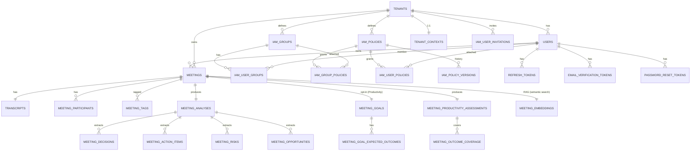

# Modelo de Dados — NORA (Postgres 16)

> Estado real do schema, alinhado com as **migrations V001–V021** em `services/api/src/main/resources/db/migration/` (inventário completo em §5).
> Cada tabela é mapeada para a migration de origem. Quando há **drift** entre o que estava documentado e o que está no banco, está marcado explicitamente.
> Multi-tenancy: coluna `tenant_id` em toda tabela tenant-bound (ADR 0002). **RLS habilitado no schema (V016, completado em V019; escopo auth-aware em V020)** — enforcement opt-in via role `nora_app` + flag `nora.security.rls.enforce`; ver §RLS.
> **Soft-delete** (V013): tabelas `tenants`, `users`, `tenant_contexts`, `meetings` têm `deleted_at`; queries Spring Data filtram `deleted_at IS NULL` via `@SQLRestriction`; UNIQUEs totais viraram parciais (ver §4).

---

## 1. Visão geral (ER)



---

## 2. Tabelas

### 2.1 `tenants` — V001

| Coluna | Tipo | Notas |
|---|---|---|
| `id` | `UUID PK DEFAULT gen_random_uuid()` | extensão `pgcrypto` |
| `name` | `TEXT NOT NULL` | |
| `slug` | `TEXT NOT NULL` | usado em URLs. **V013**: UNIQUE total trocada por índice parcial `WHERE deleted_at IS NULL` |
| `status` | `TEXT NOT NULL DEFAULT 'ACTIVE'` | CHECK: `ACTIVE`, `SUSPENDED` |
| `plan` | `TEXT NOT NULL DEFAULT 'FREE'` | CHECK: `FREE`, `PRO`, `ENTERPRISE` |
| `allowed_email_domain` | `VARCHAR(255)` | **V009** — domínio corporativo. NULL = sem restrição |
| `created_at` | `TIMESTAMPTZ NOT NULL DEFAULT NOW()` | |
| `updated_at` | `TIMESTAMPTZ NOT NULL DEFAULT NOW()` | |
| `deleted_at` | `TIMESTAMPTZ` | **V013** — soft-delete. NULL = ativo |

**Indexes**: `idx_tenants_status(status)`, `tenants_slug_uk UNIQUE (slug) WHERE deleted_at IS NULL` (V013 — partial), `tenants_deleted_at_idx(deleted_at)` (V013).

**Propósito**: raiz de tudo. Toda tabela tenant-bound referencia `tenants(id)`. `allowed_email_domain` adicionada em V009 (US32, ADR 0011) para restringir convites a um domínio corporativo. Soft-delete (V013): preferir `status = SUSPENDED` + `deleted_at` a hard-delete.

---

### 2.2 `users` — V002 (+ alterações V003, V006)

| Coluna | Tipo | Notas |
|---|---|---|
| `id` | `UUID PK DEFAULT gen_random_uuid()` | |
| `tenant_id` | `UUID NOT NULL REFERENCES tenants(id) ON DELETE RESTRICT` | |
| `email` | `CITEXT NOT NULL` | extensão `citext` (case-insensitive); **V013**: UNIQUE `(tenant_id, email)` virou índice parcial `WHERE deleted_at IS NULL` |
| `password_hash` | `TEXT NOT NULL` | bcrypt/argon2 |
| `display_name` | `TEXT NOT NULL` | |
| `status` | `TEXT NOT NULL DEFAULT 'ACTIVE'` | CHECK: `ACTIVE`, `INVITED`, `DISABLED` |
| `email_verified_at` | `TIMESTAMPTZ` | **V003**. NULL = não verificado |
| `is_root` | `BOOLEAN NOT NULL DEFAULT FALSE` | **V006**. Exatamente um por tenant (índice parcial UNIQUE) |
| `created_at` | `TIMESTAMPTZ NOT NULL DEFAULT NOW()` | |
| `updated_at` | `TIMESTAMPTZ NOT NULL DEFAULT NOW()` | |
| `deleted_at` | `TIMESTAMPTZ` | **V013** — soft-delete. NULL = ativo |

**Indexes**: `idx_users_tenant(tenant_id)`, `uq_users_root_per_tenant ON users(tenant_id) WHERE is_root = TRUE` (V006:26-27 — garante 1 Root por tenant), `users_email_uk ON users(tenant_id, email) WHERE deleted_at IS NULL` (V013 — partial), `users_deleted_at_idx(deleted_at)` (V013), **`users_tenant_id_uk UNIQUE (tenant_id, id)`** (V015 — alvo da FK composta de `meetings`, ver §2.6).

**Propósito**: identidade. Root tem bypass total em `AuthorizationService:41`. O UNIQUE composto `(tenant_id, id)` (V015) existe só para suportar a FK composta de `meetings.owner_user_id` (defesa anti cross-tenant; `id` continua PK simples).

---

### 2.3 `roles` e `user_roles` — V002 (legado, **não usado**)

Tabelas criadas em V002 para um modelo RBAC inicial (ROLES: `ROOT`, `ADMIN`, `MANAGER`, `ANALYST`, `VIEWER`) que foi **substituído** pelo IAM AWS-style em V006 (ADR 0007).

Status: **órfãs**. Comentário em `V006:7-9` indica "remoção em migration futura". Mantidas por compatibilidade enquanto não houver migration de drop.

| Tabela | Colunas resumidas | Notas |
|---|---|---|
| `roles` | `id, tenant_id, code, description, is_system, created_at` | CHECK code IN (`ROOT`,`ADMIN`,`MANAGER`,`ANALYST`,`VIEWER`). Tenant_id NULL para roles globais |
| `user_roles` | `user_id, role_id, tenant_id, granted_at` | PK composta `(user_id, role_id)` |

> **Débito**: drop tables em migration futura. Nenhum código atual lê/escreve nelas.

---

### 2.4 `email_verification_tokens` — V003

| Coluna | Tipo | Notas |
|---|---|---|
| `id` | `UUID PK DEFAULT gen_random_uuid()` | |
| `user_id` | `UUID NOT NULL REFERENCES users(id) ON DELETE CASCADE` | |
| `tenant_id` | `UUID NOT NULL REFERENCES tenants(id) ON DELETE CASCADE` | |
| `token_hash` | `TEXT NOT NULL UNIQUE` | SHA-256 do token plain |
| `expires_at` | `TIMESTAMPTZ NOT NULL` | |
| `consumed_at` | `TIMESTAMPTZ` | NULL = não consumido |
| `created_at` | `TIMESTAMPTZ NOT NULL DEFAULT NOW()` | |

**Indexes**: `idx_email_verif_tokens_user(user_id)`, `idx_email_verif_tokens_expires(expires_at)`.

**Propósito**: US02 (verificação por e-mail). Token plain só existe no e-mail; vazamento do banco não permite reuso.

---

### 2.5 `password_reset_tokens` — V003

| Coluna | Tipo | Notas |
|---|---|---|
| `id` | `UUID PK DEFAULT gen_random_uuid()` | |
| `user_id` | `UUID NOT NULL REFERENCES users(id) ON DELETE CASCADE` | |
| `tenant_id` | `UUID NOT NULL REFERENCES tenants(id) ON DELETE CASCADE` | |
| `token_hash` | `TEXT NOT NULL UNIQUE` | SHA-256 |
| `expires_at` | `TIMESTAMPTZ NOT NULL` | |
| `consumed_at` | `TIMESTAMPTZ` | |
| `created_at` | `TIMESTAMPTZ NOT NULL DEFAULT NOW()` | |

**Indexes**: `idx_pwd_reset_tokens_user(user_id)`, `idx_pwd_reset_tokens_expires(expires_at)`.

**Propósito**: US04 (reset de senha).

---

### 2.6 `meetings` — V004 (+ alterações V007, V008)

| Coluna | Tipo | Notas |
|---|---|---|
| `id` | `UUID PK DEFAULT gen_random_uuid()` | |
| `tenant_id` | `UUID NOT NULL REFERENCES tenants(id) ON DELETE CASCADE` | |
| `owner_user_id` | `UUID NOT NULL` | **V015**: FK trocada de `REFERENCES users(id)` para FK **composta** `(tenant_id, owner_user_id) REFERENCES users(tenant_id, id) ON DELETE RESTRICT` — bloqueia owner de outro tenant (defesa anti cross-tenant, ADR 0002) |
| `title` | `TEXT NOT NULL` | |
| `started_at` | `TIMESTAMPTZ` | |
| `ended_at` | `TIMESTAMPTZ` | |
| `language` | `TEXT NOT NULL DEFAULT 'pt-BR'` | |
| `transcript_format` | `TEXT NOT NULL` | CHECK: `TXT`, `VTT`, `SRT` |
| `processing_status` | `TEXT NOT NULL DEFAULT 'PENDING'` | CHECK: `PENDING`, `PROCESSING`, `COMPLETED`, `FAILED` |
| `summary_snippet` | `TEXT` | preview curto na listagem |
| `attributes` | `JSONB NOT NULL DEFAULT '{}'::jsonb` | **V007**. Pares chave/valor arbitrários (`department`, `region`, etc.) usados em IAM conditions (ADR 0007) |
| `created_at` | `TIMESTAMPTZ NOT NULL DEFAULT NOW()` | |
| `updated_at` | `TIMESTAMPTZ NOT NULL DEFAULT NOW()` | |
| `deleted_at` | `TIMESTAMPTZ` | **V013** — soft-delete. NULL = ativo |

**Indexes**:
- `idx_meetings_tenant_created(tenant_id, created_at DESC)`
- `idx_meetings_owner(owner_user_id)`
- `idx_meetings_status(tenant_id, processing_status)`
- `idx_meetings_attributes_gin USING GIN (attributes jsonb_path_ops)` — **V008**, acelera `attributes @>` para conditions IAM.
- `meetings_deleted_at_idx(deleted_at)` — **V013**, apoia o filtro `@SQLRestriction`.

**Propósito**: reunião. `attributes` permite scoping fino sem schema rígido (ex.: `{"department":"Vendas"}` casa com condition `StringEquals nora:Department=Vendas`).

> **Drift removido** (vs. doc antigo): a coluna `tags TEXT[]` não existe. Tags vivem em tabela separada `meeting_tags` (ver 2.8).

---

### 2.7 `meeting_participants` — V004

| Coluna | Tipo | Notas |
|---|---|---|
| `id` | `UUID PK DEFAULT gen_random_uuid()` | |
| `meeting_id` | `UUID NOT NULL REFERENCES meetings(id) ON DELETE CASCADE` | |
| `tenant_id` | `UUID NOT NULL REFERENCES tenants(id) ON DELETE CASCADE` | |
| `display_name` | `TEXT NOT NULL` | |
| `email` | `TEXT` | nullable |
| `is_internal` | `BOOLEAN NOT NULL DEFAULT FALSE` | |
| `created_at` | `TIMESTAMPTZ NOT NULL DEFAULT NOW()` | |

**Indexes**: `idx_meeting_participants_meeting(meeting_id)`, `idx_meeting_participants_tenant(tenant_id)`.

---

### 2.8 `meeting_tags` — V004

> **Não estava no doc antigo.** Tabela real desde V004.

| Coluna | Tipo | Notas |
|---|---|---|
| `meeting_id` | `UUID NOT NULL REFERENCES meetings(id) ON DELETE CASCADE` | |
| `tenant_id` | `UUID NOT NULL REFERENCES tenants(id) ON DELETE CASCADE` | |
| `tag` | `TEXT NOT NULL` | |
| **PK** | `(meeting_id, tag)` | |

**Indexes**: `idx_meeting_tags_tenant_tag(tenant_id, tag)`.

**Propósito**: N:N tag↔meeting. Substitui o `tags TEXT[]` previsto no doc antigo. Permite indexação por tag e queries eficientes (`WHERE tenant_id = ? AND tag = ?`).

---

### 2.9 `transcripts` — V004

| Coluna | Tipo | Notas |
|---|---|---|
| `id` | `UUID PK DEFAULT gen_random_uuid()` | |
| `meeting_id` | `UUID NOT NULL UNIQUE REFERENCES meetings(id) ON DELETE CASCADE` | 1:1 com meeting |
| `tenant_id` | `UUID NOT NULL REFERENCES tenants(id) ON DELETE CASCADE` | |
| `format` | `TEXT NOT NULL` | CHECK: `TXT`, `VTT`, `SRT` |
| `raw_text` | `TEXT NOT NULL` | **conteúdo inline** — não há `storage_uri` |
| `char_count` | `INTEGER NOT NULL CHECK (char_count >= 0)` | |
| `created_at` | `TIMESTAMPTZ NOT NULL DEFAULT NOW()` | |

**Indexes**: `idx_transcripts_tenant(tenant_id)`.

> **Drift removido**: o doc antigo previa `storage_uri TEXT NOT NULL` + `sha256 TEXT NOT NULL` + `word_count INTEGER`. A migration real (V004:52-63) armazena `raw_text` inline, sem `storage_uri`, sem `sha256`, sem `word_count`.

---

### 2.10 `tenant_contexts` — V005

| Coluna | Tipo | Notas |
|---|---|---|
| `id` | `UUID PK DEFAULT gen_random_uuid()` | |
| `tenant_id` | `UUID NOT NULL REFERENCES tenants(id) ON DELETE CASCADE` | 1:1. **V013**: UNIQUE total trocada por índice parcial `WHERE deleted_at IS NULL` |
| `document` | `JSONB NOT NULL` | normalizado; validação estrutural fica no domain/Pydantic |
| `updated_by` | `UUID REFERENCES users(id) ON DELETE SET NULL` | |
| `created_at` | `TIMESTAMPTZ NOT NULL DEFAULT NOW()` | |
| `updated_at` | `TIMESTAMPTZ NOT NULL DEFAULT NOW()` | |
| `deleted_at` | `TIMESTAMPTZ` | **V013** — soft-delete. NULL = ativo |

**Indexes**: `idx_tenant_contexts_tenant(tenant_id)`, `tenant_contexts_tenant_id_uk ON tenant_contexts(tenant_id) WHERE deleted_at IS NULL` (V013 — partial), `tenant_contexts_deleted_at_idx(deleted_at)` (V013).

> **Débito (US31)**: o doc antigo previa coluna `version INTEGER NOT NULL` para versionamento de contexto. **Não existe na realidade.** Hoje só `updated_at` permite ver "quando mudou", sem histórico. Migration V014+ trivial resolveria.

---

### 2.11 `meeting_analyses` — V005

| Coluna | Tipo | Notas |
|---|---|---|
| `id` | `UUID PK DEFAULT gen_random_uuid()` | |
| `meeting_id` | `UUID NOT NULL UNIQUE REFERENCES meetings(id) ON DELETE CASCADE` | 1:1 |
| `tenant_id` | `UUID NOT NULL REFERENCES tenants(id) ON DELETE CASCADE` | |
| `summary` | `TEXT NOT NULL` | markdown |
| `sentiment_overall` | `TEXT NOT NULL` | CHECK: `POSITIVE`, `NEUTRAL`, `NEGATIVE`, `MIXED` |
| `topics` | `TEXT[] NOT NULL DEFAULT ARRAY[]::TEXT[]` | |
| `model_version` | `TEXT` | ex.: `gpt-4o-mini-2024-07-18` |
| `prompt_version` | `TEXT` | ex.: `meeting-analysis-v1` |
| `tokens_input` | `INTEGER NOT NULL DEFAULT 0 CHECK (>= 0)` | |
| `tokens_output` | `INTEGER NOT NULL DEFAULT 0 CHECK (>= 0)` | |
| `processing_millis` | `INTEGER NOT NULL DEFAULT 0 CHECK (>= 0)` | |
| `pii_redactions_applied` | `INTEGER NOT NULL DEFAULT 0` | |
| `generated_at` | `TIMESTAMPTZ NOT NULL DEFAULT NOW()` | |
| `created_at` | `TIMESTAMPTZ NOT NULL DEFAULT NOW()` | |

**Indexes**: `idx_meeting_analyses_tenant(tenant_id)`, `idx_meeting_analyses_meeting(meeting_id)`.

**Propósito**: persistência da análise gerada pelo worker. Espelha `meeting-analysis-v1.schema.json` (ADR 0003).

---

### 2.12 `meeting_decisions` — V005

| Coluna | Tipo | Notas |
|---|---|---|
| `id` | `UUID PK DEFAULT gen_random_uuid()` | |
| `analysis_id` | `UUID NOT NULL REFERENCES meeting_analyses(id) ON DELETE CASCADE` | |
| `tenant_id` | `UUID NOT NULL REFERENCES tenants(id) ON DELETE CASCADE` | |
| `text` | `TEXT NOT NULL` | |
| `confidence` | `NUMERIC(3,2) NOT NULL CHECK (0.0 <= x <= 1.0)` | |
| `position` | `INTEGER NOT NULL CHECK (>= 0)` | ordem da decisão na análise |
| `created_at` | `TIMESTAMPTZ NOT NULL DEFAULT NOW()` | |

**Indexes**: `idx_meeting_decisions_analysis(analysis_id)`, `idx_meeting_decisions_tenant(tenant_id)`.

---

### 2.13 `meeting_action_items` — V005

| Coluna | Tipo | Notas |
|---|---|---|
| `id` | `UUID PK DEFAULT gen_random_uuid()` | |
| `analysis_id` | `UUID NOT NULL REFERENCES meeting_analyses(id) ON DELETE CASCADE` | |
| `tenant_id` | `UUID NOT NULL REFERENCES tenants(id) ON DELETE CASCADE` | |
| `title` | `TEXT NOT NULL` | |
| `assignee` | `TEXT` | nome cru extraído da fala (pode ser ambíguo) |
| `due_date` | `DATE` | |
| `priority` | `TEXT NOT NULL` | CHECK: `LOW`, `MEDIUM`, `HIGH` |
| `source_quote` | `TEXT NOT NULL` | citação que sustenta o item |
| `status` | `TEXT NOT NULL DEFAULT 'OPEN'` | **CHECK: `OPEN`, `IN_PROGRESS`, `DONE`** (V005:92-93) |
| `position` | `INTEGER NOT NULL CHECK (>= 0)` | |
| `created_at` | `TIMESTAMPTZ NOT NULL DEFAULT NOW()` | |
| `updated_at` | `TIMESTAMPTZ NOT NULL DEFAULT NOW()` | |

**Indexes**: `idx_meeting_action_items_analysis(analysis_id)`, `idx_meeting_action_items_tenant(tenant_id)`, `idx_meeting_action_items_status(tenant_id, status)`.

> **Drift corrigido**: o doc antigo listava `status IN (..., 'CANCELLED')`. **CANCELLED não existe** na CHECK constraint real (V005:92-93). Status válidos: apenas `OPEN`, `IN_PROGRESS`, `DONE`.

> **Drift removido**: a coluna `assignee_user_id UUID` não existe; apenas `assignee TEXT` (nome cru).

---

### 2.14 `meeting_risks` — V005

| Coluna | Tipo | Notas |
|---|---|---|
| `id` | `UUID PK DEFAULT gen_random_uuid()` | |
| `analysis_id` | `UUID NOT NULL REFERENCES meeting_analyses(id) ON DELETE CASCADE` | |
| `tenant_id` | `UUID NOT NULL REFERENCES tenants(id) ON DELETE CASCADE` | |
| `text` | `TEXT NOT NULL` | |
| `severity` | `TEXT NOT NULL` | CHECK: `LOW`, `MEDIUM`, `HIGH` |
| `category` | `TEXT NOT NULL` | CHECK: `COMPETITION`, `PRICE`, `CHURN`, `TIMELINE`, `TECHNICAL`, `COMPLIANCE`, `OTHER` |
| `source_quote` | `TEXT NOT NULL` | |
| `position` | `INTEGER NOT NULL CHECK (>= 0)` | |
| `created_at` | `TIMESTAMPTZ NOT NULL DEFAULT NOW()` | |

**Indexes**: `idx_meeting_risks_analysis(analysis_id)`, `idx_meeting_risks_tenant(tenant_id)`.

---

### 2.15 `meeting_opportunities` — V005

| Coluna | Tipo | Notas |
|---|---|---|
| `id` | `UUID PK DEFAULT gen_random_uuid()` | |
| `analysis_id` | `UUID NOT NULL REFERENCES meeting_analyses(id) ON DELETE CASCADE` | |
| `tenant_id` | `UUID NOT NULL REFERENCES tenants(id) ON DELETE CASCADE` | |
| `text` | `TEXT NOT NULL` | |
| `estimated_value` | `TEXT NOT NULL` | CHECK: `LOW`, `MEDIUM`, `HIGH` |
| `category` | `TEXT NOT NULL` | CHECK: `UPSELL`, `CROSS_SELL`, `REFERRAL`, `EXPANSION`, `OTHER` |
| `source_quote` | `TEXT NOT NULL` | |
| `position` | `INTEGER NOT NULL CHECK (>= 0)` | |
| `created_at` | `TIMESTAMPTZ NOT NULL DEFAULT NOW()` | |

**Indexes**: `idx_meeting_opportunities_analysis(analysis_id)`, `idx_meeting_opportunities_tenant(tenant_id)`.

---

### 2.16 `iam_groups` — V006

| Coluna | Tipo | Notas |
|---|---|---|
| `id` | `UUID PK DEFAULT gen_random_uuid()` | |
| `tenant_id` | `UUID NOT NULL REFERENCES tenants(id) ON DELETE CASCADE` | |
| `name` | `TEXT NOT NULL` | UNIQUE por `(tenant_id, name)` |
| `description` | `TEXT` | |
| `created_by` | `UUID REFERENCES users(id) ON DELETE SET NULL` | |
| `created_at` | `TIMESTAMPTZ NOT NULL DEFAULT NOW()` | |
| `updated_at` | `TIMESTAMPTZ NOT NULL DEFAULT NOW()` | |

**Indexes**: `idx_iam_groups_tenant(tenant_id)`.

---

### 2.17 `iam_user_groups` — V006

| Coluna | Tipo | Notas |
|---|---|---|
| `user_id` | `UUID NOT NULL REFERENCES users(id) ON DELETE CASCADE` | |
| `group_id` | `UUID NOT NULL REFERENCES iam_groups(id) ON DELETE CASCADE` | |
| `tenant_id` | `UUID NOT NULL REFERENCES tenants(id) ON DELETE CASCADE` | |
| `attached_by` | `UUID REFERENCES users(id) ON DELETE SET NULL` | |
| `attached_at` | `TIMESTAMPTZ NOT NULL DEFAULT NOW()` | |
| **PK** | `(user_id, group_id)` | |

**Indexes**: `idx_iam_user_groups_tenant(tenant_id)`, `idx_iam_user_groups_group(group_id)`.

---

### 2.18 `iam_policies` — V006

| Coluna | Tipo | Notas |
|---|---|---|
| `id` | `UUID PK DEFAULT gen_random_uuid()` | |
| `tenant_id` | `UUID NOT NULL REFERENCES tenants(id) ON DELETE CASCADE` | |
| `name` | `TEXT NOT NULL` | UNIQUE por `(tenant_id, name)` |
| `description` | `TEXT` | |
| `document` | `JSONB NOT NULL` | statements estilo AWS IAM (Effect/Action/Resource/Condition) |
| `current_version` | `INTEGER NOT NULL DEFAULT 1 CHECK (>= 1)` | |
| `created_by` | `UUID REFERENCES users(id) ON DELETE SET NULL` | |
| `created_at` | `TIMESTAMPTZ NOT NULL DEFAULT NOW()` | |
| `updated_at` | `TIMESTAMPTZ NOT NULL DEFAULT NOW()` | |

**Indexes**: `idx_iam_policies_tenant(tenant_id)`.

> **Drift removido**: o doc antigo previa `is_template BOOLEAN NOT NULL DEFAULT FALSE`. **Não existe** na migration real (V006:69-82). Templates oficiais (US41) são feature pendente.

Formato esperado de `document`:

```json
{
  "version": "2026-05-07",
  "statements": [
    {
      "effect": "Allow",
      "action": ["meeting:read"],
      "resource": ["nora:tenant/{tenantId}:meeting/*"],
      "condition": {
        "StringEquals": { "nora:Department": "Vendas" }
      }
    }
  ]
}
```

---

### 2.19 `iam_policy_versions` — V006

| Coluna | Tipo | Notas |
|---|---|---|
| `policy_id` | `UUID NOT NULL REFERENCES iam_policies(id) ON DELETE CASCADE` | |
| `version` | `INTEGER NOT NULL CHECK (>= 1)` | |
| `tenant_id` | `UUID NOT NULL REFERENCES tenants(id) ON DELETE CASCADE` | |
| `document` | `JSONB NOT NULL` | snapshot imutável |
| `created_by` | `UUID REFERENCES users(id) ON DELETE SET NULL` | |
| `created_at` | `TIMESTAMPTZ NOT NULL DEFAULT NOW()` | |
| **PK** | `(policy_id, version)` | |

**Indexes**: `idx_iam_policy_versions_tenant(tenant_id)`.

**Propósito**: histórico imutável de policies (auditoria e rollback).

---

### 2.20 `iam_group_policies` — V006

| Coluna | Tipo | Notas |
|---|---|---|
| `group_id` | `UUID NOT NULL REFERENCES iam_groups(id) ON DELETE CASCADE` | |
| `policy_id` | `UUID NOT NULL REFERENCES iam_policies(id) ON DELETE CASCADE` | |
| `tenant_id` | `UUID NOT NULL REFERENCES tenants(id) ON DELETE CASCADE` | |
| `attached_by` | `UUID REFERENCES users(id) ON DELETE SET NULL` | |
| `attached_at` | `TIMESTAMPTZ NOT NULL DEFAULT NOW()` | |
| **PK** | `(group_id, policy_id)` | |

**Indexes**: `idx_iam_group_policies_tenant(tenant_id)`, `idx_iam_group_policies_policy(policy_id)`.

---

### 2.21 `iam_user_policies` — V006

| Coluna | Tipo | Notas |
|---|---|---|
| `user_id` | `UUID NOT NULL REFERENCES users(id) ON DELETE CASCADE` | |
| `policy_id` | `UUID NOT NULL REFERENCES iam_policies(id) ON DELETE CASCADE` | |
| `tenant_id` | `UUID NOT NULL REFERENCES tenants(id) ON DELETE CASCADE` | |
| `attached_by` | `UUID REFERENCES users(id) ON DELETE SET NULL` | |
| `attached_at` | `TIMESTAMPTZ NOT NULL DEFAULT NOW()` | |
| **PK** | `(user_id, policy_id)` | |

**Indexes**: `idx_iam_user_policies_tenant(tenant_id)`, `idx_iam_user_policies_policy(policy_id)`.

---

### 2.22 `iam_audit_events` — V006

| Coluna | Tipo | Notas |
|---|---|---|
| `id` | `UUID PK DEFAULT gen_random_uuid()` | |
| `tenant_id` | `UUID NOT NULL REFERENCES tenants(id) ON DELETE CASCADE` | |
| `actor_user_id` | `UUID REFERENCES users(id) ON DELETE SET NULL` | |
| `action` | `TEXT NOT NULL` | ex.: `iam:group:create`, `iam:policy:attach` |
| `target_type` | `TEXT NOT NULL` | ex.: `GROUP`, `POLICY`, `USER`, `MEMBERSHIP`, `ATTACHMENT` |
| `target_id` | `UUID` | |
| `payload` | `JSONB` | contexto adicional (nome, ids, etc.) |
| `created_at` | `TIMESTAMPTZ NOT NULL DEFAULT NOW()` | |

**Indexes**: `idx_iam_audit_events_tenant_created(tenant_id, created_at DESC)`.

> **Drift relevante**: o doc antigo previa uma tabela `audit_events` **global** (cobrindo LOGIN, MEETING_UPLOAD, CONTEXT_UPDATE etc.). **Não existe.** Apenas `iam_audit_events` (escopo IAM). Demais ações não são auditadas em tabela.
>
> **Débito conhecido** (audit §6, severity Média): criar `audit_events` global para compliance LGPD.

---

### 2.23 `iam_user_invitations` e `iam_invitation_groups` — V010

#### `iam_user_invitations`

| Coluna | Tipo | Notas |
|---|---|---|
| `id` | `UUID PK` | |
| `tenant_id` | `UUID NOT NULL REFERENCES tenants(id) ON DELETE CASCADE` | |
| `email` | `VARCHAR(255) NOT NULL` | |
| `token` | `VARCHAR(128) NOT NULL UNIQUE` | UUID em texto |
| `status` | `VARCHAR(20) NOT NULL DEFAULT 'PENDING'` | CHECK: `PENDING`, `ACCEPTED`, `EXPIRED`, `REVOKED` |
| `invited_by` | `UUID NOT NULL REFERENCES users(id)` | |
| `invited_at` | `TIMESTAMPTZ NOT NULL DEFAULT NOW()` | |
| `expires_at` | `TIMESTAMPTZ NOT NULL` | |
| `accepted_at` | `TIMESTAMPTZ` | |
| `accepted_user_id` | `UUID REFERENCES users(id)` | |

**Indexes**: `idx_iam_invitations_tenant_status(tenant_id, status)`, `idx_iam_invitations_token(token)`, `idx_iam_invitations_email(tenant_id, email)`.

#### `iam_invitation_groups`

| Coluna | Tipo | Notas |
|---|---|---|
| `invitation_id` | `UUID NOT NULL REFERENCES iam_user_invitations(id) ON DELETE CASCADE` | |
| `group_id` | `UUID NOT NULL REFERENCES iam_groups(id) ON DELETE CASCADE` | |
| **PK** | `(invitation_id, group_id)` | |

**Propósito**: US06 (convite por e-mail), ADR 0011. Idempotência (mesmo email PENDING) é tratada em `InvitationService`.

---

### 2.24 `refresh_tokens` — V011

| Coluna | Tipo | Notas |
|---|---|---|
| `id` | `UUID PK` | |
| `user_id` | `UUID NOT NULL REFERENCES users(id) ON DELETE CASCADE` | |
| `tenant_id` | `UUID NOT NULL REFERENCES tenants(id) ON DELETE CASCADE` | |
| `token_hash` | `VARCHAR(255) NOT NULL UNIQUE` | SHA-256 do token plain |
| `expires_at` | `TIMESTAMPTZ NOT NULL` | |
| `revoked_at` | `TIMESTAMPTZ` | NULL = ativo |
| `created_at` | `TIMESTAMPTZ NOT NULL DEFAULT NOW()` | |
| `last_used_at` | `TIMESTAMPTZ` | atualizado em cada `/auth/refresh` |
| `family_id` | `UUID NOT NULL` | **V014** — rotação. Tokens da mesma cadeia compartilham `family_id` (backfill: `family_id = id` nos existentes) |
| `replaced_by_id` | `UUID REFERENCES refresh_tokens(id)` | **V014** — aponta para o token sucessor após rotação. NULL = token ativo da cadeia ou revogado sem sucessor |

**Indexes**:
- `idx_refresh_tokens_user(user_id) WHERE revoked_at IS NULL` (lookup de ativos)
- `idx_refresh_tokens_hash(token_hash)` (validação em refresh)
- `idx_refresh_tokens_family(family_id)` — **V014**, revoga a family inteira em reuse-detection.

**Propósito**: Sub-fase 1.3 (PR #59). Access JWT curto (15min) + refresh stateful (30 dias) revogável. Plain só existe no cookie `nora_refresh` httpOnly. **Rotação + reuse-detection (V014):** cada `/auth/refresh` emite novo token na mesma `family_id` e revoga o anterior; apresentar um token já revogado é tratado como comprometimento → **revoga a family inteira** (atacante e vítima deslogados).

---

### 2.25 `meeting_goals` — V012

| Coluna | Tipo | Notas |
|---|---|---|
| `id` | `UUID PK DEFAULT gen_random_uuid()` | |
| `tenant_id` | `UUID NOT NULL REFERENCES tenants(id) ON DELETE CASCADE` | |
| `meeting_id` | `UUID NOT NULL UNIQUE REFERENCES meetings(id) ON DELETE CASCADE` | 1:1 |
| `purpose` | `TEXT NOT NULL` | descrição livre do objetivo |
| `project_state_snapshot` | `TEXT` | "o que está feito"; manual no MVP |
| `created_at` | `TIMESTAMPTZ NOT NULL DEFAULT NOW()` | |
| `updated_at` | `TIMESTAMPTZ NOT NULL DEFAULT NOW()` | |

**Indexes**: `idx_meeting_goals_tenant(tenant_id)`.

**Propósito**: Productivity Score opt-in (ADR 0005). Sem MeetingGoal, nada é emitido.

> **Drift removido**: o doc antigo previa coluna `enabled BOOLEAN NOT NULL` e `expected_outcomes JSONB`. A migration real (V012) separa outcomes em tabela própria (ver 2.26) e dispensa `enabled` (existência do registro já indica opt-in).

---

### 2.26 `meeting_goal_expected_outcomes` — V012

| Coluna | Tipo | Notas |
|---|---|---|
| `id` | `UUID PK DEFAULT gen_random_uuid()` | |
| `meeting_goal_id` | `UUID NOT NULL REFERENCES meeting_goals(id) ON DELETE CASCADE` | |
| `outcome_text` | `TEXT NOT NULL` | |
| `position` | `INTEGER NOT NULL CHECK (>= 0)` | ordem do outcome |

**Indexes**: `idx_meeting_goal_outcomes_goal(meeting_goal_id)`.

**Propósito**: lista ordenada de outcomes esperados para o LLM avaliar.

> Nota: esta tabela **não tem `tenant_id` próprio** — é filha direta de `meeting_goals` que já está tenant-scoped, e cascade ON DELETE cobre limpeza.

---

### 2.27 `meeting_productivity_assessments` — V012

| Coluna | Tipo | Notas |
|---|---|---|
| `id` | `UUID PK DEFAULT gen_random_uuid()` | |
| `tenant_id` | `UUID NOT NULL REFERENCES tenants(id) ON DELETE CASCADE` | |
| `meeting_id` | `UUID NOT NULL UNIQUE REFERENCES meetings(id) ON DELETE CASCADE` | 1:1 |
| `score` | `INTEGER NOT NULL CHECK (BETWEEN 0 AND 100)` | |
| `band` | `VARCHAR(10) NOT NULL` | CHECK: `LOW`, `MEDIUM`, `HIGH` |
| `off_topic_ratio` | `NUMERIC(4,3)` | 0.000–1.000 |
| `decision_density` | `NUMERIC(4,3)` | 0.000–1.000 |
| `rationale` | `TEXT NOT NULL` | justificativa do LLM |
| `created_at` | `TIMESTAMPTZ NOT NULL DEFAULT NOW()` | |

**Indexes**: `idx_meeting_productivity_tenant(tenant_id)`.

> **Drift relevante**: o doc antigo amarrava o assessment a `meeting_analyses(id)` via FK. A migration real (V012:46) amarra diretamente a `meetings(id)` UNIQUE — 1:1 com meeting, não com analysis.

---

### 2.28 `meeting_outcome_coverage` — V012

| Coluna | Tipo | Notas |
|---|---|---|
| `id` | `UUID PK DEFAULT gen_random_uuid()` | |
| `assessment_id` | `UUID NOT NULL REFERENCES meeting_productivity_assessments(id) ON DELETE CASCADE` | |
| `expected_outcome` | `TEXT NOT NULL` | espelha o item do goal |
| `status` | `VARCHAR(20) NOT NULL` | CHECK: `ADDRESSED`, `PARTIAL`, `MISSED` |
| `evidence` | `TEXT` | citação que sustenta o status |
| `position` | `INTEGER NOT NULL CHECK (>= 0)` | |

**Indexes**: `idx_meeting_outcome_coverage_assessment(assessment_id)`.

> Nota: esta tabela também não tem `tenant_id` próprio (cascade via `assessment_id`).

---

### 2.29 `customer_accounts` — V017

| Coluna | Tipo | Notas |
|---|---|---|
| `id` | `UUID PK DEFAULT gen_random_uuid()` | |
| `tenant_id` | `UUID NOT NULL REFERENCES tenants(id) ON DELETE CASCADE` | |
| `name` | `TEXT NOT NULL` | nome da conta/lead |
| `owner_user_id` | `UUID REFERENCES users(id) ON DELETE SET NULL` | dono (CRM-lite), opcional |
| `stage` | `TEXT` | estágio do funil, opcional |
| `created_at` | `TIMESTAMPTZ NOT NULL DEFAULT NOW()` | |
| `updated_at` | `TIMESTAMPTZ NOT NULL DEFAULT NOW()` | |

**Indexes**: `idx_customer_accounts_tenant(tenant_id)`; **UNIQUE** `idx_customer_accounts_tenant_name(tenant_id, LOWER(name))` — dedup case-insensitive para get-or-create.

> Tenant-owned: RLS `tenant_isolation` habilitada em V017 (segue V016).

---

### 2.30 `meeting_account_links` — V017

| Coluna | Tipo | Notas |
|---|---|---|
| `meeting_id` | `UUID NOT NULL REFERENCES meetings(id) ON DELETE CASCADE` | |
| `customer_account_id` | `UUID NOT NULL REFERENCES customer_accounts(id) ON DELETE CASCADE` | |
| `tenant_id` | `UUID NOT NULL REFERENCES tenants(id) ON DELETE CASCADE` | |

**PK composta**: `(meeting_id, customer_account_id)` — vínculo N:N reunião ↔ conta.

**Indexes**: `idx_meeting_account_links_tenant(tenant_id)`, `idx_meeting_account_links_account(customer_account_id)`.

> Tenant-owned: RLS `tenant_isolation` habilitada em V017.

---

### 2.31 `customer_confidence_assessments` — V017

| Coluna | Tipo | Notas |
|---|---|---|
| `id` | `UUID PK DEFAULT gen_random_uuid()` | |
| `tenant_id` | `UUID NOT NULL REFERENCES tenants(id) ON DELETE CASCADE` | |
| `meeting_id` | `UUID NOT NULL REFERENCES meetings(id) ON DELETE CASCADE` | |
| `customer_account_id` | `UUID NOT NULL REFERENCES customer_accounts(id) ON DELETE CASCADE` | |
| `score` | `INTEGER NOT NULL CHECK (BETWEEN 0 AND 100)` | |
| `band` | `VARCHAR(10) NOT NULL` | CHECK: `LOW`, `MEDIUM`, `HIGH` |
| `trend` | `VARCHAR(10)` | NULL ⇒ 1ª reunião da conta; CHECK: `IMPROVING`, `STABLE`, `DECLINING` |
| `rationale` | `TEXT NOT NULL` | justificativa do LLM |
| `created_at` | `TIMESTAMPTZ NOT NULL DEFAULT NOW()` | |

**UNIQUE**: `(meeting_id, customer_account_id)` — 1:1 por par (uma reunião pode tocar várias contas, no máximo um assessment por conta).

**Indexes**: `idx_customer_confidence_tenant(tenant_id)`.

> Tenant-owned: RLS `tenant_isolation` habilitada em V017. **Wired (pós-#148):** `AnalysisService.java:127` → `CustomerConfidenceService.persist` grava aqui (trend server-side com banda ±5, get-or-create de conta por `LOWER(name)`); o worker emite `customerConfidence` em conversas com cliente/lead.

---

### 2.32 `customer_buying_signals` — V017

| Coluna | Tipo | Notas |
|---|---|---|
| `id` | `UUID PK DEFAULT gen_random_uuid()` | |
| `assessment_id` | `UUID NOT NULL REFERENCES customer_confidence_assessments(id) ON DELETE CASCADE` | |
| `type` | `VARCHAR(30) NOT NULL` | CHECK: `BUDGET_DISCUSSED`, `TIMELINE_DISCUSSED`, `STAKEHOLDER_INVOLVED`, `NEXT_STEP_REQUESTED`, `REFERENCE_REQUESTED`, `PROPOSAL_REQUESTED`, `OTHER` |
| `quote` | `TEXT NOT NULL` | citação que sustenta o sinal |
| `weight` | `NUMERIC(4,3)` | 0.000–1.000, opcional |
| `position` | `INTEGER NOT NULL CHECK (>= 0)` | |

**Indexes**: `idx_customer_buying_signals_assessment(assessment_id)`.

> Nota: sem `tenant_id` próprio (cascade via `assessment_id`); sem policy RLS (igual `meeting_outcome_coverage`).

---

### 2.33 `customer_objections` — V017

| Coluna | Tipo | Notas |
|---|---|---|
| `id` | `UUID PK DEFAULT gen_random_uuid()` | |
| `assessment_id` | `UUID NOT NULL REFERENCES customer_confidence_assessments(id) ON DELETE CASCADE` | |
| `type` | `VARCHAR(30) NOT NULL` | CHECK: `PRICE`, `TIMELINE`, `AUTHORITY`, `NEED`, `COMPETITOR_MENTION`, `TRUST`, `FEATURE_GAP`, `OTHER` |
| `quote` | `TEXT NOT NULL` | citação que sustenta a objeção |
| `severity` | `VARCHAR(10) NOT NULL` | CHECK: `LOW`, `MEDIUM`, `HIGH` |
| `competitor` | `TEXT` | concorrente citado, opcional |
| `position` | `INTEGER NOT NULL CHECK (>= 0)` | |

**Indexes**: `idx_customer_objections_assessment(assessment_id)`.

> Nota: sem `tenant_id` próprio (cascade via `assessment_id`); sem policy RLS (igual `meeting_outcome_coverage`).

---

### 2.34 `meeting_embeddings` — V021

| Coluna | Tipo | Notas |
|---|---|---|
| `meeting_id` | `UUID PK REFERENCES meetings(id) ON DELETE CASCADE` | 1:1 — um embedding por reunião (vetor do resumo/título) |
| `tenant_id` | `UUID NOT NULL REFERENCES tenants(id) ON DELETE CASCADE` | |
| `model` | `TEXT NOT NULL` | modelo/provider que gerou o vetor; busca só compara vetores do mesmo espaço (mesmo provider+modelo). Trocar de provider exige re-backfill |
| `dim` | `INT NOT NULL` | dimensão do vetor |
| `embedding` | `TEXT NOT NULL` | JSON array de floats |
| `source_chars` | `INT NOT NULL DEFAULT 0` | |
| `created_at` | `TIMESTAMPTZ NOT NULL DEFAULT NOW()` | |
| `updated_at` | `TIMESTAMPTZ NOT NULL DEFAULT NOW()` | |

**Indexes**: `idx_meeting_embeddings_tenant(tenant_id)`.

**Propósito**: busca semântica / RAG (US15), entregue em PR #206. Embeddings provider-agnósticos (Gemini/OpenAI) via `HttpEmbeddingClient`; `EmbeddingService` gera/persiste e a similaridade (cosseno) é computada em Java sobre os embeddings do tenant. O chat Core consome `/meetings/search` como contexto RAG. ADR 0004 (provider-agnóstico).

> Nota de escala: a similaridade roda em Java (adequado a dezenas/centenas de reuniões por tenant), evitando a dependência de `pgvector` (que exigiria allow-list de extensão no Azure). `pgvector` (índice ANN) é a otimização futura quando o volume justificar.

> Tenant-owned: RLS `tenant_isolation` habilitada em V021 (tabela de negócio, enforced sob V020).

---

## 3. Tabelas planejadas mas **não migradas**

Listadas em ADR 0006 e/ou `data-model.md` antigo, mas **sem migration correspondente** (V001–V021 não cobrem; inventário em §5). Persistência é débito conhecido (audit §6, severity Alta para a narrativa Plano A).

> **Nota (2026-05-21, reconciliada pós-#148):** o ADR 0015 reservou "V013" para `customer_confidence_persistence`, mas o slot **V013 foi usado para `add_soft_delete`** e V014–V016 para rotation / composite FK / RLS. O Customer Confidence foi entregue em **V017** (`customer_accounts`, `meeting_account_links`, `customer_confidence_assessments`, `customer_buying_signals`, `customer_objections` — ver §2.29–§2.33) e **totalmente wired em #148**: o worker emite `customerConfidence` e o `AnalysisService` persiste no pipeline. Só `account_health_snapshots` (US50-51) segue não migrada.

| Tabela | Origem | Status |
|---|---|---|
| `account_health_snapshots` | ADR 0006 | sem migration |
| `audit_events` (global) | data-model antigo | sem migration; só `iam_audit_events` existe |

O bloco LLM para Customer Confidence existe no schema (`meeting-analysis-v1.schema.json`), a persistência existe (V017, §2.29–§2.33), o worker **emite** (`MeetingAnalysisV1.customer_confidence`), o `AnalysisService` **persiste** no pipeline e `GET /meetings/{id}` + `CustomerConfidenceCard` **consomem**. **ADR 0015** (aceito 2026-05-14, voto "a") foi implementado em 4 slices, todos mergeados em **#148** (2026-05-21).

---

## 4. Regras de integridade

- Toda tabela tenant-bound carrega `tenant_id` explícito (ADR 0002). Queries da aplicação **sempre** filtram por `tenant_id` antes de `id`.
- `meeting_analyses` é 1:1 com `meeting`. Reprocessar **substitui** (não versiona — débito futuro se necessário).
- Deletar `meeting` cascateia `transcripts`, `meeting_participants`, `meeting_tags`, `meeting_analyses` (+ filhos), `meeting_goals` (+ outcomes), `meeting_productivity_assessments` (+ coverage).
- Deletar `tenant` em prod é proibido — usar `status = SUSPENDED`.
- Tokens (`email_verification_tokens`, `password_reset_tokens`, `refresh_tokens`) cascateiam por user.
- Convites cascateiam por tenant.

### Soft-delete (V013)

- `tenants`, `users`, `tenant_contexts`, `meetings` têm `deleted_at TIMESTAMPTZ NULL`. Spring Data aplica `@SQLDelete` (UPDATE seta `deleted_at`) + `@SQLRestriction("deleted_at IS NULL")` (queries default ignoram deletados).
- UNIQUEs afetados (`tenants.slug`, `users(tenant_id,email)`, `tenant_contexts.tenant_id`) viraram **índices parciais `WHERE deleted_at IS NULL`** — permite reusar slug/email após soft-delete (senão um user deletado bloquearia novo signup com mesmo email para sempre).
- **Hard-delete** continua possível via native query e sustenta a LGPD operacional **entregue** (ADR 0029): `DELETE /privacy/meetings/{id}` (direito ao esquecimento) + `RetentionSweeper` agendado (retenção), cobertos por `PrivacyFlowIntegrationTest`.

### RLS — Row-Level Security (V016 → V017 → V019 → V020 → V021)

ADR 0002 prometia RLS em produção; **V016 entregou no schema**, **V019 completou a cobertura** (ADR 0026) e **V020 ajustou o escopo de enforce para auth-aware** (ADR 0028). O que resta é o cutover/enforcement operacional em produção (runbook em ADR 0026/0028), não o schema:

- `CREATE POLICY tenant_isolation` + `ENABLE ROW LEVEL SECURITY` definidos nas tabelas tenant-owned com `tenant_id` próprio:
  - **V016 (10):** `meetings`, `tenants`, `tenant_contexts`, `users`, `refresh_tokens`, `iam_groups`, `iam_policies`, `iam_user_invitations`, `meeting_analyses`, `meeting_participants` (+ a função `nora.current_tenant_id()`).
  - **V017 (3):** `customer_accounts`, `meeting_account_links`, `customer_confidence_assessments`.
  - **V019 (15):** `transcripts` (prioridade — `raw_text` = PII em repouso), `meeting_tags`, `meeting_decisions`, `meeting_action_items`, `meeting_risks`, `meeting_opportunities`, `meeting_goals`, `meeting_productivity_assessments`, `iam_user_groups`, `iam_group_policies`, `iam_user_policies`, `iam_policy_versions`, `iam_audit_events`, `email_verification_tokens`, `password_reset_tokens`.
  - **V021 (1):** `meeting_embeddings` (RAG / busca semântica) — tabela de negócio tenant-owned, enforced.
- **Escopo de enforce auth-aware (V020, ADR 0028):** o enforce do role `nora_app` (NOBYPASSRLS) vale para as tabelas de **dados de negócio + PII** (tocadas só por requests autenticados ou pelo pipeline de análise, que setam o GUC). V020 **desabilita RLS** em duas famílias que não podem ser enforced sem quebrar fluxos sem JWT, mantendo o isolamento pelo filtro `tenant_id` na aplicação: **(A) Identidade** (`users`, `tenants`, `email_verification_tokens`, `password_reset_tokens`, `refresh_tokens`, `iam_user_invitations` — login/signup/aceite são cross-tenant ou sem tenant); **(B) Autorização IAM** (`iam_groups`, `iam_policies`, `iam_user_groups`, `iam_group_policies`, `iam_user_policies`, `iam_policy_versions`, `iam_audit_events` — config de autorização gravada em onboarding sem JWT). As policies `tenant_isolation` continuam **definidas** (inertes com RLS off), reversível sem recriar.
- **Fronteiras de cascade (sem policy, por design):** `iam_invitation_groups`, `meeting_goal_expected_outcomes`, `meeting_outcome_coverage`, `customer_buying_signals`, `customer_objections` — filhas sem `tenant_id` próprio, isoladas via cascade FK ao pai. Documentadas no cabeçalho de V019.
- **Legado fora de RLS:** `roles` (linhas globais `tenant_id NULL`) e `user_roles` (deprecadas) — saem em limpeza futura.
- Predicado: `tenant_id = nora.current_tenant_id()` (em `tenants`, `id = ...`). A função lê o GUC de sessão `nora.current_tenant_id` (NULL ⇒ fail-closed: 0 rows para role sem BYPASSRLS).
- `infrastructure/security/TenantRlsAspect` faz `SET LOCAL nora.current_tenant_id = '<uuid>'` no início de cada `@Transactional` (GUC local, auto-reset no commit).
- **Enforcement é opt-in:** owner/admin Postgres bypassa RLS (default em dev/Testcontainers — testes seguem inertes). Em prod, ativar via role dedicado `nora_app` (`NOBYPASSRLS`) + flag `nora.security.rls.enforce=true`. O provisionamento de role é versionado em `db/operational/R001__provision_app_roles.sql` (rodado por **admin**, não pelo `nora_app`); a telemetria operador-only usa um role `nora_telemetry` (BYPASSRLS) dedicado para não virar 0 silencioso sob enforce. **Sequência de cutover e detalhes: ADR 0026.**

---

## 5. Inventário completo de migrations

| Migration | Conteúdo |
|---|---|
| **V001** | `tenants` |
| **V002** | `users`, `roles` (legado), `user_roles` (legado) |
| **V003** | `email_verification_tokens`, `password_reset_tokens`, `users.email_verified_at` |
| **V004** | `meetings`, `meeting_participants`, `meeting_tags`, `transcripts` |
| **V005** | `tenant_contexts`, `meeting_analyses`, `meeting_decisions`, `meeting_action_items`, `meeting_risks`, `meeting_opportunities` |
| **V006** | `users.is_root`, `iam_groups`, `iam_user_groups`, `iam_policies`, `iam_policy_versions`, `iam_group_policies`, `iam_user_policies`, `iam_audit_events` |
| **V007** | `meetings.attributes JSONB` |
| **V008** | `idx_meetings_attributes_gin` (GIN índice para attributes) |
| **V009** | `tenants.allowed_email_domain` |
| **V010** | `iam_user_invitations`, `iam_invitation_groups` |
| **V011** | `refresh_tokens` |
| **V012** | `meeting_goals`, `meeting_goal_expected_outcomes`, `meeting_productivity_assessments`, `meeting_outcome_coverage` |
| **V013** | soft-delete: `deleted_at` em `tenants`/`users`/`tenant_contexts`/`meetings`; UNIQUEs totais → parciais `WHERE deleted_at IS NULL`; índices `*_deleted_at_idx` |
| **V014** | refresh token rotation: `refresh_tokens.family_id` + `replaced_by_id` + `idx_refresh_tokens_family` (reuse-detection) |
| **V015** | composite FK: `users` UNIQUE `(tenant_id, id)` + `meetings.(tenant_id, owner_user_id)` → `users(tenant_id, id)` (defesa anti cross-tenant) |
| **V016** | Row-Level Security: schema `nora` + `nora.current_tenant_id()` + policies `tenant_isolation` + `ENABLE RLS` em 10 tabelas tenant-owned (enforce opt-in) |
| **V017** | Customer Confidence (fundação, ADR 0015): `customer_accounts` (UNIQUE `(tenant_id, LOWER(name))`), `meeting_account_links`, `customer_confidence_assessments` (UNIQUE `(meeting_id, customer_account_id)`), `customer_buying_signals`, `customer_objections`; RLS `tenant_isolation` nas 3 tabelas tenant-owned |
| **V018** | hash do token de convite: `iam_user_invitations.token` → `token_hash` (SHA-256, alinhado aos demais tokens one-time); invalida convites PENDING legados; renomeia índice (US06, ADR 0011) |
| **V019** | RLS completa (ADR 0026): `ENABLE RLS` + policy `tenant_isolation` nas 15 tabelas tenant-owned remanescentes (prioridade `transcripts` = PII), fechando a cobertura iniciada em V016/V017 (28 tabelas com policy direta até V019; +1 em V021). Fronteiras de cascade documentadas (sem policy). Provisionamento de role versionado em `db/operational/R001` (admin) |
| **V020** | escopo de RLS auth-aware (ADR 0028, corrige o enforce do ADR 0026): `DISABLE RLS` nas famílias Identidade (6) e Autorização IAM (7) — não enforceáveis sem quebrar fluxos sem JWT; policies seguem definidas (inertes). Enforce fica restrito a dados de negócio + PII |
| **V021** | RAG / busca semântica (US15, PR #206): `meeting_embeddings` (PK `meeting_id`, embeddings provider-agnósticos em JSON/TEXT, similaridade cosseno em Java); RLS `tenant_isolation` enforced (ADR 0004/0028) |

---

## 6. Considerações acadêmicas (Oracle)

A rubrica FIAP de Database Design exige modelo em Oracle. O espelho está em **`docs/engineering/data-model-oracle.md`** — DDL Oracle equivalente para cada tabela documentada acima, mantendo Postgres como banco de produção.
