# Data Model — NORA (Postgres 16)

> Actual state of the schema, aligned with **migrations V001–V027** in `services/api/src/main/resources/db/migration/` (full inventory in §5).
> Each table is mapped to its originating migration. Where there is **drift** between what was documented and what is in the database, it is marked explicitly.
> Multi-tenancy: `tenant_id` column on every tenant-bound table (ADR 0002). **RLS enabled in the schema (V016, completed in V019; auth-aware scope in V020; extended to every table added since, V021–V024)** — enforcement is opt-in via the `nora_app` role + the `nora.security.rls.enforce` flag; see §RLS.
> **Soft-delete** (V013): the `tenants`, `users`, `tenant_contexts`, `meetings` tables have `deleted_at`; Spring Data queries filter `deleted_at IS NULL` via `@SQLRestriction`; full UNIQUEs became partial ones (see §4).

## 1. Overview (ER)

```mermaid
erDiagram
  TENANTS ||--o{ USERS : has
  TENANTS ||--o{ IAM_GROUPS : defines
  TENANTS ||--o{ IAM_POLICIES : defines
  TENANTS ||--|| TENANT_CONTEXTS : "1:1"
  TENANTS ||--o{ MEETINGS : owns
  TENANTS ||--o{ IAM_USER_INVITATIONS : invites

  USERS ||--o{ IAM_USER_GROUPS : member
  IAM_GROUPS ||--o{ IAM_USER_GROUPS : has
  IAM_GROUPS ||--o{ IAM_GROUP_POLICIES : attached
  IAM_POLICIES ||--o{ IAM_GROUP_POLICIES : grants
  USERS ||--o{ IAM_USER_POLICIES : attached
  IAM_POLICIES ||--o{ IAM_USER_POLICIES : grants
  IAM_POLICIES ||--o{ IAM_POLICY_VERSIONS : history

  USERS ||--o{ MEETINGS : owns
  USERS ||--o{ REFRESH_TOKENS : has
  USERS ||--o{ EMAIL_VERIFICATION_TOKENS : has
  USERS ||--o{ PASSWORD_RESET_TOKENS : has

  MEETINGS ||--|| TRANSCRIPTS : has
  MEETINGS ||--o{ MEETING_PARTICIPANTS : has
  MEETINGS ||--o{ MEETING_TAGS : tagged
  MEETINGS ||--|| MEETING_ANALYSES : produces
  MEETING_ANALYSES ||--o{ MEETING_DECISIONS : extracts
  MEETING_ANALYSES ||--o{ MEETING_ACTION_ITEMS : extracts
  MEETING_ANALYSES ||--o{ MEETING_RISKS : extracts
  MEETING_ANALYSES ||--o{ MEETING_OPPORTUNITIES : extracts

  MEETINGS ||--|| MEETING_GOALS : "opt-in (Productivity)"
  MEETING_GOALS ||--o{ MEETING_GOAL_EXPECTED_OUTCOMES : has
  MEETINGS ||--|| MEETING_PRODUCTIVITY_ASSESSMENTS : produces
  MEETING_PRODUCTIVITY_ASSESSMENTS ||--o{ MEETING_OUTCOME_COVERAGE : covers

  MEETINGS ||--|| MEETING_EMBEDDINGS : "RAG (semantic search)"

  TENANTS ||--o{ CHAT_SESSION : owns
  USERS ||--o{ CHAT_SESSION : "authors (user-scoped)"
  CHAT_SESSION ||--o{ CHAT_MESSAGE : has

  TENANTS ||--o{ WORKFLOWS : owns
  WORKFLOWS ||--o{ WORKFLOW_EXECUTIONS : "fires (history)"

  TENANTS ||--o{ INTEGRATION_CONNECTIONS : "connects (1 per provider)"
  USERS ||--o{ INTEGRATION_CONNECTIONS : "connected by (audit)"
```



## 2. Tables

### 2.1 `tenants` — V001

| Column | Type | Notes |
|---|---|---|
| `id` | `UUID PK DEFAULT gen_random_uuid()` | `pgcrypto` extension |
| `name` | `TEXT NOT NULL` | |
| `slug` | `TEXT NOT NULL` | used in URLs. **V013**: full UNIQUE replaced by a partial index `WHERE deleted_at IS NULL` |
| `status` | `TEXT NOT NULL DEFAULT 'ACTIVE'` | CHECK: `ACTIVE`, `SUSPENDED` |
| `plan` | `TEXT NOT NULL DEFAULT 'FREE'` | CHECK: `FREE`, `PRO`, `ENTERPRISE` |
| `allowed_email_domain` | `VARCHAR(255)` | **V009** — corporate domain. NULL = no restriction |
| `created_at` | `TIMESTAMPTZ NOT NULL DEFAULT NOW()` | |
| `updated_at` | `TIMESTAMPTZ NOT NULL DEFAULT NOW()` | |
| `deleted_at` | `TIMESTAMPTZ` | **V013** — soft-delete. NULL = active |

**Indexes**: `idx_tenants_status(status)`, `tenants_slug_uk UNIQUE (slug) WHERE deleted_at IS NULL` (V013 — partial), `tenants_deleted_at_idx(deleted_at)` (V013).

**Purpose**: the root of everything. Every tenant-bound table references `tenants(id)`. `allowed_email_domain` was added in V009 (US32, ADR 0011) to restrict invitations to a corporate domain. Soft-delete (V013): prefer `status = SUSPENDED` + `deleted_at` over hard-delete.

### 2.2 `users` — V002 (+ changes in V003, V006)

| Column | Type | Notes |
|---|---|---|
| `id` | `UUID PK DEFAULT gen_random_uuid()` | |
| `tenant_id` | `UUID NOT NULL REFERENCES tenants(id) ON DELETE RESTRICT` | |
| `email` | `CITEXT NOT NULL` | `citext` extension (case-insensitive); **V013**: UNIQUE `(tenant_id, email)` became a partial index `WHERE deleted_at IS NULL` |
| `password_hash` | `TEXT NOT NULL` | bcrypt/argon2 |
| `display_name` | `TEXT NOT NULL` | |
| `status` | `TEXT NOT NULL DEFAULT 'ACTIVE'` | CHECK: `ACTIVE`, `INVITED`, `DISABLED` |
| `email_verified_at` | `TIMESTAMPTZ` | **V003**. NULL = not verified |
| `is_root` | `BOOLEAN NOT NULL DEFAULT FALSE` | **V006**. Exactly one per tenant (partial UNIQUE index) |
| `created_at` | `TIMESTAMPTZ NOT NULL DEFAULT NOW()` | |
| `updated_at` | `TIMESTAMPTZ NOT NULL DEFAULT NOW()` | |
| `deleted_at` | `TIMESTAMPTZ` | **V013** — soft-delete. NULL = active |

**Indexes**: `idx_users_tenant(tenant_id)`, `uq_users_root_per_tenant ON users(tenant_id) WHERE is_root = TRUE` (V006:26-27 — guarantees 1 Root per tenant), `users_email_uk ON users(tenant_id, email) WHERE deleted_at IS NULL` (V013 — partial), `users_deleted_at_idx(deleted_at)` (V013), **`users_tenant_id_uk UNIQUE (tenant_id, id)`** (V015 — target of the composite FK from `meetings`, see §2.6).

**Purpose**: identity. Root has a full bypass in `AuthorizationService:41`. The composite UNIQUE `(tenant_id, id)` (V015) exists only to support the composite FK from `meetings.owner_user_id` (anti cross-tenant defense; `id` remains a simple PK).

### 2.3 `roles` and `user_roles` — V002 (legacy, **not used**)

Tables created in V002 for an initial RBAC model (ROLES: `ROOT`, `ADMIN`, `MANAGER`, `ANALYST`, `VIEWER`) that was **replaced** by AWS-style IAM in V006 (ADR 0007).

Status: **orphaned**. A comment in `V006:7-9` indicates "removal in a future migration". Kept for compatibility until a drop migration exists.

| Table | Summarized columns | Notes |
|---|---|---|
| `roles` | `id, tenant_id, code, description, is_system, created_at` | CHECK code IN (`ROOT`,`ADMIN`,`MANAGER`,`ANALYST`,`VIEWER`). Tenant_id NULL for global roles |
| `user_roles` | `user_id, role_id, tenant_id, granted_at` | Composite PK `(user_id, role_id)` |

> **Debt**: drop tables in a future migration. No current code reads from or writes to them.

### 2.4 `email_verification_tokens` — V003

| Column | Type | Notes |
|---|---|---|
| `id` | `UUID PK DEFAULT gen_random_uuid()` | |
| `user_id` | `UUID NOT NULL REFERENCES users(id) ON DELETE CASCADE` | |
| `tenant_id` | `UUID NOT NULL REFERENCES tenants(id) ON DELETE CASCADE` | |
| `token_hash` | `TEXT NOT NULL UNIQUE` | SHA-256 of the plain token |
| `expires_at` | `TIMESTAMPTZ NOT NULL` | |
| `consumed_at` | `TIMESTAMPTZ` | NULL = not consumed |
| `created_at` | `TIMESTAMPTZ NOT NULL DEFAULT NOW()` | |

**Indexes**: `idx_email_verif_tokens_user(user_id)`, `idx_email_verif_tokens_expires(expires_at)`.

**Purpose**: US02 (email verification). The plain token exists only in the email; a database leak does not allow reuse.

### 2.5 `password_reset_tokens` — V003

| Column | Type | Notes |
|---|---|---|
| `id` | `UUID PK DEFAULT gen_random_uuid()` | |
| `user_id` | `UUID NOT NULL REFERENCES users(id) ON DELETE CASCADE` | |
| `tenant_id` | `UUID NOT NULL REFERENCES tenants(id) ON DELETE CASCADE` | |
| `token_hash` | `TEXT NOT NULL UNIQUE` | SHA-256 |
| `expires_at` | `TIMESTAMPTZ NOT NULL` | |
| `consumed_at` | `TIMESTAMPTZ` | |
| `created_at` | `TIMESTAMPTZ NOT NULL DEFAULT NOW()` | |

**Indexes**: `idx_pwd_reset_tokens_user(user_id)`, `idx_pwd_reset_tokens_expires(expires_at)`.

**Purpose**: US04 (password reset).

### 2.6 `meetings` — V004 (+ changes in V007, V008)

| Column | Type | Notes |
|---|---|---|
| `id` | `UUID PK DEFAULT gen_random_uuid()` | |
| `tenant_id` | `UUID NOT NULL REFERENCES tenants(id) ON DELETE CASCADE` | |
| `owner_user_id` | `UUID NOT NULL` | **V015**: FK changed from `REFERENCES users(id)` to a **composite** FK `(tenant_id, owner_user_id) REFERENCES users(tenant_id, id) ON DELETE RESTRICT` — blocks an owner from another tenant (anti cross-tenant defense, ADR 0002) |
| `title` | `TEXT NOT NULL` | |
| `started_at` | `TIMESTAMPTZ` | |
| `ended_at` | `TIMESTAMPTZ` | |
| `language` | `TEXT NOT NULL DEFAULT 'pt-BR'` | |
| `transcript_format` | `TEXT NOT NULL` | CHECK: `TXT`, `VTT`, `SRT` |
| `processing_status` | `TEXT NOT NULL DEFAULT 'PENDING'` | CHECK: `PENDING`, `PROCESSING`, `COMPLETED`, `FAILED` |
| `summary_snippet` | `TEXT` | short preview in the listing |
| `attributes` | `JSONB NOT NULL DEFAULT '{}'::jsonb` | **V007**. Arbitrary key/value pairs (`department`, `region`, etc.) used in IAM conditions (ADR 0007) |
| `created_at` | `TIMESTAMPTZ NOT NULL DEFAULT NOW()` | |
| `updated_at` | `TIMESTAMPTZ NOT NULL DEFAULT NOW()` | |
| `deleted_at` | `TIMESTAMPTZ` | **V013** — soft-delete. NULL = active |

**Indexes**:
- `idx_meetings_tenant_created(tenant_id, created_at DESC)`
- `idx_meetings_owner(owner_user_id)`
- `idx_meetings_status(tenant_id, processing_status)`
- `idx_meetings_attributes_gin USING GIN (attributes jsonb_path_ops)` — **V008**, speeds up `attributes @>` for IAM conditions.
- `meetings_deleted_at_idx(deleted_at)` — **V013**, supports the `@SQLRestriction` filter.

**Purpose**: the meeting. `attributes` allows fine-grained scoping without a rigid schema (e.g., `{"department":"Vendas"}` matches the condition `StringEquals nora:Department=Vendas`).

> **Drift removed** (vs. the old doc): the `tags TEXT[]` column does not exist. Tags live in a separate table, `meeting_tags` (see 2.8).

### 2.7 `meeting_participants` — V004

| Column | Type | Notes |
|---|---|---|
| `id` | `UUID PK DEFAULT gen_random_uuid()` | |
| `meeting_id` | `UUID NOT NULL REFERENCES meetings(id) ON DELETE CASCADE` | |
| `tenant_id` | `UUID NOT NULL REFERENCES tenants(id) ON DELETE CASCADE` | |
| `display_name` | `TEXT NOT NULL` | |
| `email` | `TEXT` | nullable |
| `is_internal` | `BOOLEAN NOT NULL DEFAULT FALSE` | |
| `created_at` | `TIMESTAMPTZ NOT NULL DEFAULT NOW()` | |

**Indexes**: `idx_meeting_participants_meeting(meeting_id)`, `idx_meeting_participants_tenant(tenant_id)`.

### 2.8 `meeting_tags` — V004

> **Was not in the old doc.** A real table since V004.

| Column | Type | Notes |
|---|---|---|
| `meeting_id` | `UUID NOT NULL REFERENCES meetings(id) ON DELETE CASCADE` | |
| `tenant_id` | `UUID NOT NULL REFERENCES tenants(id) ON DELETE CASCADE` | |
| `tag` | `TEXT NOT NULL` | |
| **PK** | `(meeting_id, tag)` | |

**Indexes**: `idx_meeting_tags_tenant_tag(tenant_id, tag)`.

**Purpose**: N:N tag↔meeting. Replaces the `tags TEXT[]` foreseen in the old doc. Allows indexing by tag and efficient queries (`WHERE tenant_id = ? AND tag = ?`).

### 2.9 `transcripts` — V004

| Column | Type | Notes |
|---|---|---|
| `id` | `UUID PK DEFAULT gen_random_uuid()` | |
| `meeting_id` | `UUID NOT NULL UNIQUE REFERENCES meetings(id) ON DELETE CASCADE` | 1:1 with meeting |
| `tenant_id` | `UUID NOT NULL REFERENCES tenants(id) ON DELETE CASCADE` | |
| `format` | `TEXT NOT NULL` | CHECK: `TXT`, `VTT`, `SRT` |
| `raw_text` | `TEXT NOT NULL` | **inline content** — there is no `storage_uri` |
| `char_count` | `INTEGER NOT NULL CHECK (char_count >= 0)` | |
| `created_at` | `TIMESTAMPTZ NOT NULL DEFAULT NOW()` | |

**Indexes**: `idx_transcripts_tenant(tenant_id)`.

> **Drift removed**: the old doc foresaw `storage_uri TEXT NOT NULL` + `sha256 TEXT NOT NULL` + `word_count INTEGER`. The real migration (V004:52-63) stores `raw_text` inline, with no `storage_uri`, no `sha256`, no `word_count`.

### 2.10 `tenant_contexts` — V005

| Column | Type | Notes |
|---|---|---|
| `id` | `UUID PK DEFAULT gen_random_uuid()` | |
| `tenant_id` | `UUID NOT NULL REFERENCES tenants(id) ON DELETE CASCADE` | 1:1. **V013**: full UNIQUE replaced by a partial index `WHERE deleted_at IS NULL` |
| `document` | `JSONB NOT NULL` | normalized; structural validation lives in the domain/Pydantic |
| `updated_by` | `UUID REFERENCES users(id) ON DELETE SET NULL` | |
| `created_at` | `TIMESTAMPTZ NOT NULL DEFAULT NOW()` | |
| `updated_at` | `TIMESTAMPTZ NOT NULL DEFAULT NOW()` | |
| `deleted_at` | `TIMESTAMPTZ` | **V013** — soft-delete. NULL = active |

**Indexes**: `idx_tenant_contexts_tenant(tenant_id)`, `tenant_contexts_tenant_id_uk ON tenant_contexts(tenant_id) WHERE deleted_at IS NULL` (V013 — partial), `tenant_contexts_deleted_at_idx(deleted_at)` (V013).

> **Debt (US31)**: the old doc foresaw a `version INTEGER NOT NULL` column for context versioning. **It does not exist in reality.** Today only `updated_at` allows seeing "when it changed", with no history. A trivial V014+ migration would solve it.

### 2.11 `meeting_analyses` — V005

| Column | Type | Notes |
|---|---|---|
| `id` | `UUID PK DEFAULT gen_random_uuid()` | |
| `meeting_id` | `UUID NOT NULL UNIQUE REFERENCES meetings(id) ON DELETE CASCADE` | 1:1 |
| `tenant_id` | `UUID NOT NULL REFERENCES tenants(id) ON DELETE CASCADE` | |
| `summary` | `TEXT NOT NULL` | markdown |
| `sentiment_overall` | `TEXT NOT NULL` | CHECK: `POSITIVE`, `NEUTRAL`, `NEGATIVE`, `MIXED` |
| `topics` | `TEXT[] NOT NULL DEFAULT ARRAY[]::TEXT[]` | |
| `model_version` | `TEXT` | e.g.: `gpt-4o-mini-2024-07-18` |
| `prompt_version` | `TEXT` | e.g.: `meeting-analysis-v1` |
| `tokens_input` | `INTEGER NOT NULL DEFAULT 0 CHECK (>= 0)` | |
| `tokens_output` | `INTEGER NOT NULL DEFAULT 0 CHECK (>= 0)` | |
| `processing_millis` | `INTEGER NOT NULL DEFAULT 0 CHECK (>= 0)` | |
| `pii_redactions_applied` | `INTEGER NOT NULL DEFAULT 0` | |
| `generated_at` | `TIMESTAMPTZ NOT NULL DEFAULT NOW()` | |
| `created_at` | `TIMESTAMPTZ NOT NULL DEFAULT NOW()` | |

**Indexes**: `idx_meeting_analyses_tenant(tenant_id)`, `idx_meeting_analyses_meeting(meeting_id)`.

**Purpose**: persistence of the analysis generated by the worker. Mirrors `meeting-analysis-v1.schema.json` (ADR 0003).

### 2.12 `meeting_decisions` — V005

| Column | Type | Notes |
|---|---|---|
| `id` | `UUID PK DEFAULT gen_random_uuid()` | |
| `analysis_id` | `UUID NOT NULL REFERENCES meeting_analyses(id) ON DELETE CASCADE` | |
| `tenant_id` | `UUID NOT NULL REFERENCES tenants(id) ON DELETE CASCADE` | |
| `text` | `TEXT NOT NULL` | |
| `confidence` | `NUMERIC(3,2) NOT NULL CHECK (0.0 <= x <= 1.0)` | |
| `position` | `INTEGER NOT NULL CHECK (>= 0)` | order of the decision within the analysis |
| `created_at` | `TIMESTAMPTZ NOT NULL DEFAULT NOW()` | |

**Indexes**: `idx_meeting_decisions_analysis(analysis_id)`, `idx_meeting_decisions_tenant(tenant_id)`.

### 2.13 `meeting_action_items` — V005

| Column | Type | Notes |
|---|---|---|
| `id` | `UUID PK DEFAULT gen_random_uuid()` | |
| `analysis_id` | `UUID NOT NULL REFERENCES meeting_analyses(id) ON DELETE CASCADE` | |
| `tenant_id` | `UUID NOT NULL REFERENCES tenants(id) ON DELETE CASCADE` | |
| `title` | `TEXT NOT NULL` | |
| `assignee` | `TEXT` | raw name extracted from the speech (may be ambiguous) |
| `due_date` | `DATE` | |
| `priority` | `TEXT NOT NULL` | CHECK: `LOW`, `MEDIUM`, `HIGH` |
| `source_quote` | `TEXT NOT NULL` | quote that supports the item |
| `status` | `TEXT NOT NULL DEFAULT 'OPEN'` | **CHECK: `OPEN`, `IN_PROGRESS`, `DONE`** (V005:92-93) |
| `position` | `INTEGER NOT NULL CHECK (>= 0)` | |
| `created_at` | `TIMESTAMPTZ NOT NULL DEFAULT NOW()` | |
| `updated_at` | `TIMESTAMPTZ NOT NULL DEFAULT NOW()` | |

**Indexes**: `idx_meeting_action_items_analysis(analysis_id)`, `idx_meeting_action_items_tenant(tenant_id)`, `idx_meeting_action_items_status(tenant_id, status)`.

> **Drift corrected**: the old doc listed `status IN (..., 'CANCELLED')`. **CANCELLED does not exist** in the real CHECK constraint (V005:92-93). Valid statuses: only `OPEN`, `IN_PROGRESS`, `DONE`.

> **Drift removed**: the `assignee_user_id UUID` column does not exist; only `assignee TEXT` (raw name).

### 2.14 `meeting_risks` — V005

| Column | Type | Notes |
|---|---|---|
| `id` | `UUID PK DEFAULT gen_random_uuid()` | |
| `analysis_id` | `UUID NOT NULL REFERENCES meeting_analyses(id) ON DELETE CASCADE` | |
| `tenant_id` | `UUID NOT NULL REFERENCES tenants(id) ON DELETE CASCADE` | |
| `text` | `TEXT NOT NULL` | |
| `severity` | `TEXT NOT NULL` | CHECK: `LOW`, `MEDIUM`, `HIGH` |
| `category` | `TEXT NOT NULL` | CHECK: `COMPETITION`, `PRICE`, `CHURN`, `TIMELINE`, `TECHNICAL`, `COMPLIANCE`, `OTHER` |
| `source_quote` | `TEXT NOT NULL` | |
| `position` | `INTEGER NOT NULL CHECK (>= 0)` | |
| `created_at` | `TIMESTAMPTZ NOT NULL DEFAULT NOW()` | |

**Indexes**: `idx_meeting_risks_analysis(analysis_id)`, `idx_meeting_risks_tenant(tenant_id)`.

### 2.15 `meeting_opportunities` — V005

| Column | Type | Notes |
|---|---|---|
| `id` | `UUID PK DEFAULT gen_random_uuid()` | |
| `analysis_id` | `UUID NOT NULL REFERENCES meeting_analyses(id) ON DELETE CASCADE` | |
| `tenant_id` | `UUID NOT NULL REFERENCES tenants(id) ON DELETE CASCADE` | |
| `text` | `TEXT NOT NULL` | |
| `estimated_value` | `TEXT NOT NULL` | CHECK: `LOW`, `MEDIUM`, `HIGH` |
| `category` | `TEXT NOT NULL` | CHECK: `UPSELL`, `CROSS_SELL`, `REFERRAL`, `EXPANSION`, `OTHER` |
| `source_quote` | `TEXT NOT NULL` | |
| `position` | `INTEGER NOT NULL CHECK (>= 0)` | |
| `created_at` | `TIMESTAMPTZ NOT NULL DEFAULT NOW()` | |

**Indexes**: `idx_meeting_opportunities_analysis(analysis_id)`, `idx_meeting_opportunities_tenant(tenant_id)`.

### 2.16 `iam_groups` — V006

| Column | Type | Notes |
|---|---|---|
| `id` | `UUID PK DEFAULT gen_random_uuid()` | |
| `tenant_id` | `UUID NOT NULL REFERENCES tenants(id) ON DELETE CASCADE` | |
| `name` | `TEXT NOT NULL` | UNIQUE per `(tenant_id, name)` |
| `description` | `TEXT` | |
| `created_by` | `UUID REFERENCES users(id) ON DELETE SET NULL` | |
| `created_at` | `TIMESTAMPTZ NOT NULL DEFAULT NOW()` | |
| `updated_at` | `TIMESTAMPTZ NOT NULL DEFAULT NOW()` | |

**Indexes**: `idx_iam_groups_tenant(tenant_id)`.

### 2.17 `iam_user_groups` — V006 (+ composite FK in V027)

| Column | Type | Notes |
|---|---|---|
| `user_id` | `UUID NOT NULL` | **V027**: the simple FK to `users(id)` was replaced by the composite FK below |
| `group_id` | `UUID NOT NULL REFERENCES iam_groups(id) ON DELETE CASCADE` | |
| `tenant_id` | `UUID NOT NULL REFERENCES tenants(id) ON DELETE CASCADE` | |
| `attached_by` | `UUID REFERENCES users(id) ON DELETE SET NULL` | stays a **simple** FK — see the note below |
| `attached_at` | `TIMESTAMPTZ NOT NULL DEFAULT NOW()` | |
| **PK** | `(user_id, group_id)` | |

**Composite FK (V027)**: `iam_user_groups_user_id_fkey FOREIGN KEY (tenant_id, user_id) REFERENCES users(tenant_id, id) ON DELETE CASCADE` — the same remedy V015 applied to `meetings.owner_user_id`, against the same class of hole. Before V027 the two columns had independent FKs and nothing required them to describe the **same** `users` row, so a user from tenant A could be attached to a group registered under tenant B; since a group carries permissions, that granted an outside user the target tenant's rights. `IamService.addUserToGroup` validates the group's tenant but never validated the `userId` — the constraint is the floor that does not depend on anyone remembering to write the check. Target of the FK is the `users_tenant_id_uk UNIQUE (tenant_id, id)` created in V015 (§2.2).

**Indexes**: `idx_iam_user_groups_tenant(tenant_id)`, `idx_iam_user_groups_group(group_id)`.

> **`attached_by` is out of scope on purpose** (V027 header): it also references `users(id)`, but it is `ON DELETE SET NULL`, and a composite FK would null **both** columns when the actor is removed — including `tenant_id`, which is `NOT NULL`. That would be an FK unable to execute its own delete action.
>
> **Checksum warning:** `V027__composite_fk_iam_user_attachments.sql` was **edited after having already been applied** to at least one database. Flyway checksums the migration body, so any database that ran the earlier V027 fails `validate` on startup and the API will not boot until someone runs `flyway repair` there once (or recreates the environment). The migration explains why there was no alternative: the failure it fixes happens **while V027 runs**, so a follow-up V028 would never get the chance to execute. The migration also **deletes** the pre-existing rows the new constraint cannot accept (cross-tenant memberships/attachments), reporting the counts via `RAISE NOTICE` so the operator reads them in the migration log instead of losing data silently.

### 2.18 `iam_policies` — V006

| Column | Type | Notes |
|---|---|---|
| `id` | `UUID PK DEFAULT gen_random_uuid()` | |
| `tenant_id` | `UUID NOT NULL REFERENCES tenants(id) ON DELETE CASCADE` | |
| `name` | `TEXT NOT NULL` | UNIQUE per `(tenant_id, name)` |
| `description` | `TEXT` | |
| `document` | `JSONB NOT NULL` | AWS IAM-style statements (Effect/Action/Resource/Condition) |
| `current_version` | `INTEGER NOT NULL DEFAULT 1 CHECK (>= 1)` | |
| `created_by` | `UUID REFERENCES users(id) ON DELETE SET NULL` | |
| `created_at` | `TIMESTAMPTZ NOT NULL DEFAULT NOW()` | |
| `updated_at` | `TIMESTAMPTZ NOT NULL DEFAULT NOW()` | |

**Indexes**: `idx_iam_policies_tenant(tenant_id)`.

> **Drift removed**: the old doc foresaw `is_template BOOLEAN NOT NULL DEFAULT FALSE`. **It does not exist** in the real migration (V006:69-82). Official templates (US41) are a pending feature.

Expected format of `document`:

```json
{
  "version": "2026-05-07",
  "statements": [
    {
      "effect": "Allow",
      "action": ["meeting:read"],
      "resource": ["nora:tenant/{tenantId}:meeting/*"],
      "condition": {
        "StringEquals": { "nora:Department": "Vendas" }
      }
    }
  ]
}
```

### 2.19 `iam_policy_versions` — V006

| Column | Type | Notes |
|---|---|---|
| `policy_id` | `UUID NOT NULL REFERENCES iam_policies(id) ON DELETE CASCADE` | |
| `version` | `INTEGER NOT NULL CHECK (>= 1)` | |
| `tenant_id` | `UUID NOT NULL REFERENCES tenants(id) ON DELETE CASCADE` | |
| `document` | `JSONB NOT NULL` | immutable snapshot |
| `created_by` | `UUID REFERENCES users(id) ON DELETE SET NULL` | |
| `created_at` | `TIMESTAMPTZ NOT NULL DEFAULT NOW()` | |
| **PK** | `(policy_id, version)` | |

**Indexes**: `idx_iam_policy_versions_tenant(tenant_id)`.

**Purpose**: immutable history of policies (auditing and rollback).

### 2.20 `iam_group_policies` — V006

| Column | Type | Notes |
|---|---|---|
| `group_id` | `UUID NOT NULL REFERENCES iam_groups(id) ON DELETE CASCADE` | |
| `policy_id` | `UUID NOT NULL REFERENCES iam_policies(id) ON DELETE CASCADE` | |
| `tenant_id` | `UUID NOT NULL REFERENCES tenants(id) ON DELETE CASCADE` | |
| `attached_by` | `UUID REFERENCES users(id) ON DELETE SET NULL` | |
| `attached_at` | `TIMESTAMPTZ NOT NULL DEFAULT NOW()` | |
| **PK** | `(group_id, policy_id)` | |

**Indexes**: `idx_iam_group_policies_tenant(tenant_id)`, `idx_iam_group_policies_policy(policy_id)`.

### 2.21 `iam_user_policies` — V006 (+ composite FK in V027)

| Column | Type | Notes |
|---|---|---|
| `user_id` | `UUID NOT NULL` | **V027**: the simple FK to `users(id)` was replaced by the composite FK below |
| `policy_id` | `UUID NOT NULL REFERENCES iam_policies(id) ON DELETE CASCADE` | |
| `tenant_id` | `UUID NOT NULL REFERENCES tenants(id) ON DELETE CASCADE` | |
| `attached_by` | `UUID REFERENCES users(id) ON DELETE SET NULL` | stays a **simple** FK, same reason as §2.17 |
| `attached_at` | `TIMESTAMPTZ NOT NULL DEFAULT NOW()` | |
| **PK** | `(user_id, policy_id)` | |

**Composite FK (V027)**: `iam_user_policies_user_id_fkey FOREIGN KEY (tenant_id, user_id) REFERENCES users(tenant_id, id) ON DELETE CASCADE` — identical treatment to §2.17, against the same hole: `IamService.attachPolicyToUser` validated the policy's tenant but not the `userId`, so a policy of tenant B could be attached to a user of tenant A. Target is `users_tenant_id_uk UNIQUE (tenant_id, id)` (V015, §2.2). The checksum warning and the row cleanup described in §2.17 cover this table too — both constraints ship in the same migration.

**Indexes**: `idx_iam_user_policies_tenant(tenant_id)`, `idx_iam_user_policies_policy(policy_id)`.

### 2.22 `iam_audit_events` — V006

| Column | Type | Notes |
|---|---|---|
| `id` | `UUID PK DEFAULT gen_random_uuid()` | |
| `tenant_id` | `UUID NOT NULL REFERENCES tenants(id) ON DELETE CASCADE` | |
| `actor_user_id` | `UUID REFERENCES users(id) ON DELETE SET NULL` | |
| `action` | `TEXT NOT NULL` | e.g.: `iam:group:create`, `iam:policy:attach` |
| `target_type` | `TEXT NOT NULL` | e.g.: `GROUP`, `POLICY`, `USER`, `MEMBERSHIP`, `ATTACHMENT` |
| `target_id` | `UUID` | |
| `payload` | `JSONB` | additional context (name, ids, etc.) |
| `created_at` | `TIMESTAMPTZ NOT NULL DEFAULT NOW()` | |

**Indexes**: `idx_iam_audit_events_tenant_created(tenant_id, created_at DESC)`.

> **Relevant drift**: the old doc foresaw a **global** `audit_events` table (covering LOGIN, MEETING_UPLOAD, CONTEXT_UPDATE, etc.). **It does not exist.** Only `iam_audit_events` (IAM scope). Other actions are not audited in a table.
>
> **Known debt** (audit §6, Medium severity): create a global `audit_events` for LGPD compliance.

### 2.23 `iam_user_invitations` and `iam_invitation_groups` — V010

#### `iam_user_invitations`

| Column | Type | Notes |
|---|---|---|
| `id` | `UUID PK` | |
| `tenant_id` | `UUID NOT NULL REFERENCES tenants(id) ON DELETE CASCADE` | |
| `email` | `VARCHAR(255) NOT NULL` | |
| `token` | `VARCHAR(128) NOT NULL UNIQUE` | UUID as text |
| `status` | `VARCHAR(20) NOT NULL DEFAULT 'PENDING'` | CHECK: `PENDING`, `ACCEPTED`, `EXPIRED`, `REVOKED` |
| `invited_by` | `UUID NOT NULL REFERENCES users(id)` | |
| `invited_at` | `TIMESTAMPTZ NOT NULL DEFAULT NOW()` | |
| `expires_at` | `TIMESTAMPTZ NOT NULL` | |
| `accepted_at` | `TIMESTAMPTZ` | |
| `accepted_user_id` | `UUID REFERENCES users(id)` | |

**Indexes**: `idx_iam_invitations_tenant_status(tenant_id, status)`, `idx_iam_invitations_token(token)`, `idx_iam_invitations_email(tenant_id, email)`.

#### `iam_invitation_groups`

| Column | Type | Notes |
|---|---|---|
| `invitation_id` | `UUID NOT NULL REFERENCES iam_user_invitations(id) ON DELETE CASCADE` | |
| `group_id` | `UUID NOT NULL REFERENCES iam_groups(id) ON DELETE CASCADE` | |
| **PK** | `(invitation_id, group_id)` | |

**Purpose**: US06 (invitation by email), ADR 0011. Idempotency (same PENDING email) is handled in `InvitationService`.

### 2.24 `refresh_tokens` — V011

| Column | Type | Notes |
|---|---|---|
| `id` | `UUID PK` | |
| `user_id` | `UUID NOT NULL REFERENCES users(id) ON DELETE CASCADE` | |
| `tenant_id` | `UUID NOT NULL REFERENCES tenants(id) ON DELETE CASCADE` | |
| `token_hash` | `VARCHAR(255) NOT NULL UNIQUE` | SHA-256 of the plain token |
| `expires_at` | `TIMESTAMPTZ NOT NULL` | |
| `revoked_at` | `TIMESTAMPTZ` | NULL = active |
| `created_at` | `TIMESTAMPTZ NOT NULL DEFAULT NOW()` | |
| `last_used_at` | `TIMESTAMPTZ` | updated on every `/auth/refresh` |
| `family_id` | `UUID NOT NULL` | **V014** — rotation. Tokens in the same chain share a `family_id` (backfill: `family_id = id` for existing ones) |
| `replaced_by_id` | `UUID REFERENCES refresh_tokens(id)` | **V014** — points to the successor token after rotation. NULL = active token of the chain or revoked with no successor |

**Indexes**:
- `idx_refresh_tokens_user(user_id) WHERE revoked_at IS NULL` (lookup of active ones)
- `idx_refresh_tokens_hash(token_hash)` (validation on refresh)
- `idx_refresh_tokens_family(family_id)` — **V014**, revokes the entire family on reuse-detection.

**Purpose**: Sub-phase 1.3 (PR #59). Short access JWT (15min) + stateful refresh (30 days), revocable. The plain value exists only in the httpOnly `nora_refresh` cookie. **Rotation + reuse-detection (V014):** each `/auth/refresh` issues a new token in the same `family_id` and revokes the previous one; presenting an already-revoked token is treated as compromise → **revokes the entire family** (attacker and victim both logged out).

### 2.25 `meeting_goals` — V012

| Column | Type | Notes |
|---|---|---|
| `id` | `UUID PK DEFAULT gen_random_uuid()` | |
| `tenant_id` | `UUID NOT NULL REFERENCES tenants(id) ON DELETE CASCADE` | |
| `meeting_id` | `UUID NOT NULL UNIQUE REFERENCES meetings(id) ON DELETE CASCADE` | 1:1 |
| `purpose` | `TEXT NOT NULL` | free-form description of the objective |
| `project_state_snapshot` | `TEXT` | "what is done"; manual in the MVP |
| `created_at` | `TIMESTAMPTZ NOT NULL DEFAULT NOW()` | |
| `updated_at` | `TIMESTAMPTZ NOT NULL DEFAULT NOW()` | |

**Indexes**: `idx_meeting_goals_tenant(tenant_id)`.

**Purpose**: opt-in Productivity Score (ADR 0005). Without a MeetingGoal, nothing is emitted.

> **Drift removed**: the old doc foresaw an `enabled BOOLEAN NOT NULL` column and `expected_outcomes JSONB`. The real migration (V012) separates outcomes into their own table (see 2.26) and dispenses with `enabled` (the record's existence already indicates opt-in).

### 2.26 `meeting_goal_expected_outcomes` — V012

| Column | Type | Notes |
|---|---|---|
| `id` | `UUID PK DEFAULT gen_random_uuid()` | |
| `meeting_goal_id` | `UUID NOT NULL REFERENCES meeting_goals(id) ON DELETE CASCADE` | |
| `outcome_text` | `TEXT NOT NULL` | |
| `position` | `INTEGER NOT NULL CHECK (>= 0)` | order of the outcome |

**Indexes**: `idx_meeting_goal_outcomes_goal(meeting_goal_id)`.

**Purpose**: ordered list of expected outcomes for the LLM to evaluate.

> Note: this table **has no `tenant_id` of its own** — it is a direct child of `meeting_goals`, which is already tenant-scoped, and ON DELETE cascade covers cleanup.

### 2.27 `meeting_productivity_assessments` — V012

| Column | Type | Notes |
|---|---|---|
| `id` | `UUID PK DEFAULT gen_random_uuid()` | |
| `tenant_id` | `UUID NOT NULL REFERENCES tenants(id) ON DELETE CASCADE` | |
| `meeting_id` | `UUID NOT NULL UNIQUE REFERENCES meetings(id) ON DELETE CASCADE` | 1:1 |
| `score` | `INTEGER NOT NULL CHECK (BETWEEN 0 AND 100)` | |
| `band` | `VARCHAR(10) NOT NULL` | CHECK: `LOW`, `MEDIUM`, `HIGH` |
| `off_topic_ratio` | `NUMERIC(4,3)` | 0.000–1.000 |
| `decision_density` | `NUMERIC(4,3)` | 0.000–1.000 |
| `rationale` | `TEXT NOT NULL` | the LLM's justification |
| `created_at` | `TIMESTAMPTZ NOT NULL DEFAULT NOW()` | |

**Indexes**: `idx_meeting_productivity_tenant(tenant_id)`.

> **Relevant drift**: the old doc tied the assessment to `meeting_analyses(id)` via FK. The real migration (V012:46) ties it directly to `meetings(id)` UNIQUE — 1:1 with the meeting, not with the analysis.

### 2.28 `meeting_outcome_coverage` — V012

| Column | Type | Notes |
|---|---|---|
| `id` | `UUID PK DEFAULT gen_random_uuid()` | |
| `assessment_id` | `UUID NOT NULL REFERENCES meeting_productivity_assessments(id) ON DELETE CASCADE` | |
| `expected_outcome` | `TEXT NOT NULL` | mirrors the goal's item |
| `status` | `VARCHAR(20) NOT NULL` | CHECK: `ADDRESSED`, `PARTIAL`, `MISSED` |
| `evidence` | `TEXT` | quote that supports the status |
| `position` | `INTEGER NOT NULL CHECK (>= 0)` | |

**Indexes**: `idx_meeting_outcome_coverage_assessment(assessment_id)`.

> Note: this table also has no `tenant_id` of its own (cascade via `assessment_id`).

### 2.29 `customer_accounts` — V017

| Column | Type | Notes |
|---|---|---|
| `id` | `UUID PK DEFAULT gen_random_uuid()` | |
| `tenant_id` | `UUID NOT NULL REFERENCES tenants(id) ON DELETE CASCADE` | |
| `name` | `TEXT NOT NULL` | account/lead name |
| `owner_user_id` | `UUID REFERENCES users(id) ON DELETE SET NULL` | owner (CRM-lite), optional |
| `stage` | `TEXT` | funnel stage, optional |
| `created_at` | `TIMESTAMPTZ NOT NULL DEFAULT NOW()` | |
| `updated_at` | `TIMESTAMPTZ NOT NULL DEFAULT NOW()` | |

**Indexes**: `idx_customer_accounts_tenant(tenant_id)`; **UNIQUE** `idx_customer_accounts_tenant_name(tenant_id, LOWER(name))` — case-insensitive dedup for get-or-create.

> Tenant-owned: RLS `tenant_isolation` enabled in V017 (follows V016).

### 2.30 `meeting_account_links` — V017

| Column | Type | Notes |
|---|---|---|
| `meeting_id` | `UUID NOT NULL REFERENCES meetings(id) ON DELETE CASCADE` | |
| `customer_account_id` | `UUID NOT NULL REFERENCES customer_accounts(id) ON DELETE CASCADE` | |
| `tenant_id` | `UUID NOT NULL REFERENCES tenants(id) ON DELETE CASCADE` | |

**Composite PK**: `(meeting_id, customer_account_id)` — N:N link meeting ↔ account.

**Indexes**: `idx_meeting_account_links_tenant(tenant_id)`, `idx_meeting_account_links_account(customer_account_id)`.

> Tenant-owned: RLS `tenant_isolation` enabled in V017.

### 2.31 `customer_confidence_assessments` — V017

| Column | Type | Notes |
|---|---|---|
| `id` | `UUID PK DEFAULT gen_random_uuid()` | |
| `tenant_id` | `UUID NOT NULL REFERENCES tenants(id) ON DELETE CASCADE` | |
| `meeting_id` | `UUID NOT NULL REFERENCES meetings(id) ON DELETE CASCADE` | |
| `customer_account_id` | `UUID NOT NULL REFERENCES customer_accounts(id) ON DELETE CASCADE` | |
| `score` | `INTEGER NOT NULL CHECK (BETWEEN 0 AND 100)` | |
| `band` | `VARCHAR(10) NOT NULL` | CHECK: `LOW`, `MEDIUM`, `HIGH` |
| `trend` | `VARCHAR(10)` | NULL ⇒ first meeting of the account; CHECK: `IMPROVING`, `STABLE`, `DECLINING` |
| `rationale` | `TEXT NOT NULL` | the LLM's justification |
| `created_at` | `TIMESTAMPTZ NOT NULL DEFAULT NOW()` | |

**UNIQUE**: `(meeting_id, customer_account_id)` — 1:1 per pair (a meeting may touch several accounts, at most one assessment per account).

**Indexes**: `idx_customer_confidence_tenant(tenant_id)`.

> Tenant-owned: RLS `tenant_isolation` enabled in V017. **Wired (post-#148):** `AnalysisService.java:127` → `CustomerConfidenceService.persist` writes here (server-side trend with a ±5 band, get-or-create of the account by `LOWER(name)`); the worker emits `customerConfidence` in conversations with a customer/lead.

### 2.32 `customer_buying_signals` — V017

| Column | Type | Notes |
|---|---|---|
| `id` | `UUID PK DEFAULT gen_random_uuid()` | |
| `assessment_id` | `UUID NOT NULL REFERENCES customer_confidence_assessments(id) ON DELETE CASCADE` | |
| `type` | `VARCHAR(30) NOT NULL` | CHECK: `BUDGET_DISCUSSED`, `TIMELINE_DISCUSSED`, `STAKEHOLDER_INVOLVED`, `NEXT_STEP_REQUESTED`, `REFERENCE_REQUESTED`, `PROPOSAL_REQUESTED`, `OTHER` |
| `quote` | `TEXT NOT NULL` | quote that supports the signal |
| `weight` | `NUMERIC(4,3)` | 0.000–1.000, optional |
| `position` | `INTEGER NOT NULL CHECK (>= 0)` | |

**Indexes**: `idx_customer_buying_signals_assessment(assessment_id)`.

> Note: no `tenant_id` of its own (cascade via `assessment_id`); no RLS policy (same as `meeting_outcome_coverage`).

### 2.33 `customer_objections` — V017

| Column | Type | Notes |
|---|---|---|
| `id` | `UUID PK DEFAULT gen_random_uuid()` | |
| `assessment_id` | `UUID NOT NULL REFERENCES customer_confidence_assessments(id) ON DELETE CASCADE` | |
| `type` | `VARCHAR(30) NOT NULL` | CHECK: `PRICE`, `TIMELINE`, `AUTHORITY`, `NEED`, `COMPETITOR_MENTION`, `TRUST`, `FEATURE_GAP`, `OTHER` |
| `quote` | `TEXT NOT NULL` | quote that supports the objection |
| `severity` | `VARCHAR(10) NOT NULL` | CHECK: `LOW`, `MEDIUM`, `HIGH` |
| `competitor` | `TEXT` | competitor mentioned, optional |
| `position` | `INTEGER NOT NULL CHECK (>= 0)` | |

**Indexes**: `idx_customer_objections_assessment(assessment_id)`.

> Note: no `tenant_id` of its own (cascade via `assessment_id`); no RLS policy (same as `meeting_outcome_coverage`).

### 2.34 `meeting_embeddings` — V021

| Column | Type | Notes |
|---|---|---|
| `meeting_id` | `UUID PK REFERENCES meetings(id) ON DELETE CASCADE` | 1:1 — one embedding per meeting (vector of the summary/title) |
| `tenant_id` | `UUID NOT NULL REFERENCES tenants(id) ON DELETE CASCADE` | |
| `model` | `TEXT NOT NULL` | model/provider that generated the vector; search only compares vectors from the same space (same provider+model). Switching provider requires a re-backfill |
| `dim` | `INT NOT NULL` | vector dimension |
| `embedding` | `TEXT NOT NULL` | JSON array of floats |
| `source_chars` | `INT NOT NULL DEFAULT 0` | |
| `created_at` | `TIMESTAMPTZ NOT NULL DEFAULT NOW()` | |
| `updated_at` | `TIMESTAMPTZ NOT NULL DEFAULT NOW()` | |

**Indexes**: `idx_meeting_embeddings_tenant(tenant_id)`.

**Purpose**: semantic search / RAG (US15), delivered in PR #206. Provider-agnostic embeddings (Gemini/OpenAI) via `HttpEmbeddingClient`; `EmbeddingService` generates/persists them and similarity (cosine) is computed in Java over the tenant's embeddings. The Core chat consumes `/meetings/search` as RAG context. ADR 0004 (provider-agnostic).

> Scale note: similarity runs in Java (adequate for dozens/hundreds of meetings per tenant), avoiding a dependency on `pgvector` — originally because Azure's Postgres Flexible Server required an extension allow-list; on the self-hosted stack the extension is available in the `pgvector/pgvector:pg16` image but still not created, a deliberate scope decision (ADR 0034 §excluded scope), not an infra limitation. `pgvector` (ANN index) is the future optimization when the volume justifies it.

> Tenant-owned: RLS `tenant_isolation` enabled in V021 (business table, enforced under V020).

### 2.35 `chat_session` — V022

| Column | Type | Notes |
|---|---|---|
| `id` | `UUID PK` | no `DEFAULT` — the id is assigned by the application, not by the database |
| `tenant_id` | `UUID NOT NULL REFERENCES tenants(id) ON DELETE CASCADE` | |
| `user_id` | `UUID NOT NULL REFERENCES users(id) ON DELETE CASCADE` | owner of the session (`ChatSession.ownerUserId`) |
| `title` | `TEXT` | nullable — stays undefined until the first user message |
| `created_at` | `TIMESTAMPTZ NOT NULL DEFAULT now()` | |
| `updated_at` | `TIMESTAMPTZ NOT NULL DEFAULT now()` | |

**Indexes**: `idx_chat_session_tenant(tenant_id)`, `idx_chat_session_user(user_id)`, `idx_chat_session_user_updated(user_id, updated_at DESC)` — the last one serves the sidebar listing (the user's sessions, most recent first).

**Purpose**: persistent history of the NORA assistant. The title is derived from the user's first message when not given explicitly: `ChatSession.deriveTitle` collapses whitespace and cuts at **48 characters** (`DERIVED_TITLE_MAX`), appending an ellipsis when it truncates; empty content leaves the title `null`.

> **Scoping is two-layered, and only one layer is in the database.** The table is tenant-owned (ADR 0002) and RLS `tenant_isolation` is enabled in V022 under the V019/V021 pattern — but RLS isolates by **tenant**, not by user. The "each user only sees their own sessions" rule is enforced by the **application**: every statement in the persistence adapter carries `AND user_id = :userId` alongside `tenant_id`. A query that forgot the `user_id` predicate would still pass RLS.

### 2.36 `chat_message` — V022

| Column | Type | Notes |
|---|---|---|
| `id` | `UUID PK` | assigned by the application |
| `session_id` | `UUID NOT NULL REFERENCES chat_session(id) ON DELETE CASCADE` | |
| `tenant_id` | `UUID NOT NULL REFERENCES tenants(id) ON DELETE CASCADE` | denormalized so the table can carry its own RLS policy |
| `role` | `TEXT NOT NULL` | **CHECK**: `user`, `assistant` (lowercase on the wire; `ChatRole` maps to/from the enum) |
| `content` | `TEXT NOT NULL` | |
| `created_at` | `TIMESTAMPTZ NOT NULL DEFAULT now()` | |

**Indexes**: `idx_chat_message_tenant(tenant_id)`, `idx_chat_message_session_created(session_id, created_at)` — chronological load of a conversation and the last snippet per session.

> Tenant-owned: RLS `tenant_isolation` enabled in V022 (business table, enforced under V020). Note there is **no `user_id`** here — ownership is inherited from the parent session, and the message rows are reached only through it.

### 2.37 `workflows` — V023

| Column | Type | Notes |
|---|---|---|
| `id` | `UUID PK` | assigned by the application |
| `tenant_id` | `UUID NOT NULL REFERENCES tenants(id) ON DELETE CASCADE` | |
| `name` | `TEXT NOT NULL` | |
| `trigger_type` | `TEXT NOT NULL` | **no CHECK in the database** — see the note below |
| `definition_json` | `JSONB NOT NULL` | the full graph (nodes + edges) as drawn on the canvas (ADR 0032) |
| `active` | `BOOLEAN NOT NULL DEFAULT TRUE` | |
| `created_at` | `TIMESTAMPTZ NOT NULL DEFAULT now()` | |
| `updated_at` | `TIMESTAMPTZ NOT NULL DEFAULT now()` | |

**Indexes**: `idx_workflows_tenant(tenant_id)`; **partial** `idx_workflows_tenant_trigger(tenant_id, trigger_type) WHERE active` — the engine's hot path, an O(1) match of the tenant's *active* workflows for a fired trigger. `trigger_type` is denormalized out of `definition_json` for exactly this index.

**Purpose**: NORA Flows (ADR 0030). A workflow links a trigger (a domain event) to actions, optionally filtered by conditions.

> **The set of valid triggers is enforced in the application, not by a constraint.** `trigger_type` is plain `TEXT`. The `TriggerType` enum declares four wire values — `meeting.analysis_completed`, `action_item.created`, `meeting.risk_detected` and `schedule.cron` — and only the first three have a dispatcher. `schedule.cron` stays in the enum so rows already persisted with that value keep reading, but `WorkflowDefinitionParser` **refuses it on save** (`TriggerType.hasDispatcher()`); nothing in the backend schedules a workflow, so a flow saved with it would sit `ACTIVE` and never run. Because the rule lives in Java, a direct `INSERT` bypasses it.

> Tenant-owned: RLS `tenant_isolation` enabled in V023 (business table, enforced under V020).

### 2.38 `workflow_executions` — V023

| Column | Type | Notes |
|---|---|---|
| `id` | `UUID PK` | assigned by the application |
| `workflow_id` | `UUID NOT NULL REFERENCES workflows(id) ON DELETE CASCADE` | |
| `tenant_id` | `UUID NOT NULL REFERENCES tenants(id) ON DELETE CASCADE` | own `tenant_id` so the table carries its own RLS policy |
| `event_type` | `TEXT NOT NULL` | the event that fired this run |
| `status` | `TEXT NOT NULL` | **CHECK**: `RUNNING`, `SUCCESS`, `FAILED` |
| `log_json` | `JSONB NOT NULL DEFAULT '[]'::jsonb` | step-by-step log: array of `{at, nodeId, level, message}` |
| `created_at` | `TIMESTAMPTZ NOT NULL DEFAULT now()` | |
| `finished_at` | `TIMESTAMPTZ` | NULL while `RUNNING` |

**Indexes**: `idx_workflow_executions_tenant(tenant_id)`, `idx_workflow_executions_wf(workflow_id, created_at DESC)` — a workflow's execution history, most recent first.

**Purpose**: one row per firing, real **or manual test**, and it is the history the UI shows. Unlike `workflows.trigger_type`, `status` **is** constrained in the database.

> Tenant-owned: RLS `tenant_isolation` enabled in V023 (business table, enforced under V020).

### 2.39 `integration_connections` — V024 (+ CHECK expanded in V025, V026)

| Column | Type | Notes |
|---|---|---|
| `id` | `UUID PK` | assigned by the application |
| `tenant_id` | `UUID NOT NULL REFERENCES tenants(id) ON DELETE CASCADE` | |
| `user_id` | `UUID NOT NULL REFERENCES users(id) ON DELETE CASCADE` | records **who** connected (audit). The connection itself is tenant-level |
| `provider` | `TEXT NOT NULL` | **CHECK** with nine values — history below |
| `scopes` | `TEXT NOT NULL` | scopes granted at connection time |
| `external_account` | `TEXT` | account/workspace identifier at the provider, optional |
| `access_token` | `TEXT NOT NULL` | **not a raw token** — an envelope, see the encryption note |
| `refresh_token` | `TEXT` | same envelope; NULL for providers without refresh |
| `expires_at` | `TIMESTAMPTZ` | NULL when the token does not expire |
| `created_at` | `TIMESTAMPTZ NOT NULL DEFAULT now()` | |
| `updated_at` | `TIMESTAMPTZ NOT NULL DEFAULT now()` | |

**UNIQUE**: `uq_integration_tenant_provider (tenant_id, provider)` — one connection per provider per tenant. Core is individual (1 root user per tenant), so the connection is scoped to the tenant rather than to the user.

**Indexes**: `idx_integration_connections_tenant(tenant_id)`.

**CHECK history on `provider`** — three migrations, each dropping and recreating the constraint that Postgres named inline in V024 (`integration_connections_provider_check`):

| Migration | Accepted values | Added |
|---|---|---|
| **V024** | `google`, `slack` | initial pair |
| **V025** | + `github`, `notion`, `todoist`, `linear` | wave 1 |
| **V026** | + `microsoft`, `telegram`, `trello` | wave 2 — the current nine |

The nine values match the `IntegrationProvider` enum. Neither V025 nor V026 changes indexes or RLS — only the list of accepted values.

> **Three connection modes share this one table.** Most providers use the OAuth2 authorization-code flow (Microsoft with refresh); **Telegram pairs by code**, and its `access_token` column holds the bot's `chat_id` rather than a token; **Trello** uses a token pasted by the user. Same table, same cipher, different acquisition paths (V026 header, ADR 0031).

> **Encryption at rest (ADR 0031).** `access_token` and `refresh_token` are written by the `TokenCipher` adapter as **AES-256-GCM with a random IV per value**, stored in the format `enc:v1:base64(iv):base64(ciphertext)`; the 32-byte key comes from `NORA_INTEGRATIONS_ENC_KEY`. With no key the cipher writes a `plain:` prefix instead — a local-dev degradation that is now **opt-in**: without `NORA_INTEGRATIONS_ALLOW_PLAINTEXT=true` a missing key kills the boot rather than silently storing every token in the clear. Decryption still accepts both formats, so a database already holding `plain:` rows stays readable once the key lands — but turning the key on does **not** migrate them; they remain in the clear until the integration is reconnected. The database column type is the same either way, so the prefix is the only way to tell the two apart.

> Tenant-owned: RLS `tenant_isolation` enabled in V024 (business table, enforced under V020) — one tenant's tokens are invisible to a session carrying another tenant's GUC.

## 3. Tables planned but **not migrated**

Listed in ADR 0006 and/or the old `data-model.md`, but **with no corresponding migration** (V001–V027 do not cover them; inventory in §5).

> **Note (2026-05-21, reconciled post-#148):** ADR 0015 reserved "V013" for `customer_confidence_persistence`, but the **V013 slot was used for `add_soft_delete`** and V014–V016 for rotation / composite FK / RLS. Customer Confidence was delivered in **V017** (`customer_accounts`, `meeting_account_links`, `customer_confidence_assessments`, `customer_buying_signals`, `customer_objections` — see §2.29–§2.33) and **fully wired in #148**: the worker emits `customerConfidence` and `AnalysisService` persists it in the pipeline. Only `account_health_snapshots` (US50-51) remains not migrated.

| Table | Origin | Status |
|---|---|---|
| `account_health_snapshots` | ADR 0006 | no migration — **closed scope, not debt** (see below) |
| `audit_events` (global) | old data-model | no migration; only `iam_audit_events` exists. **Still open debt** |

**`account_health_snapshots` is no longer a gap to close.** It was the persistence for aggregated Account Health (US50-51), which the scope realignment of **2026-08-16** dropped formally rather than deferring: the Enterprise tier was reduced to what exists (IAM + Customer Confidence per meeting + multi-tenancy). Per-meeting Customer Confidence — the part that shipped — persists in V017 (§2.29–§2.33) and needs no snapshot table. Listing it here as missing persistence would overstate the backlog.

> **Anchor pending:** the successor ADR that records this realignment is not in `docs/adr/` at the time of writing (the index ends at 0037). Until it lands, this row states the decision without an ADR to cite — which is the honest form, not a reason to keep calling the table debt.

**`audit_events` (global) remains genuine debt.** ADR 0029 dealt with **retention and erasure** (the `RetentionSweeper` and `DELETE /privacy/meetings/{id}`), not with global auditing: only IAM actions are recorded in a table (`iam_audit_events`, §2.22). Logins, uploads and context changes are not audited in the database.

The LLM block for Customer Confidence exists in the schema (`meeting-analysis-v1.schema.json`), persistence exists (V017, §2.29–§2.33), the worker **emits** it (`MeetingAnalysisV1.customer_confidence`), `AnalysisService` **persists** it in the pipeline, and `GET /meetings/{id}` + `CustomerConfidenceCard` **consume** it. **ADR 0015** (accepted 2026-05-14, vote "a") was implemented in 4 slices, all merged in **#148** (2026-05-21).

## 4. Integrity rules

- Every tenant-bound table carries an explicit `tenant_id` (ADR 0002). Application queries **always** filter by `tenant_id` before `id`.
- `meeting_analyses` is 1:1 with `meeting`. Reprocessing **replaces** (it does not version — future debt if needed).
- Deleting a `meeting` cascades to `transcripts`, `meeting_participants`, `meeting_tags`, `meeting_analyses` (+ children), `meeting_goals` (+ outcomes), `meeting_productivity_assessments` (+ coverage).
- Deleting a `tenant` in prod is forbidden — use `status = SUSPENDED`.
- Tokens (`email_verification_tokens`, `password_reset_tokens`, `refresh_tokens`) cascade by user.
- Invitations cascade by tenant.
- Deleting a `chat_session` cascades to `chat_message`; deleting a `workflow` cascades to `workflow_executions` (V022/V023). Both also cascade from `tenants`.
- `chat_session`, `integration_connections` cascade from `users` as well — removing a user drops their chat history and any integration they connected.
- `integration_connections` is unique per `(tenant_id, provider)`: reconnecting a provider updates the existing row rather than adding a second one.

### Soft-delete (V013)

- `tenants`, `users`, `tenant_contexts`, `meetings` have `deleted_at TIMESTAMPTZ NULL`. Spring Data applies `@SQLDelete` (UPDATE sets `deleted_at`) + `@SQLRestriction("deleted_at IS NULL")` (default queries ignore deleted rows).
- Affected UNIQUEs (`tenants.slug`, `users(tenant_id,email)`, `tenant_contexts.tenant_id`) became **partial indexes `WHERE deleted_at IS NULL`** — this allows reusing a slug/email after a soft-delete (otherwise a deleted user would block a new signup with the same email forever).
- **Hard-delete** remains possible via a native query and underpins the **delivered** operational LGPD support (ADR 0029): `DELETE /privacy/meetings/{id}` (right to be forgotten) + the scheduled `RetentionSweeper` (retention), covered by `PrivacyFlowIntegrationTest`.

### RLS — Row-Level Security (V016 → V017 → V019 → V020 → V021 → V022 → V023 → V024)

ADR 0002 promised RLS in production; **V016 delivered it in the schema**, **V019 completed the coverage** (ADR 0026) and **V020 adjusted the enforce scope to be auth-aware** (ADR 0028). What remains is the operational cutover/enforcement in production (runbook in ADR 0026/0028), not the schema:

- `CREATE POLICY tenant_isolation` + `ENABLE ROW LEVEL SECURITY` defined on tenant-owned tables that have their own `tenant_id`:
  - **V016 (10):** `meetings`, `tenants`, `tenant_contexts`, `users`, `refresh_tokens`, `iam_groups`, `iam_policies`, `iam_user_invitations`, `meeting_analyses`, `meeting_participants` (+ the `nora.current_tenant_id()` function).
  - **V017 (3):** `customer_accounts`, `meeting_account_links`, `customer_confidence_assessments`.
  - **V019 (15):** `transcripts` (priority — `raw_text` = PII at rest), `meeting_tags`, `meeting_decisions`, `meeting_action_items`, `meeting_risks`, `meeting_opportunities`, `meeting_goals`, `meeting_productivity_assessments`, `iam_user_groups`, `iam_group_policies`, `iam_user_policies`, `iam_policy_versions`, `iam_audit_events`, `email_verification_tokens`, `password_reset_tokens`.
  - **V021 (1):** `meeting_embeddings` (RAG / semantic search) — tenant-owned business table, enforced.
  - **V022 (2):** `chat_session`, `chat_message` (assistant history). Isolation is by **tenant**; the per-user rule is an application filter (§2.35), not a policy.
  - **V023 (2):** `workflows`, `workflow_executions` (NORA Flows).
  - **V024 (1):** `integration_connections` (OAuth tokens at rest).
- **Auth-aware enforce scope (V020, ADR 0028):** the enforce of the `nora_app` role (NOBYPASSRLS) applies to the **business data + PII** tables (touched only by authenticated requests or by the analysis pipeline, which set the GUC). V020 **disables RLS** on two families that cannot be enforced without breaking flows that have no JWT, keeping isolation through the application's `tenant_id` filter: **(A) Identity** (`users`, `tenants`, `email_verification_tokens`, `password_reset_tokens`, `refresh_tokens`, `iam_user_invitations` — login/signup/acceptance are cross-tenant or tenant-less); **(B) IAM Authorization** (`iam_groups`, `iam_policies`, `iam_user_groups`, `iam_group_policies`, `iam_user_policies`, `iam_policy_versions`, `iam_audit_events` — authorization config written during onboarding without a JWT). The `tenant_isolation` policies remain **defined** (inert with RLS off), reversible without recreating them.
- **Cascade boundaries (no policy, by design):** `iam_invitation_groups`, `meeting_goal_expected_outcomes`, `meeting_outcome_coverage`, `customer_buying_signals`, `customer_objections` — children without their own `tenant_id`, isolated via the FK cascade to the parent. Documented in the V019 header.
- **Legacy outside RLS:** `roles` (global rows with `tenant_id NULL`) and `user_roles` (deprecated) — to be removed in a future cleanup.
- Predicate: `tenant_id = nora.current_tenant_id()` (on `tenants`, `id = ...`). The function reads the session GUC `nora.current_tenant_id` (NULL ⇒ fail-closed: 0 rows for a role without BYPASSRLS).
- `infrastructure/security/TenantRlsAspect` performs `SET LOCAL nora.current_tenant_id = '<uuid>'` at the start of each `@Transactional` (local GUC, auto-reset on commit).
- **Enforcement is opt-in:** the Postgres owner/admin bypasses RLS (the default in dev/Testcontainers — tests remain inert). In prod, activate via the dedicated `nora_app` role (`NOBYPASSRLS`) + the `nora.security.rls.enforce=true` flag. Role provisioning is versioned in `db/operational/R001__provision_app_roles.sql` (run by **admin**, not by `nora_app`); operator-only telemetry uses a dedicated `nora_telemetry` role (BYPASSRLS) so it does not silently become 0 under enforce. **Cutover sequence and details: ADR 0026.**

## 5. Full migration inventory

| Migration | Content |
|---|---|
| **V001** | `tenants` |
| **V002** | `users`, `roles` (legacy), `user_roles` (legacy) |
| **V003** | `email_verification_tokens`, `password_reset_tokens`, `users.email_verified_at` |
| **V004** | `meetings`, `meeting_participants`, `meeting_tags`, `transcripts` |
| **V005** | `tenant_contexts`, `meeting_analyses`, `meeting_decisions`, `meeting_action_items`, `meeting_risks`, `meeting_opportunities` |
| **V006** | `users.is_root`, `iam_groups`, `iam_user_groups`, `iam_policies`, `iam_policy_versions`, `iam_group_policies`, `iam_user_policies`, `iam_audit_events` |
| **V007** | `meetings.attributes JSONB` |
| **V008** | `idx_meetings_attributes_gin` (GIN index for attributes) |
| **V009** | `tenants.allowed_email_domain` |
| **V010** | `iam_user_invitations`, `iam_invitation_groups` |
| **V011** | `refresh_tokens` |
| **V012** | `meeting_goals`, `meeting_goal_expected_outcomes`, `meeting_productivity_assessments`, `meeting_outcome_coverage` |
| **V013** | soft-delete: `deleted_at` on `tenants`/`users`/`tenant_contexts`/`meetings`; full UNIQUEs → partial `WHERE deleted_at IS NULL`; `*_deleted_at_idx` indexes |
| **V014** | refresh token rotation: `refresh_tokens.family_id` + `replaced_by_id` + `idx_refresh_tokens_family` (reuse-detection) |
| **V015** | composite FK: `users` UNIQUE `(tenant_id, id)` + `meetings.(tenant_id, owner_user_id)` → `users(tenant_id, id)` (anti cross-tenant defense) |
| **V016** | Row-Level Security: `nora` schema + `nora.current_tenant_id()` + `tenant_isolation` policies + `ENABLE RLS` on 10 tenant-owned tables (opt-in enforce) |
| **V017** | Customer Confidence (foundation, ADR 0015): `customer_accounts` (UNIQUE `(tenant_id, LOWER(name))`), `meeting_account_links`, `customer_confidence_assessments` (UNIQUE `(meeting_id, customer_account_id)`), `customer_buying_signals`, `customer_objections`; RLS `tenant_isolation` on the 3 tenant-owned tables |
| **V018** | invitation token hash: `iam_user_invitations.token` → `token_hash` (SHA-256, aligned with the other one-time tokens); invalidates legacy PENDING invitations; renames the index (US06, ADR 0011) |
| **V019** | full RLS (ADR 0026): `ENABLE RLS` + `tenant_isolation` policy on the remaining 15 tenant-owned tables (priority `transcripts` = PII), closing the coverage started in V016/V017 (28 tables with a direct policy through V019; +1 in V021, +5 in V022–V024 → **34**). Cascade boundaries documented (no policy). Role provisioning versioned in `db/operational/R001` (admin) |
| **V020** | auth-aware RLS scope (ADR 0028, corrects the enforce from ADR 0026): `DISABLE RLS` on the Identity (6) and IAM Authorization (7) families — not enforceable without breaking flows without a JWT; policies remain defined (inert). Enforce is restricted to business data + PII |
| **V021** | RAG / semantic search (US15, PR #206): `meeting_embeddings` (PK `meeting_id`, provider-agnostic embeddings in JSON/TEXT, cosine similarity in Java); RLS `tenant_isolation` enforced (ADR 0004/0028) |
| **V022** | persistent chat sessions: `chat_session` (tenant + owner user, title derived from the 1st message) and `chat_message` (`role` CHECK `user`/`assistant`); 3 indexes on the session (incl. `(user_id, updated_at DESC)` for the sidebar) + 2 on the message; RLS `tenant_isolation` on both. Per-user scoping is an application filter, not a policy |
| **V023** | NORA Flows (ADR 0030): `workflows` (`definition_json` JSONB with the canvas graph, `trigger_type` denormalized, `active`) and `workflow_executions` (`status` CHECK `RUNNING`/`SUCCESS`/`FAILED`, `log_json` JSONB default `[]`); partial index `idx_workflows_tenant_trigger … WHERE active` for the engine's match; RLS `tenant_isolation` on both. `trigger_type` has **no** CHECK — the valid set lives in `TriggerType`/`WorkflowDefinitionParser` |
| **V024** | OAuth integrations (ADR 0031): `integration_connections` with `UNIQUE (tenant_id, provider)`, `user_id` for audit, tokens encrypted at rest by `TokenCipher` (AES-256-GCM, envelope `enc:v1:iv:ciphertext`); initial provider CHECK `('google','slack')`; RLS `tenant_isolation` |
| **V025** | integration providers wave 1: provider CHECK → `google, slack, github, notion, todoist, linear`. Drops and recreates `integration_connections_provider_check`; no index/RLS change |
| **V026** | integration providers wave 2: provider CHECK → the current nine (+ `microsoft, telegram, trello`). Telegram pairs by code (`access_token` holds the bot's `chat_id`) and Trello uses a user-pasted token; same table and cipher |
| **V027** | composite FK: `iam_user_groups` and `iam_user_policies` `.(tenant_id, user_id)` → `users(tenant_id, id)` (same remedy as V015 for `meetings`), closing cross-tenant group/policy attachment. Deletes offending pre-existing rows with `RAISE NOTICE` counts. **Edited after being applied** — carries a checksum warning; a database that ran the earlier version needs `flyway repair` (see §2.17) |

## 6. Academic considerations (Oracle)

The FIAP Database Design rubric requires a model in Oracle. The mirror is in **`docs/engineering/data-model-oracle.md`** — equivalent Oracle DDL for each table documented above, keeping Postgres as the production database.
